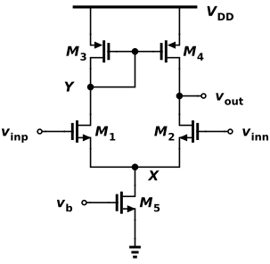
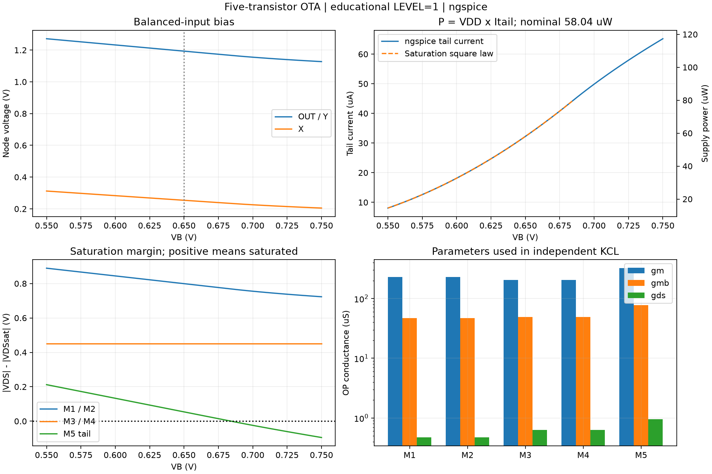
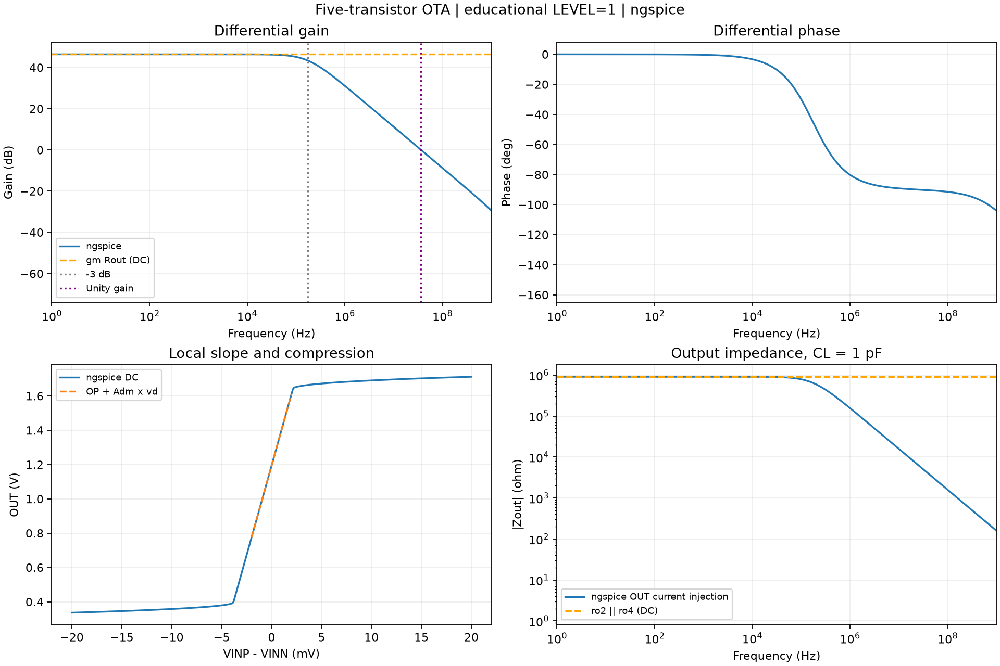
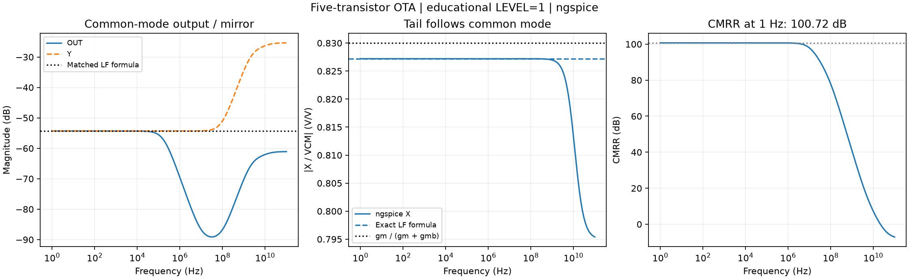
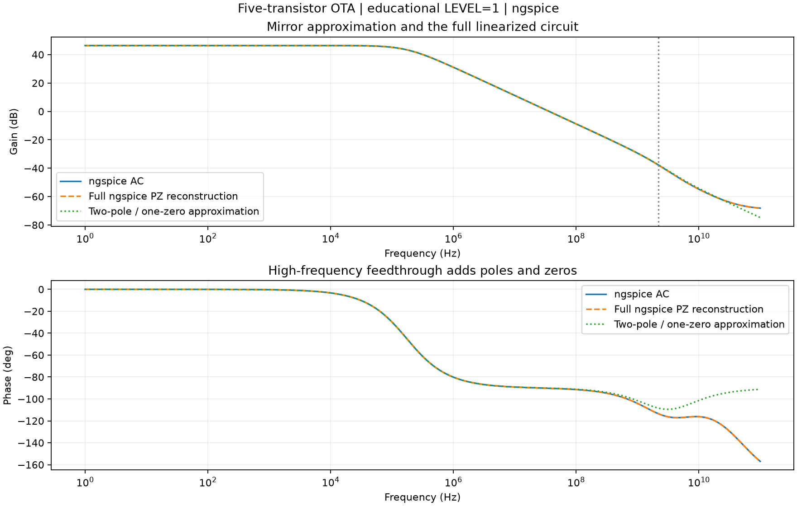
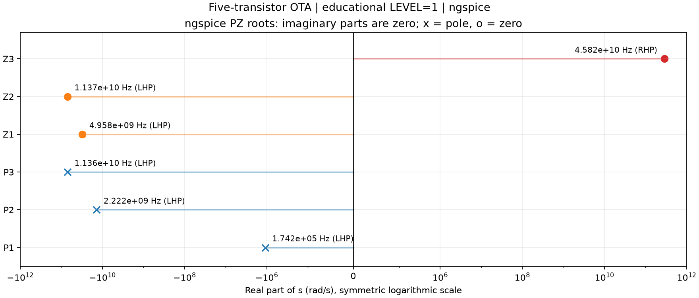
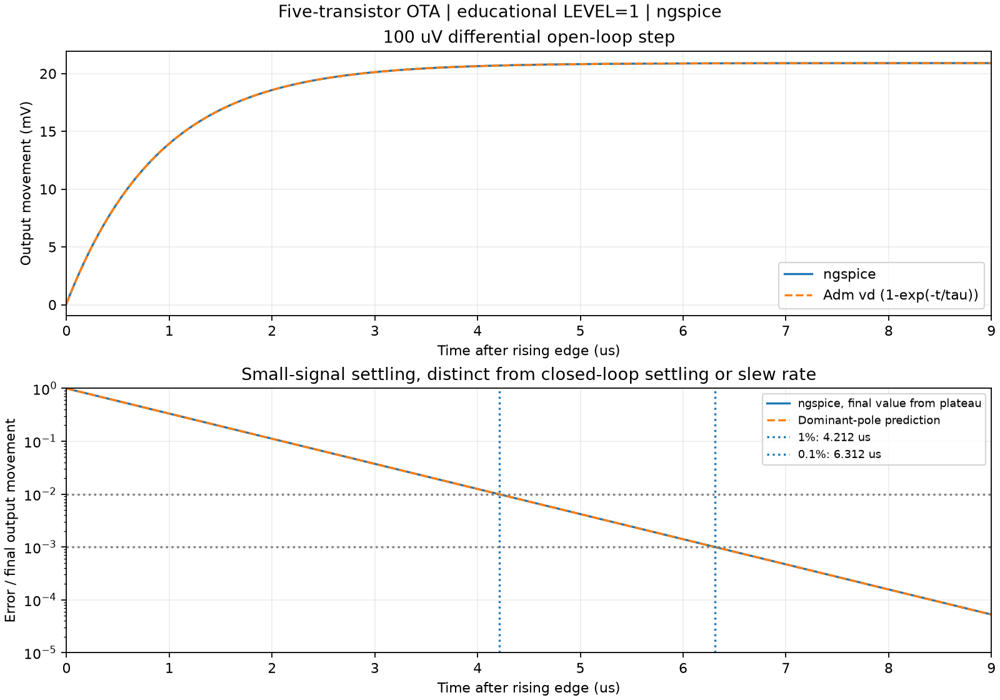
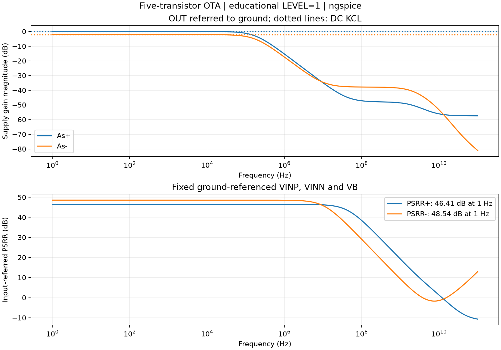
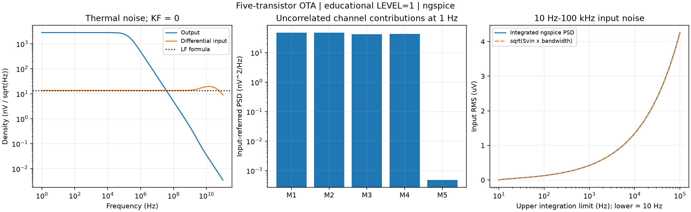
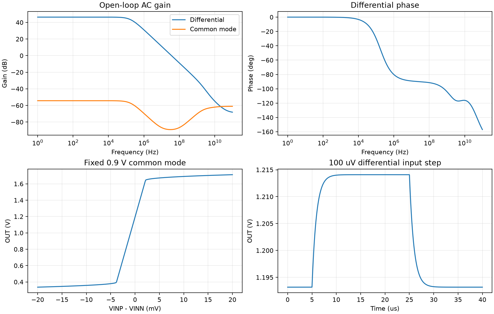

<!--
Input: user-exported Analog Canvas OTA and eleven ngspice testbenches | Output: schematic, metric derivations, simulation plots and independent checks | Position: Companion technical document
-->
# Five-Transistor OTA: Schematic and Simulation

This companion document records the schematic, netlists, simulation results and independently checked small-signal equations for the circuit discussed in [the original analysis](5T-Differential-Amplifier-Analysis.md).

This note studies an NMOS-input, PMOS-current-mirror-loaded operational transconductance amplifier (OTA) with a **single-ended output**. The source is the [Analog Canvas Gallery circuit](https://analog-canvas.tokenzhang.com/g/tckfnzbrkf), using the project exported by the user on 2026-10-07.

**Verification status:** the original project and its structural netlist match the five-transistor reference, including connections and device parameters. A separate educational LEVEL=1 model version preserves the topology and W/L dimensions. Eleven testbenches were executed on 2026-10-09: OP, bias sweep, differential/common-mode AC, output impedance, positive/negative supply AC, noise, pole-zero extraction, differential DC and transient. Each metric below has its equation, test method, plot and comparison. These numerical results verify the stated educational model; they are not SKY130 process predictions. Flicker noise, mismatch, closed-loop stability/settling and large-signal slew rate require further models or testbenches. The original analysis file is unchanged.

## Circuit and Downloadable Files

The drawing names X and Y in a teaching copy of the exported project. The original drawing is also available as [SVG](figures/5t-ota/gallery-original.svg) and [PNG](figures/5t-ota/gallery-original.png).

| File | Purpose and execution status |
|---|---|
| [Original editable project](circuits/5t-ota/Five-transistor%20OTA.icproj.json) | Gallery circuit; original SKY130 bindings retained |
| [Educational editable project](circuits/5t-ota/educational.icproj.json) | Same geometry, connectivity and W/L; named X/Y; educational models |
| [Original structural netlist](simulations/5t-ota/gallery-original.cir) | SKY130 calls; requires its PDK and a testbench; not run here |
| [Educational core](simulations/5t-ota/ota-core.cir) and [models](simulations/5t-ota/models.lib) | Generated core; all eleven testbenches exercised; no external PDK |
| [Run instructions](simulations/5t-ota/README.md) | Commands, stimuli and model distinctions |
| [Source and structural verification](circuits/5t-ota/provenance.json) | Gallery URL, source SHA-256 and comparison results |

### Devices, Nodes and Signals

| Device | Connection/function | W / L |
|---|---|---|
| M1 | NMOS input at VINP; drain at Y | 4 um / 0.5 um |
| M2 | NMOS input at VINN; drain at OUT | 4 um / 0.5 um |
| M3 | Diode-connected PMOS at Y | 8 um / 0.5 um |
| M4 | PMOS mirror output; drain at OUT, gate at Y | 8 um / 0.5 um |
| M5, also called M_tail | NMOS tail; gate at VB, drain at X | 8 um / 1 um |

NMOS bodies connect to VSS; PMOS bodies connect to VDD. Only M3 is diode-connected. There is no sixth bias-replica transistor in this Gallery circuit: an external voltage source supplies VB in the testbenches. The original has `nf=1` and `m=1`; the educational primitives retain unit multiplicity and the same W/L.

| Symbol | Definition | Unit |
|---|---|---|
| $v_d$ | $v_{\mathrm{inp}}-v_{\mathrm{inn}}$ | V |
| $v_{\mathrm{cm}}$ | $(v_{\mathrm{inp}}+v_{\mathrm{inn}})/2$ | V |
| $v_o,v_X,v_Y$ | Small-signal OUT, tail and mirror voltages relative to a fixed reference | V |
| $g_{mi},g_{mbi},g_{di}$ | Positive transconductance, body transconductance and output conductance magnitudes; $g_{di}=1/r_{oi}$ | S |
| $g_t$ | $g_{d5}$, with VB and VSS AC grounded | S |
| $C_L$ | External output load capacitance | F |

The original export calls X `net0`, Y `net1` and OUT `vout`. Both core versions use the port order `VDD VSS vinp vinn vout vb`. A testbench calls `XDUT vdd 0 vinp vinn out vb ota_5t`.

## Bias and Small-Signal KCL

The derivations assume all five devices conduct in saturation, VDD/VSS/VB are AC grounded, and the load has no DC conductance. Low-frequency equations neglect capacitances. Matching is used only where stated.

At balanced inputs, M1 and M2 each carry approximately half the tail current. M3 converts the left current into a gate voltage; M4 mirrors it into the output branch. The output bias follows current balance and finite device output conductances, not an assumed mid-supply voltage.

Define $k_i=g_{mi}+g_{mbi}+g_{di}$ for the input NMOS devices. KCL at Y, OUT and X gives

$$
(g_{d1}+g_{d3}+g_{m3})v_Y-k_1v_X=-g_{m1}v_{\mathrm{inp}},
$$

$$
g_{m4}v_Y+(g_{d2}+g_{d4})v_o-k_2v_X=-g_{m2}v_{\mathrm{inn}},
$$

$$
-g_{d1}v_Y-g_{d2}v_o+(k_1+k_2+g_t)v_X
=g_{m1}v_{\mathrm{inp}}+g_{m2}v_{\mathrm{inn}}.
$$

The [run script](code/run_5t_ota.py) independently solves these equations using operating-point $g_m$, $g_{mb}$ and $g_d$, and compares the solution with the 1 Hz AC results. This checks the selected model's linearization, not its fabrication-process accuracy.

### Bias Current, Power and Saturation: Equation to Plot

The LEVEL=1 saturated tail device has its source and body at VSS, so at VSS = 0,

$$
I_{\mathrm{tail}}=\frac{K_{Pn}}{2}\frac{W_5}{L_5}
(V_B-V_{T0,n})^2(1+\lambda_n V_X),
\qquad P_{\mathrm{DC}}=V_{\mathrm{DD}}|I_{\mathrm{VDD}}|.
$$

Here $K_{Pn}=200\ \mathrm{uA/V^2}$, $W_5/L_5=8$, $V_{T0,n}=0.45$ V and $\lambda_n=0.03\ \mathrm{V^{-1}}$. Input-device body effect instead uses

$$
V_{T,n}(V_{SB})=V_{T0,n}+\gamma_b
\left(\sqrt{\Phi+V_{SB}}-\sqrt{\Phi}\right),
\quad V_{SB}=V_X,\quad \gamma_b=0.4\ \mathrm{V^{1/2}},\quad \Phi=0.7\ \mathrm V.
$$

For each conducting device, define the saturation margin
$m_i=|V_{DS,i}|-|V_{DSsat,i}|$. Positive $m_i$ identifies saturation under this model.

**Test:** [OP](simulations/5t-ota/op.cir) captures $I_D,g_m,g_{mb},g_{ds}$ and capacitances. The [bias sweep](simulations/5t-ota/bias-sweep.cir) changes VB from 0.55 to 0.75 V with balanced 0.9 V inputs. The square-law overlay uses ngspice's $V_X$ at each point, so it checks the device equation rather than independently predicting the complete bias solution.

**Comparison:** at VB = 0.65 V, OUT = Y = 1.19318 V, X = 0.25398 V, $I_{\mathrm{tail}}=32.244$ uA and $P=58.039$ uW. M1/M2, M3/M4 and M5 have margins 0.79920, 0.45000 and 0.05398 V. The tail square law agrees with SPICE in saturation; the first sampled VB where M5 leaves saturation is 0.685 V. The overlay stops there. With fixed inputs, increasing VB does not preserve the assumed operating region indefinitely.

Raw evidence: [bias CSV](simulations/5t-ota/results/bias-sweep.csv), [device parameters and checks](simulations/5t-ota/results/summary.json).

## Differential Gain

Drive VINP with $+v_d/2$ and VINN with $-v_d/2$. Increasing VINP increases M1 current and pulls Y down, making M4 supply more output current. Decreasing VINN also reduces M2 current. Both effects raise OUT:

$$
\boxed{A_{\mathrm{dm}}=\frac{v_o}{v_d}\approx
g_{mn}(r_{o2}\parallel r_{o4})}.
$$

This approximation assumes matched pairs, efficient mirroring and $g_m\gg g_d$. The output resistance uses M2 and M4 at OUT. Each branch contribution contains the input factor $1/2$; their sum gives the expression above, with a positive sign for the declared input convention.

Finite $g_d$ makes this single-ended circuit asymmetric, so X need not be exactly motionless under differential drive. Use the full KCL when that residual movement matters.

### Gain, Output Resistance, Bandwidth and DC Linearity: Equation to Plot

The device-resistance estimate and a dominant-pole unity-gain estimate are

$$
R_{o,\mathrm{approx}}=\frac{1}{g_{d2}+g_{d4}},\qquad
f_u\approx A_0 f_{p,o}\approx\frac{g_{mn}}{2\pi(C_L+C_{\mathrm{par},o})}.
$$

The actual output resistance includes internal node movement. Apply a test current $i_{\mathrm{test}}$ into OUT with inputs, rails and VB AC grounded: $Z_o(f)=v_o/i_{\mathrm{test}}$, $R_o=Z_o(0)$. If $G$ is the three-node KCL matrix above, its low-frequency prediction is $R_o=(G^{-1})_{22}$ in the declared Y/OUT/X ordering.

**Test:** [differential AC](simulations/5t-ota/ac-differential.cir) applies a unit differential voltage. The [output-impedance deck](simulations/5t-ota/ac-output-resistance.cir) injects a unit AC current. Unit AC excitations select a transfer function in the linearized circuit; they are not large-signal voltage/current swings. The [DC sweep](simulations/5t-ota/dc-transfer.cir) independently checks the central slope against $A_{\mathrm{dm}}$ and shows compression.

| Metric | Formula / independent calculation | ngspice |
|---|---|---|
| Low-frequency $A_{\mathrm{dm}}$ | $g_{mn}(r_{o2}\parallel r_{o4})=209.375$ V/V; full KCL = 209.055 V/V | +209.055 V/V, 46.405 dB |
| $R_o$ | $r_{o2}\parallel r_{o4}=909.093$ kohm; full KCL = 910.128 kohm | 910.126 kohm at 1 Hz |
| Differential DC slope at zero | AC prediction = 209.055 V/V | Central difference = 209.055 V/V |
| Dominant bandwidth | Scalar output pole = 174.65 kHz | -3 dB crossing = 173.75 kHz |
| First falling unity crossing | $g_{mn}/[2\pi(C_L+C_{\mathrm{par},o})]=36.57$ MHz | 36.41 MHz |

The scalar pole and unity-gain estimates use the OP capacitances described below. The difference between the device-resistance approximation and full KCL is small at this bias. Compression away from $v_d=0$ is a large-signal effect and does not invalidate the local derivative.

Raw evidence: [AC CSV](simulations/5t-ota/results/ac-differential.csv), [impedance CSV](simulations/5t-ota/results/ac-output-resistance.csv), [DC CSV](simulations/5t-ota/results/dc-transfer.csv).

## Common-Mode Gain and CMRR

At the matched balanced operating point, let the NMOS pair share $g_{mn},g_{mbn},g_{dn}$ and the PMOS pair share $g_{mp},g_{dp}$. Set $k=g_{mn}+g_{mbn}+g_{dn}$.

Driving both inputs by $v_{\mathrm{cm}}$ makes the Y and OUT equations identical, so $v_Y=v_o$. Define

$$D=2k(g_{mp}+g_{dp})+g_t(g_{mp}+g_{dp}+g_{dn}).$$

Solving the remaining equations gives equalities **within this matched, low-frequency model**:

$$
\boxed{A_{\mathrm{cm}}=\frac{v_o}{v_{\mathrm{cm}}}
=\frac{v_Y}{v_{\mathrm{cm}}}=-\frac{g_{mn}g_t}{D}},
\qquad
\boxed{\frac{v_X}{v_{\mathrm{cm}}}
=\frac{2g_{mn}(g_{mp}+g_{dp})}{D}}.
$$

For $g_d\ll g_m$ and small tail conductance,

$$
\frac{v_X}{v_{\mathrm{cm}}}\approx\frac{g_{mn}}{g_{mn}+g_{mbn}},
\qquad
A_{\mathrm{cm}}\approx-\frac{g_t}{2g_{mp}}
\frac{g_{mn}}{g_{mn}+g_{mbn}}.
$$

A large tail output resistance is a small conductance to ground: it lets X follow the common-mode input. It does not make X an AC ground. Body effect reduces that following gain below unity. The mirror cancels most common-mode branch-current changes; the gain of a resistively loaded differential pair cannot be substituted for this mirror-loaded output.

$$
\boxed{\mathrm{CMRR}=\left|\frac{A_{\mathrm{dm}}}{A_{\mathrm{cm}}}\right|},
\qquad \mathrm{CMRR}_{\mathrm{dB}}=20\log_{10}(\mathrm{CMRR}).
$$

The shortcut $2g_{mn}r_{o5}$ is not this topology's CMRR under the model above. The very high simulated CMRR below assumes perfect matching and an ideal bias source; mismatch and bias circuitry can dominate a real implementation.

### Common Mode and CMRR: Equation to Plot

**Test:** [common-mode AC](simulations/5t-ota/ac-common-mode.cir) drives both inputs with AC 1 V in phase and records complex OUT, X and Y voltages. Differential and common-mode runs use identical frequency samples. Calculate $\mathrm{CMRR}_{\mathrm{dB}}(f)=20\log_{10}|A_{\mathrm{dm}}(f)/A_{\mathrm{cm}}(f)|$ from those complex transfers.

**Comparison:** the exact matched low-frequency formulas give $A_{\mathrm{cm}}=-0.00192525$ V/V and $v_X/v_{\mathrm{cm}}=0.827199$ V/V; SPICE gives -0.00192526 and 0.827199 V/V. The body-effect approximation $g_{mn}/(g_{mn}+g_{mbn})$ is 0.83003 V/V. OUT and Y coincide at low frequency under matched common-mode drive; their curves diverge at higher frequency because their loads and capacitances differ. CMRR at 1 Hz is 100.715 dB and changes with frequency; its DC value cannot characterize the complete bandwidth. The horizontal formula lines are low-frequency references.

Raw evidence: [common-mode CSV](simulations/5t-ota/results/ac-common-mode.csv) and [differential CSV](simulations/5t-ota/results/ac-differential.csv).

## Poles, Mirror Zero and Settling

When the output capacitance dominates,

$$
\omega_{p,o}\approx\frac{1}{(r_{o2}\parallel r_{o4})(C_L+C_{\mathrm{par},o})},
\qquad f_{p,o}=\frac{\omega_{p,o}}{2\pi}.
$$

A first-order mirror approximation gives $\omega_{p,Y}\approx g_{mp}/C_Y$. Here $C_Y$ includes input-drain and mirror-device capacitances at Y. Coupling capacitances require a multi-node model; this scalar approximation is not an exact pole extraction.

With equal direct/mirrored DC contributions and an output pole common to both paths,

$$
A(s)\approx\frac{A_0}{2}
\left(1+\frac{1}{1+s/\omega_{p,Y}}\right)
\frac{1}{1+s/\omega_{p,o}}
=\boxed{A_0\frac{1+s/(2\omega_{p,Y})}
{(1+s/\omega_{p,o})(1+s/\omega_{p,Y})}}.
$$

The reduced model has a **left-half-plane** zero at $s=-2\omega_{p,Y}$; its numerator has a plus sign. Other capacitances, feedforward paths and frequency-dependent tail movement are omitted.

A zero at twice a pole frequency does not by itself establish a slow settling tail. Settling depends on poles, residues, feedback, load and step amplitude. The former expression $1/(\omega_{p,Y}-\omega_z/2)$ is undefined at $\omega_z=2\omega_{p,Y}$ and is not a settling-time estimate.

### Poles and Zeros: Equation to Plot

**Test:** [pole-zero extraction](simulations/5t-ota/poles-zeros.cir) uses linear controlled sources to apply the balanced differential port. A 1 Gohm resistor establishes its zero-volt DC input; ngspice PZ supplies its own voltage excitation. A zero-volt source across that port would short the PZ excitation. All bias conditions match the AC deck.

For this model, junction capacitances default to zero. Using OP Meyer/overlap capacitances,

$$
C_Y\approx C_{gs3}+C_{gs4}+C_{gd4}+C_{gd1}=14.8084\ \mathrm{fF},
\quad
C_L+C_{\mathrm{par},o}\approx C_L+C_{gd2}+C_{gd4}=1.0024\ \mathrm{pF}.
$$

$C_{gd3}$ has both ends at Y and contributes no current. These are scalar estimates obtained by holding neighboring nodes fixed; coupling capacitances still move charge between nodes in the full simulation.

| Feature | Reduced-model prediction | Full ngspice PZ |
|---|---|---|
| Output pole | 174.65 kHz | P1: LHP, 174.18 kHz |
| Mirror pole | 2.2098 GHz | P2: LHP, 2.2223 GHz |
| Mirror zero | LHP, $2f_{p,Y}=4.4196$ GHz | Z1: LHP, 4.9581 GHz |
| Additional internal pole | Omitted | P3: LHP, 11.3593 GHz |
| Additional zeros | Omitted | Z2: LHP, 11.3661 GHz; Z3: RHP, 45.8192 GHz |

The full mirror zero is about 2.23 times P2, rather than exactly twice it. The additional high-frequency roots belong to the declared compact model with capacitive feedthrough. The sweep to 100 GHz exposes the difference between the reduced and full mathematical models; it does not establish the physical validity of LEVEL=1 or SKY130 performance at those frequencies.

The independent root reconstruction uses

$$
H_{\mathrm{PZ}}(s)=A_{\mathrm{dm}}(0)
\frac{\prod_j(1-s/z_j)}{\prod_i(1-s/p_i)}.
$$

Its maximum complex relative error versus the AC sweep is $1.83\times10^{-6}$. This confirms that the extracted roots describe the same linearized transfer. The reduced two-pole/one-zero model reproduces the dominant behavior and develops visible high-frequency error.

Raw evidence: [PZ log](simulations/5t-ota/results/poles-zeros.log), [signed roots CSV](simulations/5t-ota/results/poles-zeros.csv), [OP capacitances](simulations/5t-ota/results/capacitances.dat).

### Small-Signal Open-Loop Settling: Equation to Plot

If the output pole dominates, a sufficiently small differential step gives

$$
\Delta v_o(t)\approx A_0\Delta v_d(1-e^{-t/\tau}),\qquad
\tau=\frac{1}{|p_1|},\qquad
\boxed{t_{\epsilon}\approx\tau\ln\frac{1}{\epsilon}}.
$$

Here $\epsilon$ is the remaining error divided by the final output movement. This describes an **open-loop small-signal** response at this load, not a feedback settling time or slew-rate limit.

**Test:** [transient](simulations/5t-ota/transient.cir) applies a balanced 100 uV differential pulse at 5 us with 10 ns edges and 20 us width. The final output is measured over 20–24 us, after the response has settled. Measure the last exit from the error band before the pulse falls. Report time after the rising edge finishes; the formula assumes an instantaneous step, giving a small edge-related timing difference.

| Metric | Dominant-pole prediction, $\tau=0.913743$ us | ngspice transient |
|---|---|---|
| Final output movement | $209.055\times100$ uV = 20.9055 mV | 20.9065 mV |
| 1% settling | 4.20794 us | 4.212 us |
| 0.1% settling | 6.31191 us | 6.312 us |

Both measured settling times agree with the dominant-pole prediction within 1%. The final-value agreement and error curve verify the small-signal interpretation; this test does not establish large-step performance.

Raw evidence: [transient CSV](simulations/5t-ota/results/transient.csv).

## PSRR

Define supply transfers and input-referred rejection as

$$
A_{s+}=\frac{v_o}{v_{\mathrm{DD}}},\quad
A_{s-}=\frac{v_o}{v_{\mathrm{SS}}},\quad
\mathrm{PSRR}^{\pm}=\left|\frac{A_{\mathrm{dm}}}{A_{s\pm}}\right|.
$$

VINP, VINN and VB stay fixed relative to external ground. OUT and the bottom of $C_L$ also reference external ground. Excite VDD or VSS separately while grounding the other rail in AC. This declared convention is essential: a supply-following bias generator or VSS-referenced output would give different results.

Let $G$ be the earlier KCL matrix. With fixed input/bias voltages, the added supply terms are

$$
G\begin{bmatrix}v_Y\\v_o\\v_X\end{bmatrix}
=\underbrace{\begin{bmatrix}g_{m3}+g_{d3}\\g_{m4}+g_{d4}\\0\end{bmatrix}}_{b_+}v_{\mathrm{DD}}
+\underbrace{\begin{bmatrix}-g_{mb1}\\-g_{mb2}\\g_{mb1}+g_{mb2}+g_{m5}+g_{d5}\end{bmatrix}}_{b_-}v_{\mathrm{SS}}.
$$

Thus $A_{s\pm}(0)=(G^{-1}b_\pm)_2$ in Y/OUT/X ordering. PMOS sources and bodies move together with VDD; their body terms cancel in these vectors. VSS moves input NMOS bodies and the tail source/body, so its transfer is different from common-mode input gain. M4 remains a mirror-output transistor, rather than a diode-connected load.

### PSRR: Equation to Plot

**Test:** [positive supply AC](simulations/5t-ota/ac-psrr-positive.cir) sets VDD AC = 1 V; [negative supply AC](simulations/5t-ota/ac-psrr-negative.cir) sets VSS AC = 1 V. Calculate both PSRR curves using differential gain on the same frequency grid.

| Metric at 1 Hz | Supply KCL prediction | ngspice |
|---|---|---|
| $A_{s+}$ | 0.999996 V/V | 0.999996 V/V |
| $A_{s-}$ | 0.782301 V/V | 0.782301 V/V |
| PSRR+ | 46.4052 dB | 46.4052 dB |
| PSRR− | 48.5377 dB | 48.5377 dB |

OUT nearly follows VDD at low frequency, which is consistent with the matched PMOS mirror setting its voltage relative to the positive rail. The PSRR definition divides this supply transfer by differential gain; a large numerical input-referred rejection does not mean OUT has negligible absolute ripple. Both rejection curves vary with frequency.

Raw evidence: [positive-supply CSV](simulations/5t-ota/results/ac-psrr-positive.csv), [negative-supply CSV](simulations/5t-ota/results/ac-psrr-negative.csv).

## Thermal Noise and Integrated Noise

For matched strong-inversion devices, independent channel noise sources and the leading-order gain approximation, the **one-sided** input-referred thermal noise PSD is

$$
S_{v,\mathrm{in}}\approx
\frac{8k_BT\gamma_n}{g_{mn}}+
\frac{8k_BT\gamma_p g_{mp}}{g_{mn}^2}
\quad[\mathrm{V^2/Hz}].
$$

For saturated MOS1 channel noise, $S_{i,j}=4k_BT\gamma_jg_{mj}$ with $\gamma_n=\gamma_p=2/3$. The two input devices each contribute through approximately $1/g_{mn}$ when referred to differential input, producing the first factor of eight. The two load devices produce the second term through the same leading-order gain normalization. Tail-noise transfer is omitted from this approximation and included in the full simulation.

Use ngspice amplitude densities $e_{n,o}$ and $e_{n,\mathrm{in}}$ in V/$\sqrt{\mathrm{Hz}}$, rather than treating them as PSD:

$$
S_{v,\mathrm{in}}(f)=e_{n,\mathrm{in}}^2(f)
=\frac{e_{n,o}^2(f)}{|A_{\mathrm{dm}}(f)|^2},\quad
v_{n,\mathrm{in,rms}}=\sqrt{\int_{f_1}^{f_2}S_{v,\mathrm{in}}(f)\,df}.
$$

For a flat input PSD this reduces to $v_{n,\mathrm{in,rms}}\approx\sqrt{S_{v,\mathrm{in}}(f_2-f_1)}$. Output RMS instead integrates the output PSD, including its gain and roll-off.

### Noise: Equation to Plot

**Test:** [noise deck](simulations/5t-ota/noise.cir) references its source to $v_d=v_{\mathrm{inp}}-v_{\mathrm{inn}}$ using balanced linear controlled sources. It records total input/output densities and individual M1–M5 contributions. KF defaults to zero, so this is a thermal-only result. Ideal bias/supply sources add no noise.

For an independent low-frequency check, solve $Gh_j=q_j$, where $q_j$ injects a unit current between device j's drain and source. The output component of $h_j$ is its transimpedance. Compare $\sum_j |h_{j,o}|^2(4k_BT\gamma_jg_{mj})$ with the simulated output PSD, then divide by $|A_{\mathrm{dm}}|^2$. The runner also checks that the five independent MOS noise powers sum to the total across the entire sweep.

| Metric | Formula / independent KCL | ngspice |
|---|---|---|
| Low-frequency input density | Leading order: 13.47708 nV/$\sqrt{\mathrm{Hz}}$; full noise KCL: 13.47714 nV/$\sqrt{\mathrm{Hz}}$ | 13.47712 nV/$\sqrt{\mathrm{Hz}}$ at 1 Hz |
| Low-frequency output density | Noise KCL including all five devices | 2.81746 uV/$\sqrt{\mathrm{Hz}}$ at 1 Hz |
| Input RMS, 10 Hz–100 kHz | White approximation: 4.26161 uV | Integrated input PSD: 4.26163 uV |
| Output RMS, 10 Hz–100 kHz | $\sqrt{\int e_{n,o}^2df}$ | 848.832 uV |

M1–M4 dominate at this matched bias; M5's contribution is small but finite. Agreement of the thermal approximation does not establish flicker noise or mismatch behavior. Flicker coefficients, bias-circuit noise and correlations must follow the selected model and actual circuit when those are added.

Raw evidence: [noise densities and source contributions CSV](simulations/5t-ota/results/noise.csv), [noise log](simulations/5t-ota/results/noise.log).

## Reproducible Simulation Results

Conditions: VDD = 1.8 V, VSS = 0 V, input common mode = 0.9 V, VB = 0.65 V, $C_L$ = 1 pF and temperature = 27 C. Dimensions match the Gallery table; model coefficients are in `models.lib`. Actual execution used the official `ngspice-33-w7` Windows package; logs report `ngspice-33 done`. The report records executable and input SHA-256 values.

| Observable | Educational-model result |
|---|---|
| OUT / Y bias | 1.19318 V |
| X bias | 0.25398 V |
| Tail current / supply power | 32.244 uA / 58.039 uW |
| Differential gain at 1 Hz | +209.055 V/V = 46.405 dB |
| $g_{mn}(r_{o2}\parallel r_{o4})$ | 209.375 V/V |
| Common-mode gain at 1 Hz | -0.0019253 V/V |
| Common-mode X gain at 1 Hz | 0.82720 V/V |
| CMRR at 1 Hz | 100.715 dB, under perfect matching |
| Differential -3 dB bandwidth | 173.75 kHz |
| First falling unity-gain crossing | 36.41 MHz |
| Output resistance at 1 Hz | 910.126 kohm |
| PSRR+ / PSRR− at 1 Hz | 46.4052 / 48.5377 dB, declared ground reference |
| Input thermal noise at 1 Hz | 13.4771 nV/$\sqrt{\mathrm{Hz}}$ |
| Integrated input noise, 10 Hz–100 kHz | 4.26163 uV RMS |
| Open-loop 1% / 0.1% settling | 4.212 / 6.312 us, 100 uV differential step |

The DC sweep changes $v_d$ from -20 mV to +20 mV at fixed common mode; compression outside the center invalidates the small-signal approximation. A 100 uV balanced differential step produces approximately 20.9 mV output movement, agreeing with AC gain.

All five devices have positive saturation margins at the balanced OP. Checks also cover bias-sweep square law, independent differential/common-mode/supply KCL, output impedance, central DC slope, transient plateau and settling, noise normalization/source sums/current-noise KCL, and complete PZ reconstruction of complex AC. Saturation is not asserted over the entire sweep. Crossing frequencies interpolate sampled dB against logarithmic frequency.

See the [machine-readable report](simulations/5t-ota/results/summary.json), [OP log](simulations/5t-ota/results/op.log) and [CSV waveforms](simulations/5t-ota/results/). From any directory, run:

~~~sh
python /path/to/circuits-and-systems-classroom/code/run_5t_ota.py --ngspice /path/to/ngspice
~~~

The script needs NumPy and Matplotlib. Its [metric-check and plotting module](code/ota_5t_metrics.py) produces all per-section plots from actual ngspice data, with clearly labeled analytical overlays. Each plot has a PNG for reading and an SVG counterpart for export. The result report records input and script hashes. Use the [export script](code/export_5t_ota.mjs) with the built analog-canvas repository to regenerate drawings/projects and netlists before rerunning after a circuit change. Structural matching checks connections and parameters; the ngspice runs establish the stated educational-model behavior.

## Sources

1. [Five-transistor OTA, Analog Canvas Gallery](https://analog-canvas.tokenzhang.com/g/tckfnzbrkf), accessed through the user-supplied project. Its exact identity is in `provenance.json`.
2. [ngspice documentation](https://ngspice.sourceforge.io/docs.html) and [downloads](https://ngspice.sourceforge.io/download.html). Actual local execution evidence is retained above.
3. [SKY130 open PDK documentation](https://skywater-pdk.readthedocs.io/en/main/), relevant to the original bindings. No SKY130 models or silicon data were evaluated for the numerical results here.

The KCL and reduced transfer-function derivations are this note's independent analysis. The historical local `reference/five_transistor_amplifier.tex` is not verification of the corrected equations.
