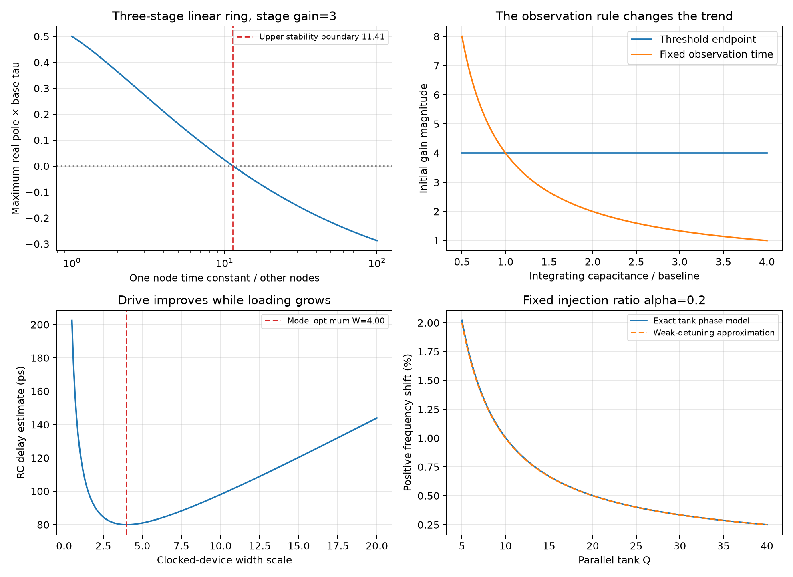

# Reviewing AI-Assisted Analog Circuit Analysis and Design

Razavi's **Analog Design Experiments With AI**, Parts 1–2, provide useful cases for testing whether a circuit explanation follows the actual connections and operating conditions. This note turns those cases into a reusable review method and independently checks selected equations. Both full articles and all 11 original pages were reviewed. The calculations are analytical models; no present-day AI benchmark, PDK design or transistor simulation was run.

## Sources and interpretation

| ID / original article | Scope and reported result | Access |
|---|---|---|
| A1: [Part 1](https://www.seas.ucla.edu/brweb/papers/Journals/BR_SSCM_4_2025.pdf), Fall 2025, pp. 11–15, [DOI 10.1109/MSSC.2025.3611213](https://doi.org/10.1109/MSSC.2025.3611213) | 30 basic-analysis questions, 0–4 points each; ChatGPT receives 49/120, about 41% | Full text and all five pages reviewed; p. 15 Editor's Note excluded |
| A2: [Part 2](https://www.seas.ucla.edu/brweb/papers/Journals/BR_SSCM_2_2026.pdf), Spring 2026, pp. 8–13, [DOI 10.1109/MSSC.2026.3686589](https://doi.org/10.1109/MSSC.2026.3686589) | 20 trend/design questions; Gemini 3.1 Pro receives 44/80, 55% | Full text and all six pages reviewed |

All are by Behzad Razavi in *IEEE Solid-State Circuits Magazine*. The point totals were independently summed from the original per-question grades. They are graded results from **different historical question sets**, not interchangeable accuracy probabilities or a controlled current-model ranking. A1 does not identify a precise ChatGPT model/version or provide a complete reproducibility package. A2 includes follow-up/corrective questions. Statements about the interfaces' inability to run simulations describe those experiments, not every current tool environment.

A2's five-level pyramid is a useful order of evidence: correct analysis → parameter intuition → design to specifications → topology selection → innovation. A correct equation at the first level does not establish performance or originality at the fifth.

## Begin with terminals, constraints and the requested observation

For each MOS device record type, D/G/S/B nodes and DC bias. Identify grounded wires, junction dots and crossings separately; a capacitor is open at DC, while an ideal wire remains a short. Define input/output ports before assigning names such as common-source or cascode. Establish conduction and saturation before using a gain formula.

For long-channel illustrations below, use $I_D=\beta V_{ov}^2/2$, $\beta=\mu C_{ox}W/L$, positive transconductance magnitude $g_m$, and positive output conductance $g_o$. This omits body effect unless explicitly stated. It does not supply a nanometer-process sizing law.

| Source case | Connection that must survive interpretation | Consequence |
|---|---|---|
| A1 Fig. 3, Q6 | PMOS gate and drain are tied | Diode connection gives low incremental resistance, not a good high-impedance current source |
| A1 Figs. 5–7, Q8–Q10 | Fig. 5 output is the NMOS source; Fig. 6 input is the source of a diode-connected PMOS; Fig. 7's source has a direct ground wire | A small drawing change changes the model. In Fig. 7 the ideal source stimulus is shorted; the input coupling capacitor alone does not create common-gate signal gain |
| A1 Fig. 10, Q13 | Upper NMOS drain at VDD, gate at input, source at output | A source follower with current-sink load, rather than a common-source stage |
| A1 Fig. 11, Q14–Q15 | Standard inverter has upper PMOS/lower NMOS; the second diagram reverses the types | Shared gates alone do not imply inverter operation. Opposing followers can leave a weakly driven interval |
| A1 Fig. 14, Q18–Q19 | Upper device M2 is PMOS with source at VDD; lower PMOS M1 is the common-gate/cascode device | Device position or numbering does not identify which device supplies cascode feedback |
| A1 Figs. 16–17, Q21/Q23 | Fig. 16 has a lower PMOS follower and upper NMOS common-gate device; Fig. 17 input reaches a source with fixed gate bias | Two stacked devices are not automatically a conventional cascode |
| A1 Fig. 18, Q24 | PMOS load has gate and source at AC ground, with its drain at output | Its Cgs is between grounded terminals; its Cgd and Cdb load the output |
| A1 Figs. 22–24, Q28–Q30 | Fig. 22 M2 gate is at output, not its own drain; Figs. 23–24 also contain explicit feedback paths | Determine loop sign from node perturbations before applying a memorized amplifier formula |
| A2 Fig. 12(b), Q14–Q15 | Red inverter joins the first sampled node to the second sampled node | It is feedforward around the main path, rather than a cross-coupled keeper. Its competition at low rate creates a lower frequency bound |

The [inverter timing note](CMOS-Inverter-Clock-and-Timing-Circuits.md) and [millimeter-wave divider note](Millimeter-Wave-Frequency-Divider.md) define the clocked paths and storage phases separately. Periodic division does not by itself prove arbitrary-data retention or quadrature accuracy.

## Geometry and bias: name what stays fixed

A1 Q1 doubles both W and L. At fixed overdrive and under $\lambda\propto1/L$, W/L, current and gm remain constant, while ro and intrinsic gain gmro double. Fixed supply alone does not guarantee fixed overdrive or drain voltage. Short-channel, junction, body and loading effects require a process model.

For A1 Q2,

$$
g_m=\beta V_{ov}=\frac{2I_D}{V_{ov}}.
$$

Increasing overdrive at fixed geometry increases gm. Increasing overdrive at fixed current requires changing geometry/bias and decreases gm. Saying “fixed overdrive, then increase overdrive” is internally inconsistent, as in the source answer. Each parameter derivative must have a declared constraint.

A diode-connected device's current-voltage derivative is approximately $g_m+g_o$, so $r_{diode}\approx1/(g_m+g_o)$ without body effects. A1 Fig. 2 additionally fixes drain-to-source voltage at 1 V while varying the gate. For $V_{ov}\le1$ V it is saturated; for $V_{ov}>1$ V the square-law triode current becomes $\beta[V_{ov}(1\text{ V})-(1\text{ V})^2/2]$, linear in gate overdrive. Region boundaries explain the curve change.

For the PMOS stack in A1 Fig. 14, define positive $V_{SG1}$ and $|V_{T2}|$. Upper M2 saturation requires

$$
V_X\le V_{b2}+|V_{T2}|,\qquad V_X\approx V_{b1}+V_{SG1},
$$

$$
\boxed{V_{b1}\le V_{b2}+|V_{T2}|-V_{SG1}
=V_{DD}-V_{ov2}-V_{SG1}}.
$$

This also needs lower-device output compliance and current consistency. The source correctly emphasizes the lower gate's control of X but prints $V_{b1}<|V_{GS2}-V_{TH2}|+|V_{GS1}|$. That is not the same bound for gate voltages referenced to ground in Fig. 14. For an illustrative 0.95-V supply, $V_{SG2}=0.4$ V, $|V_{T2}|=0.2$ V and $V_{SG1}=0.35$ V, the correct upper limit is 0.40 V; the printed sum gives 0.55 V. At a 0.50-V lower gate, X≈0.85 V and M2 lacks its 0.20-V saturation headroom. An expert's comment still needs the same node/region check.

## Derive impedance and feedback before naming the circuit

In A1 Fig. 16, let the lower follower's incremental source conductance be $G_S\approx g_{m1}$, neglecting its go/body effect, and let the upper common-gate device have $g_{m2},r_{o2}$. Looking into its drain,

$$
R_{out}=r_{o2}+\frac{1+g_{m2}r_{o2}}{G_S}.
$$

The independent two-node KCL gives 30.5 kΩ for $G_S=2$ mS, $g_{m2}=4$ mS and $r_{o2}=10$ kΩ. Replacing the follower with a high-resistance common-source current-source stage would give a different result, approximately $r_{o1}+r_{o2}+g_{m2}r_{o1}r_{o2}$ for a conventional cascode.

In A1 Fig. 21, a gate resistor R and gate–source capacitor Cgs make the upper NMOS follower's output impedance frequency dependent. With signal source at AC ground, ideal lower current sink and negligible body/output conductances,

$$
\frac{v_g}{R}+sC_{gs}(v_g-v_o)=0,\qquad
i_o=(g_m+sC_{gs})(v_o-v_g),
$$

$$
\boxed{Z_o(s)=\frac{1+sRC_{gs}}{g_m+sC_{gs}}}.
$$

Low/high frequency limits are $1/g_m$ and R. The low-frequency inductive coefficient is $C_{gs}(g_mR-1)/g_m^2$; it is positive only for $g_mR>1$ in this model. Output/body conductances and other capacitances alter both limits. A limiting-case check rejects the source AI's $g_mR/(sC)$: it diverges at DC and tends to zero at high frequency, unlike this circuit's limits, even though its impedance units are correct.

A1 Fig. 22 illustrates positive feedback. Define X as M1 gate/M2 drain and Y as M1 drain/M2 gate. With grounded sources,

$$
\begin{bmatrix}sC_X+g_{o2}&g_{m2}\\g_{m1}&sC_Y+g_{o1}\end{bmatrix}
\begin{bmatrix}v_X\\v_Y\end{bmatrix}
=\begin{bmatrix}i_{in}\\0\end{bmatrix}.
$$

The characteristic constant is $g_{o1}g_{o2}-g_{m1}g_{m2}$. If negative, one pole is RHP with positive capacitors: a formal DC solution is not a stable linear amplifier. Positive feedback is not unconditionally unstable; its gain and operating point determine the mode.

In A2 Fig. 14(b), an unloaded inverting Thevenin gain −A0 has series output resistance $R_O=R_{D2}$ and feedback RF. Output KCL gives

$$
\frac{v_o+A_0v_i}{R_O}+\frac{v_o-v_i}{R_F}=0,
\qquad \boxed{R_{in}=\frac{R_F+R_O}{1+A_0}}.
$$

This is exact for the **specified simplified model**, not every transistor implementation. A2 Eq. (11) uses $A_0=g_{m1}g_{m2,3}R_{D1}R_{D2}/2$, neglecting output conductances and dynamic loading. Inserting only an output-loaded forward gain into RF/(1+A) omits the passive feedback feedthrough. With A0=10, RF=2 kΩ and RO=500 Ω, exact Rin is 227.273 Ω, versus 222.222 Ω from that incomplete substitution.

The LNA optimization in A2 Q16 likewise needs the same finite-ro signal/noise matrix and the matching constraint. Raising ro changes permissible RF, gain and noise; a large-ro bound alone does not determine the complete optimum. The [analog front-end note](CMOS-Inverter-Analog-Front-Ends.md) includes feedback-resistor noise, gamma convention and source numerical discrepancies.

## Count independent states, then check their poles

A1 Q11/Q24's two-state answer is consistent with the shown capacitors, but “energy-storing nodes” is shorthand. A capacitor between two moving nodes couples their states; it does not create a third independent voltage. Write the nodal capacitance matrix, remove ideal voltage constraints and determine its rank. The number of visible capacitors alone is insufficient. Pole-zero cancellation can also hide an internal mode from a selected transfer function.

For A2 Figs. 5–6, take three inverting first-order stages with magnitude a and time constants $\tau_i$:

$$
\prod_{i=1}^3(1+s\tau_i)+a^3=0.
$$

With equal tau, the potentially unstable pair has $\operatorname{Re}s=(a/2-1)/\tau$. Increasing **all** capacitances/time constants scales the rates without changing their signs; for a>2 the equilibrium remains unstable in this ideal model. This supports the source's uniform-loading intuition, while finite leakage/gain can change an actual large-capacitance limit.

If only one time constant is $\rho\tau$, write $p=s\tau$:

$$
\rho p^3+(1+2\rho)p^2+(2+\rho)p+1+a^3=0.
$$

Routh stability requires $(1+2\rho)(2+\rho)>\rho(1+a^3)$. For a=3 the upper stable boundary is $\rho=11.4124$; a sufficiently large single load stabilizes the equilibrium and suppresses small-signal startup. These illustrative poles do not prove the source circuit's final nonlinear waveform or amplitude.

A2's ring-noise formula, p. 10 Eq. (1), is

$$
S_{\phi n}(\Delta f)=\left(\frac{f_0}{\Delta f}\right)^2
\left[\frac{S_{I,NMOS}+S_{I,PMOS}}{2I_D^2}
+\frac{2kT}{I_DV_{DD}}\right].
$$

Keep its device-bias/noise convention when using the prefactors. Doubling all node capacitances halves f0 and quarters the phase PSD at a fixed absolute offset under the stated constant-current/noise assumptions. Width doubling with ideal current/capacitance scaling holds frequency roughly fixed, doubles power and halves phase PSD. Neither comparison establishes equal timing jitter after integrating different bands or equal external loads.

## Distinguish average supply resistance from incremental resistance

A2 Q5–Q6 gives $R_X\approx1/(3f_0C_L)=2T_D/C_L$ for a three-stage ring. Average supply current from switched charge is $I_{DD}=3C_Lf_0V_{DD}$, rather than a permanently conducting series pair of diode-connected MOSFETs.

However, an incremental supply pole must use

$$
r_{inc}=\left[3C_L\left(f_0+V_{DD}\frac{df_0}{dV_{DD}}\right)
 +\frac{dI_{other}}{dV_{DD}}\right]^{-1}
$$

with additional dependence of capacitance/bias included when relevant. Source Eq. (3) is an average or fixed-frequency approximation. Its derivative argument omits the frequency derivative. A chosen example f0=1 GHz, VDD=0.8 V, df0/dV=1 GHz/V and CL=100 fF gives 3.333-kΩ average resistance but 1.852-kΩ incremental resistance. A bypass capacitor uses the latter for a local pole, subject to periodic dynamics and current-source impedance.

## Observation time and competing parameter trends

A2 Q7–Q9 applies $A_v\approx g_{m1,2}V_{THN}/I_{CM}$ to StrongARM initial amplification. With square-law fixed geometry, gm scales as sqrt(ICM), so endpoint gain falls approximately as 1/sqrt(ICM). That conclusion assumes the defined phase endpoint; widening the tail changes the bias trajectory and other parasitics too.

An independent integrating model explains why capacitance can disappear: $v_d(t)=g_mv_{id}t/C$, while a threshold event at $t_*\approx C\Delta V/I_{CM}$ gives $A(t_*)=g_m\Delta V/I_{CM}$. At a **fixed** observation time T instead, gain is gmT/C and decreases with C. The cancellation requires the same relevant capacitance/current trajectory in the timing and signal equations; it does not prove complete StrongARM delay/noise invariance under arbitrary extra P/Q capacitance. The 2015 paper cited by A2 was not separately full-text reviewed in this batch; see the distinct reviewed [StrongARM design note](StrongARM-Comparator-Design.md).

For clocked divider devices in A2 Q10/Q12, a local RC illustration is

$$
t_d(w)\approx(R_D+R_K/w)(C_0+cw),\qquad
w_{opt}=\sqrt{R_KC_0/(R_Dc)}.
$$

Resistance improvement competes with loading, producing initial speed improvement and eventual degradation. R_D=1 kΩ, R_K=4 kΩ, C0=20 fF and c=5 fF give wopt=4 and an 80-ps RC estimate. This is a chosen model, not source sizing or a universal optimum. Regenerative devices have the analogous competition between useful gm and total node capacitance; the direction of change cannot be inferred from device capacitance alone.

## LC phase noise and quadrature frequency require the periodic circuit

A2 Q18 gives supply pushing in Hz/V, $K_{push}=df_0/dV_{supply}$. For one-sided supply PSD $S_v$ and small quasi-static FM,

$$
S_\phi^{(1)}(f_m)=\left(\frac{K_{push}}{f_m}\right)^2S_v(f_m),\qquad
\mathcal L(f_m)=\frac{S_\phi^{(1)}(f_m)}2.
$$

The factor 1/2 converts one-sided phase PSD to SSB phase noise. For 10-nV/√Hz supply noise, Kpush=1 GHz/V and 1-MHz offset, the contribution is −103.010 dBc/Hz. Use Hz/V throughout; substituting rad/s/V requires the corresponding 2π conversion.

In Fig. 15, tank supply motion changes varactor terminal voltage while the control is stiff. Its dominant tuning path can give $K_{push}\approx-K_{VCO}$, with equal magnitude and opposite sign under $V_{var}=V_{cont}-V_{supply}$. Other supply paths and tracking of the control/banks can alter this relation. Lower KVCO trades noise sensitivity against tuning range; it does not by itself establish complete supply rejection.

A2 Q19's tail capacitor has several regimes: tail impedance/harmonics, flicker conversion, conduction-angle changes and possible low-frequency instability. The source discusses an intermediate Class-C region with lower phase noise, but does not provide a universal CT interval. A capacitor that shunts one current-noise path does not eliminate periodic gm/AM-to-PM conversion or guarantee saturation. Reproduce these claims only with the actual periodically biased transistor model, startup and noise tests.

For A2 Q20's quadrature injection, define parallel half-tank $Q=\omega_0C_{node}R_p$ and injection ratio alpha. Near resonance, an illustrative phase balance gives

$$
Q(x-1/x)=\alpha,\qquad x=\omega/\omega_0,
\qquad \frac{\Delta\omega}{\omega_0}\approx\frac{\alpha}{2Q}.
$$

The displayed positive branch corresponds to a chosen injection phase; the sign depends on the coupled mode. Source Eq. (17) uses alpha≈I1/ISS for near-complete switching. In a small-signal convention alpha=gmc/gm1, so

$$
\Delta\omega\approx\frac{g_{mc}}{g_{m1}}\frac{1}{2C_{node}R_p}.
$$

The AI's gmc/(2Cnode) misses the factor gm1Rp and matches that expression only at the assumed oscillation threshold gm1Rp=1. For alpha=0.2 and Q=10, the weak-detuning shift is 1%; the exact selected tank-phase branch gives 1.005%. This calculation is not a nonlinear quadrature-oscillator simulation.

## Reusable review and research record

For a new structure such as a bootstrapped switch, first request a terminal/phase description, then a compact assumption table and one derivation from charge or KCL. Ask for a parameter trend under specified fixed quantities. Verify it with a separate state/circuit model and physical limits. Use [the bootstrapped-switch note](Bootstrapped-Sampling-Switch.md) for a reviewed example, including body effect, parasitics, settling and terminal stress.

Keep one record per claim:

| Field | Required content |
|---|---|
| Source/experiment | PDF page/figure, prompt and answer; record exact model/version/date when actually available |
| Interpreted circuit | Device terminal table or netlist; phases, initial state and input/output definition |
| Assumptions | Device region, grounded quantities, fixed parameter, loading, PSD/port convention and observation time |
| Claimed result | Equation, direction of trend or specification with units and conditions |
| Independent check | KCL/charge/state equation, numerical example, limiting case or separately run simulation |
| Status | Supported in model, contradicted, or requires named physical evidence; preserve source statement separately |

A topology recognition error invalidates formulas that depend on that topology even if their algebra looks familiar. A correct model-derived result can still fail a specified PVT/noise/loading requirement. Topology selection needs equal operating conditions and a defined objective; proposed innovations need comparison with prior art and physical validation.

Run [the analysis script](code/razavi_seventh_batch_analysis.py) to reproduce the independently stamped KCL, ring-state/polynomial, charge-timing and trend checks. The [seventh-batch verification record](sources/razavi-seventh-batch-verification.md) records all source questions, scoring, conversion defects and access boundaries. Physical tests still require operating-point checks, PVT/mismatch, complete reset/clock timing, transient startup, periodic noise and terminal-voltage limits relevant to the chosen topology.
