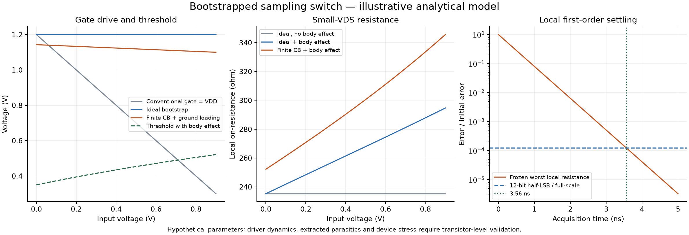

# Bootstrapped Sampling Switch

<!--
Input: Explicit functional switching model, independent derivations, and Razavi's 2021 article read in full against its original pages
Output: Mechanism, design constraints, analytical example, and transistor-level validation plan
Position: Sampling and data conversion knowledge note
-->

**Scope and status:** Sections 1–7 derive a single-ended functional model. Sections 8–9 connect it to Razavi's complete 2021 differential-sampler design study [2], whose six PDF pages (printed pp. 7–12) have been read and visually checked. The functional model and the paper's transistor implementation are distinct. Project calculations are analytical; numerical transistor simulations quoted from [2] remain the author's results. No project PDK simulation or measurement has been performed. Reference [1] remains a bibliographic starting point; its full text has not been reviewed here.

## 1. Functional Topology and Timing

The main NMOS switch $M_S$ connects input $v_{\mathrm{in}}$ to sampled output $v_H$. A sampling capacitor $C_S$ connects $v_H$ to ground. The gate of $M_S$ is $G$, and its bulk is grounded in the baseline model. The bootstrap capacitor $C_B$ has top plate $P$ and bottom plate $B$.

| Phase | Bootstrap connections | Main gate | Sampling output |
|---|---|---|---|
| Precharge / hold | $P$ to $V_{DD}$; $B$ to ground; $P$ disconnected from $G$ | $G$ clamped to ground | $M_S$ off; $C_S$ holds the previous sample |
| Track | Disconnect both precharge paths; connect $P$ to $G$ and $B$ to $v_{\mathrm{in}}$ | Driven by the floating capacitor | $M_S$ on; $C_S$ tracks the input |
| Return to hold | Disconnect $P$ from $G$ and $B$ from input; discharge $G$; then restore precharge connections | Returns to ground | $M_S$ turns off and the sample is held |

This sequence describes intended connectivity. A transistor implementation must define control voltages, non-overlap, discharge timing, device bodies, and how switches connected to elevated nodes are driven. Ideal switches do not establish that a driver can start, settle, or satisfy device stress limits.

**Mechanism:** During precharge, $C_B$ stores a voltage approximately equal to $V_{DD}$. During tracking, moving its bottom plate with the input lifts the top plate and main gate. Ideally the gate follows the input with a fixed offset.

## 2. Symbols and Assumptions

| Symbol | Meaning | Unit / convention |
|---|---|---|
| $V_{DD}$ | Supply and ideal bootstrap precharge voltage | V |
| $v_{\mathrm{in}},v_H,v_G$ | Input, held-output, and main-gate voltages | V, relative to ground |
| $C_B,C_S$ | Bootstrap and sampling capacitance | F |
| $C_{PG}$ | Lumped capacitance from the joined gate/top-plate node to ground during track | F; initially uncharged |
| $\alpha$ | Bootstrap charge-sharing factor | Dimensionless |
| $V_{T0},\gamma_b,2\phi_F$ | Zero-body-bias threshold, body-effect coefficient, surface-potential parameter | V, V$^{1/2}$, V |
| $\beta=\mu_n C_{ox}W/L$ | Long-channel conduction factor | A/V$^2$ |
| $R_{\mathrm{src}}$ | Input source resistance | $\Omega$ |
| $t_{\mathrm{acq}}$ | Available tracking / acquisition interval | s; not necessarily half a clock period |
| $V_{\mathrm{FS}},N$ | Full-scale input span and resolution | V, bits |

Baseline assumptions:

- Enhancement-mode NMOS, nonnegative input, grounded bulk, and positive overdrive throughout the evaluated input range.
- Long-channel triode equations with constant mobility; no velocity saturation or voltage-dependent capacitance.
- Near final settling, $v_H\approx v_{\mathrm{in}}$ and $|V_{DS}|$ is small. The effective source is the lower-potential diffusion; using $V_{SB}\approx v_{\mathrm{in}}$ is a local approximation near equilibrium.
- $C_{PG}$ represents capacitance to a fixed ground only. Gate-to-source, gate-to-output, bottom-plate parasitics, leakage, and driver resistance are excluded unless explicitly discussed.
- The settling example has a constant input and a frozen resistance. It describes a local first-order model, not the full large-step trajectory.

## 3. Ideal Bootstrap and Residual Body Effect

With no loading on the floating top plate, capacitor charge conservation gives

$$Q_B=C_B V_{DD}=C_B(v_G-v_{\mathrm{in}}).$$

Therefore,

$$\boxed{v_G=v_{\mathrm{in}}+V_{DD},\qquad V_{GS}\approx V_{DD}.}$$

For comparison, a conventional gate driven only to $V_{DD}$ has $V_{GS}\approx V_{DD}-v_{\mathrm{in}}$. Its overdrive decreases strongly as input increases.

Starting with the long-channel triode equation,

$$I_D=\beta\left[(V_{GS}-V_T)V_{DS}-\frac{V_{DS}^2}{2}\right],$$

the local conductance around $V_{DS}=0$ is

$$g_{\mathrm{on}}=\left.\frac{\partial I_D}{\partial V_{DS}}\right|_0=\beta(V_{GS}-V_T),$$

so

$$\boxed{R_{\mathrm{on}}\approx\frac{1}{\beta(V_{GS}-V_T)}}\qquad (|V_{DS}|\ll V_{GS}-V_T).$$

With grounded bulk, the body-effect model gives

$$V_T(v_{\mathrm{in}})\approx V_{T0}+\gamma_b\left[\sqrt{2\phi_F+v_{\mathrm{in}}}-\sqrt{2\phi_F}\right].$$

Consequently, even an ideal bootstrap has

$$R_{\mathrm{on,ideal}}(v_{\mathrm{in}})\approx\frac{1}{\beta[V_{DD}-V_T(v_{\mathrm{in}})]}.$$

**Constant $V_{GS}$ does not imply constant $R_{\mathrm{on}}$.** Body effect changes threshold; real devices also have mobility and capacitance variations. Body tracking requires a suitable isolated-well implementation and a separate junction/stress analysis.

Checks: $\beta(V_{GS}-V_T)$ has units A/V, so its reciprocal is $\Omega$. If $\gamma_b\to0$, the ideal-bootstrap model becomes input independent. If overdrive approaches zero, this on-state resistance approximation ceases to describe a useful conducting switch.

## 4. Finite Bootstrap Capacitance and Charge Sharing

Use the precise initial conditions from the phase table: $C_B$ is charged to $V_{DD}$, while $C_{PG}$ on the disconnected gate is discharged. After connecting the top plate to the gate and the bottom plate to input, conservation of total charge on the combined floating top/gate node gives

$$C_B V_{DD}=C_B(v_G-v_{\mathrm{in}})+C_{PG}v_G.$$

Define

$$\alpha=\frac{C_B}{C_B+C_{PG}}.$$

Then

$$\boxed{v_G=\alpha(V_{DD}+v_{\mathrm{in}}),\qquad V_{GS}\approx\alpha V_{DD}-(1-\alpha)v_{\mathrm{in}}.}$$

The resulting local resistance is

$$\boxed{R_{\mathrm{on}}(v_{\mathrm{in}})\approx\frac{1}{\beta[\alpha V_{DD}-(1-\alpha)v_{\mathrm{in}}-V_T(v_{\mathrm{in}})]}.}$$

This expression includes two separate causes of input dependence: incomplete gate tracking and body effect. A capacitor connected to a moving source or output cannot simply be added to $C_{PG}$: its charge is $C(v_G-v_{\mathrm{other}})$, so that node's motion and initial charge must enter conservation explicitly.

The gate-source voltage loss relative to the ideal bootstrap is

$$\Delta V_{GS}=V_{DD}-V_{GS}=(1-\alpha)(V_{DD}+v_{\mathrm{in}}).$$

For a permitted loss $\delta$ at $v_{\mathrm{in,max}}$, rearranging gives

$$\boxed{C_B\ge C_{PG}\left(\frac{V_{DD}+v_{\mathrm{in,max}}}{\delta}-1\right).}$$

This is a sizing constraint for this charge-sharing model, not a universal capacitor ratio. In the limit $C_{PG}\to0$ or $C_B\to\infty$, the ideal result is recovered. Leakage causing charge loss $\Delta Q$ produces an additional gate droop approximately $\Delta Q/(C_B+C_{PG})$ when the modeled capacitances and input are fixed.

## 5. Acquisition, Noise, and Sampling Errors

### Local First-Order Settling

For a constant input and constant $R_\Sigma=R_{\mathrm{src}}+R_{\mathrm{on}}$,

$$C_S\frac{dv_H}{dt}=\frac{v_{\mathrm{in}}-v_H}{R_\Sigma},$$

which gives

$$v_H(t)-v_{\mathrm{in}}=[v_H(0)-v_{\mathrm{in}}]e^{-t/(R_\Sigma C_S)}.$$

For an initial error of $V_{\mathrm{FS}}$ and a half-LSB deterministic settling target,

$$\boxed{t_{\mathrm{acq}}\ge (N+1)\ln2\;R_\Sigma C_S.}$$

The time constant has units $\Omega\cdot$F = s. This check assumes an already established gate drive and constant local resistance. Large steps require nonlinear transient analysis; a moving input adds tracking error. For constant resistance and a slowly changing input, the approximate lag is $v_H-v_{\mathrm{in}}\approx-R_\Sigma C_S\,dv_{\mathrm{in}}/dt$. Signal-dependent resistance makes that lag nonlinear; a resistance sweep alone does not determine THD or SFDR.

### Sampled Thermal Noise

For a resistor $R_\Sigma$ at temperature $T$ driving $C_S$, use the one-sided resistor voltage PSD $S_v(f)=4kTR_\Sigma$ in V$^2$/Hz, with $f\ge0$. At equilibrium,

$$\sigma_H^2=\int_0^\infty\frac{4kTR_\Sigma}{1+(2\pi fR_\Sigma C_S)^2}\,df
=\boxed{\frac{kT}{C_S}}.$$

Resistance determines bandwidth and convergence time, but cancels from equilibrium variance. For a noiseless initial capacitor in this fixed RC model,

$$\sigma_H^2(t)=\frac{kT}{C_S}\left[1-e^{-2t/(R_\Sigma C_S)}\right].$$

An independent initial noise variance contributes $\sigma_H^2(0)e^{-2t/(R_\Sigma C_S)}$; correlated initial states require covariance terms. Short tracking is not a free noise reduction because signal acquisition also degrades. The formula excludes bootstrap-driver noise, source excess noise, and correlations from preceding phases. A discrete-time noise spectrum requires a sampling/aliasing convention beyond this equilibrium variance calculation.

At fixed input, a small precharge-voltage perturbation in the charge-sharing model gives $\Delta v_G=\alpha\Delta V_{\mathrm{pre}}$. This is a gate perturbation, not directly an output-referred noise voltage; its effect depends on the switch trajectory and sample timing.

### Charge Injection and Clock Feedthrough

The approximate inversion-channel charge near equilibrium is

$$Q_{\mathrm{ch}}\approx-WL C_{ox}(V_{GS}-V_T).$$

If a fraction $\eta_H$ of released channel charge reaches the held node, the magnitude estimate is

$$|\Delta v_{H,\mathrm{inj}}|\sim\frac{\eta_H|Q_{\mathrm{ch}}|}{C_H},$$

where $C_H$ includes relevant hold-node capacitances. Neither $\eta_H=1/2$ nor the signed error is universal: source impedance, edge rate, node voltages, and driver sequence determine partition and redistribution.

For a gate transition coupled through an effective overlap capacitance $C_{ov}$ onto an otherwise floating hold node,

$$\Delta v_{H,\mathrm{ft}}\approx\frac{C_{ov}}{C_H+C_{ov}}\Delta v_G.$$

This simplified capacitive-divider estimate assumes the conduction path is already open and other nodes are fixed. Channel-charge and overlap-capacitance estimates should not be added blindly when their definitions double-count the same charge in a transistor model.

## 6. Device Stress and Implementation Choices

Gate voltage above $V_{DD}$ is an intended bootstrap behavior. Reliability depends on terminal differences and process rules, not gate-to-ground voltage alone.

- Check $V_{GS}$, $V_{GD}$, $V_{GB}$, $V_{DS}$ and relevant well/junction voltages of every main and driver device throughout startup, tracking, and turn-off, against the PDK's DC and transient limits.
- In the ideal expression, $V_{GD}\approx V_{DD}+v_{\mathrm{in}}-v_H$. If the input is high but the previous sample is low, this can initially exceed the settled $V_{GS}$. Overlap, overshoot, and sequencing matter.
- Grounded-body $V_{GB}$ also rises with input. Acceptable oxide and well conditions must come from the actual device structure and foundry rules.
- Precharge paths must isolate elevated nodes; input-side drivers introduce loading and kickback; leakage affects long hold or track intervals.

| Design change | Expected benefit | Cost or condition |
|---|---|---|
| Increase $C_B$ | Less charge-sharing loss | Area, precharge load and clock energy; more bottom-plate input loading |
| Increase main-switch width | Lower local resistance | Greater gate loading, channel charge and input capacitance |
| Use bulk tracking where available | Lower input-dependent threshold | Isolated-well availability and junction constraints |
| Use differential sampling / tailored turn-off | May reduce some common-mode errors | Cancellation depends on symmetry, timing and the sampling topology |
| Use process-approved driver protection | Control terminal stress | Additional capacitance, resistance and sequencing requirements |

These are design directions. No universal width, capacitance ratio, or stress rating follows without a specific implementation and PDK.

## 7. Illustrative Analytical Design Example

The following values are hypothetical model inputs, not extracted process parameters or measured performance.

| Parameter | Value |
|---|---|
| $V_{DD}$; input evaluation range | 1.2 V; 0 to 0.9 V |
| $V_{T0},\gamma_b,2\phi_F$ | 0.35 V; 0.40 V$^{1/2}$; 0.70 V |
| $\beta$ | 5.0 mA/V$^2$ |
| $C_B,C_{PG},C_S$ | 2.0 pF; 0.10 pF; 1.0 pF |
| $R_{\mathrm{src}},T$ | 50 $\Omega$; 300 K |
| $N,V_{\mathrm{FS}}$ | 12 bits; 1.0 V full-scale span |

The 1.0 V span defines the LSB and conservative initial-error budget; it does not extend the resistance evaluation beyond the stated 0–0.9 V input range.

With $\alpha=2/2.1\approx0.9524$, at $v_{\mathrm{in}}=0.9$ V:

$$V_{GS}=1.10\ \mathrm{V},\quad V_T\approx0.5213\ \mathrm{V},\quad
R_{\mathrm{on}}\approx345.6\ \Omega.$$

Thus $\tau\approx(50+345.6)\ \Omega\times1\ \mathrm{pF}=0.3956$ ns, and the frozen-resistance 12-bit criterion is approximately $t_{\mathrm{acq}}\ge3.56$ ns. The derived gate voltage is about 2.0 V; actual driver and main-device stress still require validation.

For a 0.10 V maximum charge-sharing loss at the maximum input, the capacitor constraint requires $C_B\ge2.0$ pF. This choice exhausts the modeled loss allowance and leaves no additional margin for unmodeled parasitics or leakage.

At 300 K,

$$\sigma_H=\sqrt{kT/C_S}\approx64.36\ \mu\mathrm{V}_{\mathrm{RMS}}.$$

One LSB is 244.14 $\mu$V, so this RC noise contribution is about 0.264 LSB RMS. A half-LSB settling bound is deterministic; it is not a half-LSB bound on random noise or a guarantee of 12-bit ENOB.



Reproduce the plotted models and example using:

```powershell
python code/bootstrapped_switch_analysis.py
```

The script requires NumPy and Matplotlib. It checks the ideal-bootstrap limit, body-effect-free resistance, and the half-LSB settling identity; these are analytical invariants, not circuit simulation results.

## 8. From ADC Specifications to the Sampler

### Literature Conditions and Noise Budget

Razavi [2], pp. 7–8, designs a **differential 10-bit, 5-GS/s** sampler in 28-nm CMOS at the SS corner, 75°C, and $V_{DD}=0.95$ V. Each side swings from 0.25 to 0.75 V, so the differential signal has a 1-V peak-to-peak span and peak amplitude $A=0.5$ V. Nominal track and hold intervals are each 100 ps. These conditions differ from the hypothetical 12-bit example in Section 7.

For a uniform quantizer with step $\Delta$, assume uncorrelated quantization error with variance $\Delta^2/12$. Two independent sampling capacitors, each $C_1$, contribute differential variance $2kT/C_1$. Thus the independently rederived form of source Eq. (1), p. 7, is

$$\boxed{\mathrm{SNR}_{\mathrm{linear}}=\frac{A^2/2}{\Delta^2/12+2kT/C_1}.}$$

Let $D$ be the allowed SNR loss in dB relative to quantization noise alone. Since

$$D=10\log_{10}\left(1+\frac{24kT}{C_1\Delta^2}\right),$$

the capacitance constraint is

$$\boxed{C_1\ge\frac{24kT}{\Delta^2(10^{D/10}-1)}.}$$

Using the paper's rounded $\Delta=1$ mV, $T=348$ K and $D=1$ dB gives about 445 fF per side, agreeing with p. 8. Using the exact $\Delta=1/1024$ V gives about 467 fF. The selected 0.5 pF per side satisfies either calculation. The factor of two is specific to independent differential sample noise; correlated noise requires its covariance.

### Bandwidth Is a Separate Constraint from Settling

For the constant-$R$ track-mode pole, $|H(j\omega)|=[1+(\omega R_{\mathrm{on}}C_1)^2]^{-1/2}$. If permitted amplitude attenuation is $D_A$ dB,

$$\boxed{R_{\mathrm{on}}\le\frac{\sqrt{10^{D_A/10}-1}}{2\pi f_{\mathrm{in}}C_1}.}$$

With $D_A=0.5$ dB, $f_{\mathrm{in}}=2.5$ GHz and $C_1=0.5$ pF, this gives about 44.5 $\Omega$, as on p. 8. This requirement concerns a moving sinusoid; the exponential full-step criterion in Section 5 addresses a different stimulus. Both need consideration, with the actual driver and source impedance included.

### Incremental Implementation Reveals the Limiting Mechanism

The following is an interpretation of [2], pp. 8–12, with source results kept under their original conditions:

| Design stage | What it isolates | Source observation / design response |
|---|---|---|
| Ideal bootstrap voltage, track only | Main-device body effect and signal-dependent lag | At 2.47 GHz, doubling $W_1$ from 10 to 20 $\mu$m improves HD3 from about −56 to −66 dBc; Fig. 5, pp. 8–9 |
| Ideal gate connection and reset switches | Sample/hold transitions and injection | HD3 around −64.4 dBc at 2.47 GHz; Fig. 6, pp. 9–10 |
| Replace gate switches with MOS devices | Elevated-node turn-off failure | The PMOS gate-connect device can remain on when its source exceeds the clock high level; Fig. 7, p. 10 |
| Add input isolation and bootstrap auxiliary gates | Driver connectivity and hold isolation | Disconnecting the bootstrap bottom plate from input during hold restores a valid turn-off path; Fig. 8, pp. 10–11 |
| Replace the ideal voltage source by $C_B$ | Recharge, charge sharing and driver loading | With $C_B=0.25$ pF, its voltage reaches only 0.895 V and drops below 0.83 V during tracking; Fig. 9, p. 11 |
| Add stress protection and refine driver widths | Protection-versus-speed tradeoff | Final HD3 about −64.3 dBc, HD5 roughly 20 dB lower, and total power roughly 1 mW at 2.47 GHz input; Fig. 11, p. 12 |

The final result approaches the −65-dBc ambition rather than exceeding it. The author identifies an effective gate pulse of only about 80 ps as a remaining limitation. These are source simulations, not reproduced project results.

The approximate 20-fF parasitic estimate on p. 11 follows the observed bootstrap-voltage deficit. It is an effective lumped estimate in that implementation; it must not be inserted unchanged into the fixed-ground $C_{PG}$ model of Section 4, which has different initial conditions and capacitance connections.

### Topology Mapping and Protection

Source Fig. 1(b), p. 7, maps $M_1$ to the main sampling switch, $M_2$ to the top-plate/gate connection, $M_3$ to the bottom-plate/input connection, $M_4$ to gate discharge, and $M_5,M_6$ to capacitor recharge. The source's node $X$ is the main gate; its later node $P$ is the bootstrap top plate. These labels differ from this note's $G,P,B$ convention.

In Figs. 7–9, pp. 10–11, the PMOS wells for $M_2$ and $M_5$ connect to elevated node $P$, rather than a node that is forced to ground during hold. This prevents the specific forward-bias failure discussed in the source; it does not certify every well/junction voltage in another PDK.

Fig. 10, p. 12, adds a cascode above the gate-discharge device and a driver that moves the PMOS control voltage with the boosted node. One auxiliary device provides startup even though a second parallel path supplies the low resistance during normal tracking. Preserve both roles when adapting the implementation. A complete remake still needs every device's terminal waveform checked against the chosen process rules.

### Recharge and Buffer Constraints Beyond the Article

For a simplified recharge path of resistance $R_{\mathrm{chg}}$, precharge time $t_H$, and initial capacitor voltage $V_{B0}$,

$$V_B(t_H)=V_{DD}+(V_{B0}-V_{DD})e^{-t_H/(R_{\mathrm{chg}}C_B)}.$$

For an allowed residual fraction $\epsilon_{\mathrm{chg}}$ of the initial deficit, require

$$R_{\mathrm{chg}}C_B\le\frac{t_H}{\ln(1/\epsilon_{\mathrm{chg}})}.$$

The source's $RC<t_H$ starting criterion, p. 11, alone does not ensure full recharge: one time constant leaves 36.8% of the initial deficit. Wider recharge switches reduce resistance but add gate-node loading, and a larger $C_B$ needs more recharge current. This joint optimization explains why increasing only one component can give diminishing returns.

The instantaneous input-current estimate is $I_{\mathrm{peak}}\approx|v_{\mathrm{in}}-v_H(0)|/(R_{\mathrm{src}}+R_{\mathrm{on}})$. The source's example, p. 12, uses about 0.5 V and 23 $\Omega$ to estimate 22 mA. A real source must be modeled: lower resistance can improve acquisition while imposing a larger transient-current demand on the preceding buffer.

## 9. Sampling and FFT Discipline

Source Figs. 2–3, pp. 8–9, emphasize broad phase coverage and processing the held values. A project test should sample one value per clock at a defined hold aperture after startup, rather than FFT the continuously varying track/hold waveform.

For a coherent record of $M$ samples and $m$ sinusoidal periods,

$$f_{\mathrm{in}}=\frac{m}{M}f_S.$$

If $\gcd(m,M)=1$, there are $M$ distinct input **phases** before repetition. This need not mean $M$ distinct scalar sine amplitudes because of sine symmetry. For $f_S/f_{\mathrm{in}}=P/Q$ in lowest terms, the sequence repeats after **$P$ samples**, while containing $Q$ input cycles. The statement on source p. 8 referring to only $Q$ values is inconsistent with this relation; its concrete $500/57$ example correctly states 500 clock cycles.

An irrational frequency ratio is unnecessary for a finite coherent FFT; a coprime pair with a sufficiently long record provides phase coverage and avoids rectangular-window leakage. For $f_S=5$ GHz, $M=4096$, $m=2023$ gives $f_{\mathrm{in}}\approx2.469482$ GHz with 4096 phases. A poorly chosen record can make different distortion products occupy the same FFT bin, so check harmonic collisions too.

An analog harmonic $hf_{\mathrm{in}}$ folds to the signed first Nyquist interval through

$$f_{\mathrm{alias}}=\left[\left(hf_{\mathrm{in}}+\frac{f_S}{2}\right)\bmod f_S\right]-\frac{f_S}{2}.$$

A one-sided display uses $|f_{\mathrm{alias}}|$. At 2.47-GHz input and 5-GS/s sampling, the third harmonic appears at 2.41 GHz. Record the fundamental, folded harmonic bins, amplitude normalization, record length, aperture and any window when reporting HD3 or SFDR.

Use [the first-batch analytical script](code/razavi_first_batch_analysis.py) for the independent capacitance budget, attenuation limit, coherent-phase count and alias checks. It does not reproduce the source's transistor-level distortion.

## 10. Transistor-Level Validation Plan

Use an actual driver schematic and PDK before interpreting this example as a circuit design.

| Question | Test / stimulus | Recorded result and criterion |
|---|---|---|
| Does the gate track as intended? | DC input sweep with clocked precharge and track; repeat after startup | $v_G-v_{\mathrm{in}}$, top/bottom-plate voltage, gate rise time and droop; compare against the charge-sharing budget |
| What is actual on-resistance? | Small $V_{DS}$ perturbation during stable track at each input value | Local $\partial I/\partial V_{DS}$; compare with the analytical curve |
| Does acquisition meet the target? | Sweep previous sample, new input and source impedance, including opposite input-range endpoints | Error at the specified aperture; deterministic settling budget, with driver delay included |
| How linear is sampling? | Coherent sinusoidal input at specified amplitude and frequency; sample after periodic steady state | FFT with defined record length/window; THD/SFDR against project specifications |
| What is sampled noise? | Supported periodic sampled-noise analysis, or repeated transient-noise records after steady state | Output sample variance/spectrum with bandwidth and aliasing conventions; separate RC, source and driver contributions where possible |
| What are hold errors? | Sweep clock edges, sequencing and input while observing just before/after aperture and across hold | Pedestal, feedthrough, input kickback and leakage drift; separate offset from signal-dependent error |
| Are all devices within limits? | Startup, input endpoint transitions and worst clock overlap, then PVT and extracted parasitics | Peak/duration of every relevant terminal voltage and junction bias against the actual PDK rules |

Choose numerical pass/fail limits from the intended ADC or sampler specifications. None are inferred from this illustrative 12-bit example.

## 11. Evidence and Open Questions

| Item | Status |
|---|---|
| Functional phase connections | Defined in Section 1; transistor realization unspecified |
| Charge conservation, local conductance, RC settling and noise integral | Independently derived in this note |
| Numerical example and analytical invariants | Reproducible with the linked script |
| Reference [1] | Title, authors, date and DOI verified through Crossref metadata; full text not reviewed |
| Reference [2] | Full six-page text and rendered pages reviewed; source Eq. (1), Figs. 1–11 and cited numerical results checked against original pages |
| ADC budget, coherent sampling and harmonic folding | Independently derived and calculated by the first-batch script |
| PDK models, driver sizing, distortion and device reliability | Unverified; require the tests in Section 10 |

Open decisions: which protected bootstrap driver topology to implement; available well/device options; actual input range, sampling rate and acquisition duty cycle; extracted parasitics; and the allocated settling, noise, distortion and energy budgets.

## References and Related Notes

**[1]** A. M. Abo and P. R. Gray, “A 1.5-V, 10-bit, 14.3-MS/s CMOS pipeline analog-to-digital converter,” *IEEE Journal of Solid-State Circuits*, May 1999. [DOI: 10.1109/4.760369](https://doi.org/10.1109/4.760369). [Verified bibliographic metadata](https://api.crossref.org/works/10.1109/4.760369). Metadata accessed 2026-10-04. This is a primary-paper starting point for further study; the hypothetical values and derivations above are not attributed to its measured converter.

**[2]** B. Razavi, “The Design of a Bootstrapped Sampling Circuit,” *IEEE Solid-State Circuits Magazine*, vol. 13, no. 1, pp. 7–12, Winter 2021. [Original PDF](https://www.seas.ucla.edu/brweb/papers/Journals/BR_SSCM_1_2021.pdf), [DOI: 10.1109/MSSC.2020.3036143](https://doi.org/10.1109/MSSC.2020.3036143). Read in full 2026-10-04. The DOI's 2020 component does not change the issue year. See [source verification record](sources/razavi-first-batch-verification.md) and [series index](Razavi-Analog-Mind-Index.md).

- [Current Integration Sampling](Current-Integration-Sampling.md): another sampling mechanism and its design tradeoffs.
- [kT/C Noise Cancellation](kTC-Noise-Cancellation.md): techniques beyond the baseline equilibrium RC noise considered here.
- [Correlated Double Sampling](Correlated-Double-Sampling.md): correlation-dependent subtraction of sampled errors and noise.
