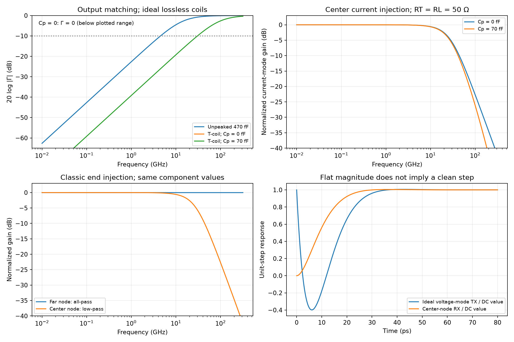

# Broadband I/O and T-Coil Design

Broadband input/output (I/O) interfaces must accommodate driver, electrostatic-discharge (ESD) and pad capacitance while preserving a useful data eye and impedance match. This note studies the distinct bridged T-coil topologies in Razavi's Spring 2021 article [1], incorporating the author's later correction [2]. All seven original PDF pages and the correction were read and visually reviewed. Project calculations use ideal passive-network models; source eye diagrams are source simulations, not project PDK or electromagnetic results.

## 1. What the interface needs to preserve

The source targets 40-Gb/s non-return-to-zero (NRZ) data, 0.5-V single-ended peak-to-peak swing, a 50-Ω line and 10-ps input rise/fall times [1, p. 6]. A 28-GHz bandwidth (0.7 times bit rate) is its starting heuristic. The Nyquist **frequency** is 20 GHz; the bit period is 25 ps. Neither a bandwidth number nor a return-loss curve alone proves negligible intersymbol interference (ISI).

The unpeaked current-mode example has $R_T=R_L=50$ Ω and

$$
C_{tot}=C_{dr}+C_E+C_p=100+300+70=470\ \mathrm{fF}.
$$

Its loaded pole is

$$
f_{3dB}=\frac1{2\pi(R_T\parallel R_L)C_{tot}}=13.545\ \mathrm{GHz}.
$$

For output impedance, suppress the ideal current source and look back into $R_T\parallel C_{tot}$, excluding the line load. With reference impedance $R_L=R_T=R$,

$$
\Gamma(s)=\frac{Z_{out}-R}{Z_{out}+R}=-\frac{sRC_{tot}}{2+sRC_{tot}},\qquad
|\Gamma|=\frac{\omega RC_{tot}}{\sqrt{4+\omega^2R^2C_{tot}^2}}.
$$

At the loaded 3-dB pole, $|\Gamma|=1/\sqrt2$, or −3.01 dB. The −10-dB threshold occurs already at **4.515 GHz**. The article calls $20\log_{10}|S_{22}|$ “return loss” and requests values below −10 dB [1, Eqs. (1)–(2)]. A positive return-loss convention instead uses $-20\log_{10}|\Gamma|$ and requests values above 10 dB. State the convention and the port termination explicitly.

The source's baseline TX eye has approximately 64% of nominal height. With RX parasitics and a short line, the combined bandwidth is approximately 7.2 GHz, eye height 24%, and peak-to-peak jitter 9.4 ps. A 25-cm line worsens the eye [1, pp. 6–7, Figs. 1–2]. Back termination absorbs waves returning from the far end; its power penalty belongs to the specified current-mode comparison, not every possible link architecture.

## 2. Define the circuit before borrowing its equations

Use three nodes, $A$—$X$—$B$. Equal coupled inductors $L_1=L_2=L$ connect $A$ to $X$ and $X$ to $B$. Bridge capacitor $C_B$ connects $A$ to $B$. Absorbed capacitance $C_E$ connects $X$ to ground. Current directions $i_1:A\to X$ and $i_2:X\to B$ enter the respective dotted ends, giving **positive** mutual terms $M=kL$.

| Version | Excitation and termination | Useful output / absorbed capacitance |
|---|---|---|
| Classic gain network, Fig. 3(a)/4(a) | Current injected at $A$; $R_L$ at $B$; no back termination | Center $X$ for a low-pass gain stage; $C_E$ at $X$ |
| Current-mode TX, Fig. 3(b)/5 | Current injected at $X$; $R_T$ at $A$, line equivalent $R_L$ at $B$ | $B$; $C_E+C_{dr}$ at $X$; pad $C_p$ at $B$ |
| Voltage-mode TX, Fig. 3(c)/9 | Voltage source through $R_T$ into $A$; line equivalent $R_L$ at $B$ | $B$; ESD $C_E$ at $X$, driver capacitance at $A$, pad capacitance at $B$ |
| RX, Fig. 3(d)/11 | Incident line represented by source through $R_S$ into $A$; $R_T$ at $B$ | $X$; $C_E+C_{in}$ at $X$, pad capacitance at $A$ |

For small-signal passive analysis, supply termination is AC ground. A matched semi-infinite line or line terminated without reflections acts like a real load; a finite, mismatched, lossy line needs its own two-port model. Extra capacitances remain at their physical nodes rather than being silently combined into $C_E$.

| Symbol | Meaning / unit |
|---|---|
| $L,M,k$ | Self/mutual inductance (H), coupling coefficient $M/L$ |
| $C_E,C_B,C_p$ | Absorbed, bridge and pad capacitance (F) |
| $R,\Gamma$ | Matched termination (Ω), voltage reflection coefficient |
| $\omega_n,\zeta$ | Natural angular frequency (rad/s), damping ratio |
| $V_X/I,V_B/I$ | Center and far-node transimpedance (Ω), not interchangeable |

Assume lossless inductors/capacitors, $|k|<1$, equal inductors, linear components and a real termination. The negative inductance $-M$ in the source's equivalent T network is an algebraic representation of mutual coupling, not an independently realizable negative component.

## 3. Coupled-inductor equations and the published correction

For the classic version with current $I$ at $A$ and $R$ at $B$, KCL and winding equations are

$$
\begin{aligned}
I&=i_1+sC_B(V_A-V_B),\\
0&=sC_EV_X-i_1+i_2,\\
0&=V_B/R+sC_B(V_B-V_A)-i_2,\\
V_A-V_X&=sLi_1+sMi_2,\\
V_X-V_B&=sMi_1+sLi_2.
\end{aligned}
$$

Eliminating currents yields $V_B/I=RN/D$, where the **corrected** general polynomials are

$$
\begin{aligned}
N(s)&=C_BC_E(L^2-M^2)s^4+[2C_B(L+M)-C_EM]s^2+1,\\
D(s)&=C_BC_E(L^2-M^2)s^4+2C_BC_ER(L+M)s^3\\
&\quad+[2C_B(L+M)+C_EL]s^2+RC_Es+1.
\end{aligned}
$$

These are from [2, p. 11, Eqs. (4)–(5)], replacing [1, p. 8, Eqs. (9)–(10)]. They are independently checked against the five physical equations above, including detuned bridge capacitance. Copying the earlier numerator gives an incorrect general transfer. The author's correction states that subsequent design results remain unchanged.

## 4. Constant resistance, all-pass and low-pass are different results

The matching conditions are

$$
R^2C_E=2(L+M),\qquad 2R^2C_B=L-M,
$$

or equivalently [1, p. 8, Eqs. (12)–(15)]

$$
\boxed{L=\frac{R^2C_E}{2(1+k)}},\qquad
\boxed{C_B=\frac{1-k}{1+k}\frac{C_E}{4}}.
$$

Define $\tau=RC_E/2$ and $\beta=(L-M)C_E/2$. Substitution factors the corrected polynomials:

$$
D=(1+\tau s+\beta s^2)^2,\qquad
N=(1-\tau s+\beta s^2)(1+\tau s+\beta s^2).
$$

The resulting transfers are

$$
\boxed{Z_{in}=V_A/I=R},\qquad
\boxed{\frac{V_B}{I}=R\frac{1-\tau s+\beta s^2}{1+\tau s+\beta s^2}},\qquad
\boxed{\frac{V_X}{I}=\frac{R}{1+\tau s+\beta s^2}}.
$$

The far-node transfer is all-pass in magnitude and has right-half-plane zeros; the center-node transfer is a second-order low-pass. Constant input resistance does not imply a constant output phase, zero delay or undistorted data. Losslessness plus a real input resistance explains constant far-node power: the only dissipative element is $R$. Real coil loss and self-resonance remove the ideal “infinite bandwidth” result.

The center-node natural frequency and damping are

$$
\omega_n^2=\frac{2}{(L-M)C_E},\qquad
\zeta^2=\frac{L+M}{4(L-M)}=\frac{1+k}{4(1-k)}.
$$

At $k=0.5$, $\zeta=\sqrt3/2$, $L=R^2C_E/3$ and $C_B=C_E/12$. The simplified inductance expression applies to this coupling; use the general expression when changing $k$. The low-pass group delay is

$$
\tau_g(\omega)=\frac{\tau(1+\beta\omega^2)}{(1-\beta\omega^2)^2+\tau^2\omega^2}.
$$

For $\tau^2=3\beta$ (the $k=0.5$ choice), its quadratic variation around DC vanishes. This is low-frequency maximally flat delay, not uniform delay at all frequencies.

## 5. Why TX current and voltage excitation behave differently

With equal $R_T=R_L=R$, center current injection and no pad capacitance, symmetry gives $V_A=V_B$. No current flows in $C_B$ for this excitation. The transfer reduces to

$$
\frac{V_B}{I_{center}}=\frac{R/2}{1+\tau s+\beta s^2}.
$$

It is a series-peaked second-order network [1, pp. 9–10, Fig. 5]. Changing $C_B$ does not change this ideal symmetric transfer, but **does** change the impedance looking back from the output. Pad capacitance, unequal terminations and asymmetry break that simplification.

The current-mode source example absorbs 400 fF, requiring ideal $L=333.33$ pH and $C_B=33.33$ fF (source rounded values 330 pH, 33 fF). At $C_p=70$ fF the source reports $20\log_{10}|S_{22}|<-10$ dB through approximately 30 GHz. An additional 25-pH center series inductor improves its eye and matching; increasing it further raises jitter [1, Figs. 6–7]. These are idealized source network simulations, not EM-extracted coil results.

For voltage excitation through $R_T=R$, the matched network draws $I=V_{in}/(2R)$, so its far-node voltage is **half the all-pass transfer**. An ideal input step therefore creates an immediate half-scale output jump, followed by a dip and recovery. For the $k=0.5$ model, with $\alpha=\zeta\omega_n$ and $\omega_d=\omega_n\sqrt{1-\zeta^2}$,

$$
\frac{V_B(t)}{V_B(\infty)}=1-\frac{2\tau}{\beta\omega_d}e^{-\alpha t}\sin(\omega_dt),\quad t\ge0.
$$

The calculated minimum is approximately **−0.399 of final value**, despite perfectly flat frequency magnitude. Finite edge time, driver capacitance at $A$ and pad capacitance at $B$ suppress the immediate jump, but also alter matching and bandwidth [1, pp. 10–11, Fig. 9]. Do not infer an eye opening from all-pass magnitude alone.

The voltage-mode source's prose uses 300-fF ESD capacitance and its 250-pH/25-fF values imply exactly 300 fF for $k=0.5$, while **Fig. 10 labels $C_E=330$ fF**. Preserve this inconsistency rather than selecting an undocumented value. Using 330 fF in the ideal equations instead gives 275 pH and 27.5 fF. The source reports −10-dB matching through approximately 20 GHz for its depicted voltage-mode case.

The RX uses the center-node low-pass output, with $C_E+C_{in}=350$ fF, approximately 290-pH inductors and 30-fF bridge capacitance, plus 70-fF pad capacitance. Its reported −10-dB input matching extends to approximately 28 GHz [1, pp. 11, 15, Fig. 11]. The RX does not have the voltage-mode TX's ideal far-node step artifact.

All plots use explicit ideal passive models; they do not reproduce source eyes or include coil resistance, self-resonance or a full transmission line.

## 6. Practical design and validation

Voltage-mode TXs can save power but need rail-to-rail high-speed gate drive, programmable output resistance and supply decoupling. The article's one-quarter-power comparison assumes its matched swings and driver definitions; it is not a complete transceiver power ratio. Output MOS resistance is nonlinear and PVT dependent. Current-mode TXs offer different swing/headroom and bias tradeoffs.

For a process implementation, extract winding $L_1,L_2,M$, frequency-dependent loss, self-resonance, pads, ESD and package in a consistent multiport EM model. Verify passivity and the dot convention; a sign mistake in $M$ changes the matching equations. Simulate return loss with the proper opposite-port termination, then connect the actual channel and RX and test PRBS plus long-run/alternating sequences. Measure eye height/width at the intended sampler, deterministic jitter and voltage stress; check supply noise and PVT changes in termination resistance. Include source-rise-time sensitivity and post-layout routing.

The [analysis script](code/razavi_third_batch_analysis.py) checks corrected polynomials, coupled-inductor MNA, matching and symmetry. The [third-batch review record](sources/razavi-third-batch-verification.md) records source anchors and discrepancies. Related: [CTLE](Continuous-Time-Linear-Equalizer.md), [TIA](Transimpedance-Amplifier-Design.md), [bandwidth calculations](Amplifier-Bandwidth-Calculations.md).

## References

[1] B. Razavi, “The Design of Broadband I/O Circuits,” *IEEE Solid-State Circuits Magazine*, Spring 2021, printed pp. 6–11, 15; seven PDF pages. [DOI: 10.1109/MSSC.2021.3072299](https://doi.org/10.1109/MSSC.2021.3072299). [Original PDF](https://www.seas.ucla.edu/brweb/papers/Journals/BR_SSCM_2_2021.pdf). The unrelated Circuit Intuitions text above the final continuation is excluded.

[2] B. Razavi, “The Design of an Equalizer—Part Two,” Winter 2022, “Corrections to Previous Articles,” printed pp. 11–12, especially Eqs. (4)–(5). [DOI: 10.1109/MSSC.2021.3126997](https://doi.org/10.1109/MSSC.2021.3126997). [Original PDF](https://www.seas.ucla.edu/brweb/papers/Journals/BR_SSCM_1_2022.pdf). The corrected transfer is independently derived above; the bibliographies' older sources were not separately read for this note.
