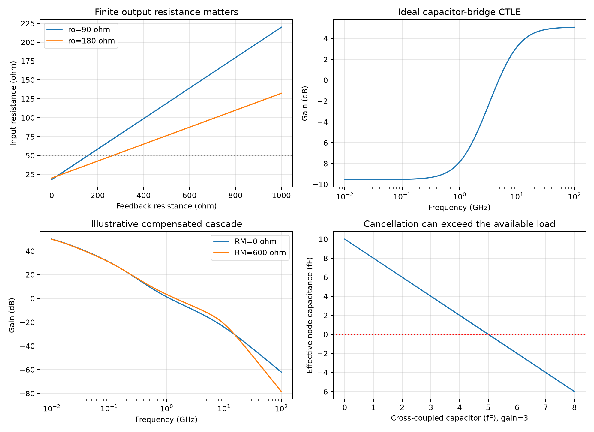

# CMOS Inverter Analog Front Ends

This note develops continuous-time inverter models for impedance matching, gain, equalization, amplification and frequency translation. Source IDs P1–P5 refer to the fully reviewed [CMOS inverter series](CMOS-Inverter-Applications.md). All source figures and equations were checked against their original pages. The calculations below are independent small-signal models; source transistor simulations retain their original conditions and are not project validation.

## 1. Nodes, bias and the basic feedback stage

An NMOS connects output $y$ to ground and a PMOS connects it to $V_{DD}$; their gates share input $x$. With supply and bulk at AC ground, define

$$
G_m=g_{mn}+g_{mp},\qquad g_o=g_{on}+g_{op},\qquad r_o=1/g_o.
$$

| Symbol | Meaning / units |
|---|---|
| $v_x,v_y$ | Incremental gate/output voltages (V) around a specified operating point |
| $G_m,g_o$ | Inverter transconductance and output conductance (S) |
| $R_F,R_S$ | Output-to-input feedback and external source resistance (Ω) |
| $C_x,C_y$ | Total input and output capacitances (F); additional mutual capacitance must be stamped separately |
| $S_i,S_v$ | One-sided current/voltage PSD (A²/Hz, V²/Hz) for $f>0$ |
| $s=j\omega$ | Laplace frequency; $\omega=2\pi f$ (rad/s) |

Open-loop voltage gain is $-G_m/(g_o+sC_y)$. This model requires both devices near their intended conducting region and sufficiently small excursions. Supply noise also moves the trip point and PMOS source voltage; treating the supply as an ideal AC ground suppresses a real coupling path. Pseudodifferential subtraction cancels only matched common disturbances and does not replace a regulator or common-mode control.

Add $R_F$ from $y$ to $x$. Output KCL gives

$$
(g_o+sC_y+1/R_F)v_y+(G_m-1/R_F)v_x=0.
$$

Ignoring input capacitance for the moment, $i_x=(v_x-v_y)/R_F$, hence

$$
\boxed{Z_{in}(s)=\frac{1+R_F(g_o+sC_y)}{G_m+g_o+sC_y}},\qquad
R_{in}=\frac{R_F+r_o}{1+G_mr_o}.
$$

With $C_x$, the port admittance is $sC_x+1/Z_{in}(s)$. The approximation $R_{in}=1/G_m$ requires large $r_o$ relative to $R_F$; it is not a universal input impedance [P1, p. 10, Fig. 8, Eqs. (5)–(6)].

**Source numerical discrepancy:** P1 p. 11 gives $G_m\approx44$ mS, $r_o=90$ Ω, then uses denominator 9 and reports $R_{in}\approx66$ Ω at $R_F=500$ Ω. The stated parameters instead give $1+G_mr_o=4.96$, $R_{in}=118.95$ Ω, and $R_F=158$ Ω for exactly 50 Ω. Denominator 9 would require $G_m\approx88.9$ mS at 90 Ω. Preserve the plotted source simulation separately; these calculations cannot identify which reported parameter is incorrect.

## 2. LNA matching and noise require the same loaded model

Connect a Thevenin source $v_s,R_S$ to $x$. At low frequency, with $g_F=1/R_F$, $g_S=1/R_S$, the exact signal/noise equations are

$$
\begin{bmatrix}g_S+g_F&-g_F\\G_m-g_F&g_o+g_F\end{bmatrix}
\begin{bmatrix}v_x\\v_y\end{bmatrix}
=\begin{bmatrix}g_Sv_s+i_x\\i_y\end{bmatrix}.
$$

For inverter channel-noise current injected at $y$, the equivalent source-voltage PSD is

$$
S_{v,eq,channel}=\left|\frac{1+R_S/R_F}{G_m-1/R_F}\right|^2 S_{i,channel}.
$$

Use $S_{i,channel}=4kT(\gamma_ng_{mn}+\gamma_pg_{mp})$ only when the white MOS noise approximation applies. Add flicker, induced-gate effects and correlations where relevant. A resistor-noise source for $R_F$ injects equal and opposite currents into $x,y$; stamp that source as a correlated two-node vector. Counting its two terminal injections as independent would give the wrong noise.

Noise factor is $F=1+S_{v,eq,added}/(4kTR_S)$ when all source/noise temperatures equal $T$; noise figure is $10\log_{10}F$. P1 Eqs. (7)–(9) instead use a high-gain input-voltage-noise model and explicitly neglect $R_F$ noise. Their matching/noise approximations must be reconciled with finite gain before using a 3-dB bound or the source's 1.9-dB estimate. A process-specific $\gamma$ cannot be silently replaced by 2/3 to reproduce the source number.

P1 Fig. 9 reports roughly 0.9–1.05-dB NF, 11-dB voltage gain and 5.2-mW power for the source circuit over 1–6 GHz. These are source simulation results, distinct from the inconsistent numerical substitution above.

A passive current-mode mixer can severely load this LNA. With load $R_{mix}$, replace $r_o$ by $r_o\parallel R_{mix}$ in the output KCL; as $R_{mix}\to0$, $v_y\to0$ and $R_{in}\to R_F$. P4 pp. 13–14, Fig. 14 instead uses two forward inverters and a third inverter feeding output current back to the input. For positive forward magnitude $A_1G_{m2}R_{mix}$,

$$
R_{in}\approx\frac{1}{A_1G_{m2}R_{mix}G_{m3}}.
$$

Thus $A_1=5$, $G_{m2}R_{mix}=1$, $G_{m3}=4$ mS yield 50 Ω. Finite conductances, frequency response and all three stages' noise still enter. P4 Fig. 15's sub-1-dB NF above 1 GHz and $S_{11}$ below −10 dB to about 8.5 GHz are source simulations, not an independently reproduced receiver.

## 3. Self-bias, AC coupling and oscillator loading

At DC, an isolated gate with $R_F$ feedback approaches $v_x=v_y$ at the inverter trip point. An input coupling capacitor $C_C$ passes a signal without imposing its external DC level [P1, pp. 11–12, Fig. 10]. If the amplifier input is represented by constant $R_{in}$ in parallel with $C_x$,

$$
\frac{v_x}{v_s}=\frac{sC_C}{1/R_{in}+s(C_C+C_x)}.
$$

The high-pass pole is $1/[R_{in}(C_C+C_x)]$; high-frequency attenuation is $C_C/(C_C+C_x)$. Choosing $C_C=10C_x$ gives 0.909 voltage transmission, about −0.83 dB. The common approximation $1/(2\pi R_{in}C_C)$ requires $C_C\gg C_x$ and negligible source impedance. Include frequency-dependent feedback impedance for a fuller model.

The source's 30-fF example reaches about 7.5 dB at 6 GHz. An oscillator feeding this stage sees additional loss and capacitance. A reported large-signal increase in effective input resistance does not authorize using a small-signal $R_{in}$ formula at every phase of the cycle; compare loaded/unloaded startup, frequency and phase noise.

## 4. Active inductors and capacitor-bridge equalization

With $C_y=C_1$ in the feedback stage, the impedance in Section 1 rises from $(R_F+r_o)/(1+G_mr_o)$ toward $R_F$. Its low-frequency expansion is

$$
Z_{in}(s)=R_{in}+sL_{eff}+O(s^2),\qquad
L_{eff}=\frac{C_1(R_FG_m-1)}{(G_m+g_o)^2}.
$$

It is inductive only for $R_FG_m>1$ in this model. If $g_o\ll G_m$ and $R_FG_m\gg1$, $L_{eff}\approx R_FC_1/G_m$ [P1, pp. 12–14, Figs. 12–13]. An inverter can drive this rising impedance to create peaking/CTLE behavior. Output/input capacitances eventually overturn the inductive range; the circuit also contributes noise and static power.

P4 pp. 10–11, Fig. 6 uses a different CTLE. Inv1/Inv3 drive nodes $x/y$; diode-connected Inv2/Inv4 provide conductances $G_2/G_4$, and capacitor $C$ joins $x,y$. With $G_1,G_3$ as forward transconductances,

$$
\begin{aligned}
(G_2+sC)v_x-sCv_y&=-G_1v_{in},\\
-sCv_x+(G_4+sC)v_y&=-G_3v_{in}.
\end{aligned}
$$

Eliminate $v_y$:

$$
\boxed{H(s)=-\frac{G_1G_4+sC(G_1+G_3)}{G_2G_4+sC(G_2+G_4)}}.
$$

This yields $|H(0)|=G_1/G_2$, $|H(\infty)|=(G_1+G_3)/(G_2+G_4)$,

$$
\omega_z=\frac{G_1G_4}{(G_1+G_3)C},\quad
\omega_p=\frac{G_2G_4}{(G_2+G_4)C},\quad
B=\frac{\omega_p}{\omega_z}.
$$

These reproduce source Eqs. (1)–(6) under its assumptions; source gains are magnitudes, whereas $H$ includes inversion. Loaded diode conductance is actually $G_m+g_o$, and extra output capacitance adds poles. The project example $(G_1,G_2,G_3,G_4)=(1,3,8,2)$ mS, $C=25$ fF gives $f_z=1.415$ GHz, $f_p=7.639$ GHz and 14.648-dB asymptotic boost. It is not the source's 8-dB/20-GHz, 20-fF-load simulation.

## 5. Gyrator port definitions and stability

A gyrator needs opposite transconductance signs. Define $i_{in}=G_2v_x$ and $sCv_x=G_1v_{in}$. Then $Z_{in}=sC/(G_1G_2)$ and $L=C/(G_1G_2)$ [P4, pp. 11–12, Fig. 8, Eq. (7)]. Reversing one sign instead produces a negative inductance or positive feedback.

For the differential Fig. 8(d), let internal odd-mode voltages be $v_x=-v_y$. The capacitor between them carries $2sCv_x$. A diode inverter loads each node by $g_D=G_{m5}+g_{o5}$; a cross-coupled inverter contributes negative local conductance approximately $-g_C$ after its positive output conductance is included. The explicitly defined half-circuit model is

$$
Z_{half}=\frac{2sC+g_D-g_C}{G_1G_2},\qquad Z_{diff}=2Z_{half}
$$

when differential voltage is $2v_{in}$ and differential-port current equals the current entering its positive terminal. A symmetric cross-coupled pair alone has between-node resistance $-2/G_{m,c}$ if its output conductance is neglected, but its **local odd-mode conductance** is $-G_{m,c}$. These are different definitions.

P4 Eqs. (8)–(9) write $(2sC+G_{m5}-G_{m7,8}/2)/(G_{m1}G_{m2})$ while discussing a differential impedance and the pair resistance. The port/pair conversion is not explicit. The formula must not be combined with independently defined device $g_m$ values without reconciling these factors. Positive residual conductance gives $Q\approx2\omega C/(g_D-g_C)$ in the half model; canceling it nearly to zero risks latch or oscillation across corners.

The source's plotted slope of 380 nΩ/Hz corresponds to 60.48 nH through $d|Z|/df\approx2\pi L$ only in the inductance-dominated region. It does not by itself establish the residual resistance, Q, port convention or stability.

## 6. Current reuse and capacitance cancellation

The stacked amplifier in P3 pp. 14–15, Fig. 6 uses two inverters in series between supplies, AC coupling to both gates and AC joining of their outputs. The middle supply node is bypassed by $C_5$. Two equal Thevenin outputs with independent noise share a parallel output: signal voltage remains $Av_{in}$, while noise becomes $(n_1+n_2)/2$. For equal PSD $S_n$ and real normalized correlation $\rho$,

$$
S_{n,out}=\frac{S_n}{2}(1+\rho).
$$

The $\sqrt2$ reduction in voltage noise requires independent noise, matched gain/impedance and adequate coupling. Shared supply noise does not average away. Pseudo-resistor nonlinearity, bypass impedance and stacked headroom set additional limits. The source reports gain about 22, current 20 μA and approximately 9 nV/√Hz near the lower end of its noise plot; this is a spectrum, not integrated RMS noise.

P3 pp. 15–16, Fig. 7 adds capacitors across opposite-polarity paths of a differential two-stage feedback amplifier. If the cross-coupled output has $v_{opp}=+av_x$, the current through $C_N$ is $sC_N(1-a)v_x$. Effective capacitance can fall, but $a(s)$ is complex and frequency dependent. Cancellation is therefore neither a fixed negative capacitor nor an unconditional stability improvement. P3 reports 36→63-GHz bandwidth with 3-fF capacitors, 1.3-dB peaking and about 2 mW. Verify differential and common-mode return ratios, corners and settling before using the peaking.

## 7. Three-stage op amp and high-gain TIA

The P5 pp. 9–10 op amp cascades three inverters. Define positive $g_1,g_2,g_3$ as output conductances, $C_A,C_B,C_C$ as node capacitances, and $G_1,G_2,G_3$ as inverter transconductances. The series Miller branch between $A,B$ has

$$
Y_M=\frac{sC_M}{1+sR_MC_M}.
$$

Its exact small-signal equations are

$$
\begin{aligned}
(g_1+sC_A+Y_M)v_A-Y_Mv_B&=-G_1v_{in},\\
(G_2-Y_M)v_A+(g_2+sC_B+Y_M)v_B&=0,\\
G_3v_B+(g_3+sC_C)v_C&=-G_4v_{in}.
\end{aligned}
$$

Set $G_4=0$ without feedforward; adding the fourth inverter also increases $g_3$ and parasitics. The feedthrough zero of stage 2 satisfies $Y_M=G_2$, giving

$$
\boxed{s_z=\frac{G_2}{C_M(1-G_2R_M)}}.
$$

It is RHP at $R_M=0$, moves to infinity at $R_M=1/G_2$, and becomes LHP for larger $R_M$. **P5 p. 9 names $C_B$ in its RHP-zero expression; the branch model instead gives $C_M$.** Node poles and the feedthrough zero are not interchangeable. Feedforward creates two zeros in the source's factored pole model; a lower LHP-zero approximation requires adequate pole separation and shared negative path signs.

For negative $H=v_C/v_{in}$, define the feedback return ratio as $L=-\beta H$ so its low-frequency value is positive. Phase margin is $180°+\arg L(j\omega_u)$ at $|L|=1$ with a continuous phase convention. Source plots omit the static inversion in displayed phase. Resistance at the external input adds another pole through input capacitance.

P5 reports an uncompensated unity frequency about 30 GHz and dynamic phase −210°, then about 15 GHz/58° PM with $C_M=1$ pF, $R_M=600$ Ω and $C_L=500$ fF. Feedforward helps PM about 10° at 50-fF load with a 3-dB gain cost; it is ineffective at the heavier load. Those remain source results.

The P5 Fig. 4 TIA puts global $R_F$ from $C$ to the photodiode input $x$, while **local compensation is between $x,A$**, not $A,B$. Stamp all four nodes and $C_{PD}$; the op amp's pole estimates cannot be copied directly. The source prose both says $\omega_A$ rises and that the poles at A/B remain unchanged. Use the actual network KCL rather than treating these statements as a complete pole description.

For any TIA, distinguish $S_{i,eq}(f)=S_{v,out}(f)/|Z_t(f)|^2$ from a white-equivalent density formed from integrated output variance. The latter requires $|Z_t(0)|^2$ and a defined effective noise bandwidth; dividing by gain to the first power is dimensionally wrong. P1 p. 14 reports 25-GHz bandwidth but uses 18 GHz in its single-pole noise normalization. P5 reports 35 pA/√Hz from an integrated, strongly colored output spectrum with an 11-GHz noise peak. Neither number establishes a flat input PSD over the signal band. See the separate [TIA note](Transimpedance-Amplifier-Design.md) for ENBW and BER definitions.

## 8. Linearized transconductor

P4 pp. 17–18, Fig. 21 closes a loop around a replica inverter and resistor $R_1$. Let $u$ be the replica gate control, $v_x=u/A$ for a positive correcting amplifier magnitude $A$, and let the replica sink $F(u)$. KCL is

$$
F(u)=\frac{v_{in}-u/A}{R_1}.
$$

If the output copy has exactly $F_2(u)=\alpha F(u)$ at matching drain bias,

$$
i_{out}=\frac{\alpha}{R_1}(v_{in}-u/A),\qquad
\frac{di_{out}}{dv_{in}}=\frac{\alpha}{R_1}
\frac{AF'(u)R_1}{1+AF'(u)R_1}.
$$

The ideal $\alpha/R_1$ follows for large loop gain. Nonlinear $F$ cancels in the perfect replica limit; mismatched output voltage, body bias or device scale breaks this relation. $\alpha=8,R_1=5$ kΩ give 1.6 mS. The source reports about 1.658 mS with 0.14% peak-to-peak variation under its sweep; matching and finite-loop effects must be checked rather than assigning an ideal universal linearity.

## 9. Polyphase filters and translated virtual grounds

For the passive P5 p. 14, Fig. 12(a), differential input fixes the opposite nodes. Unloaded branches give

$$
H_X=\frac{1}{1+sRC},\qquad H_Y=\frac{sRC}{1+sRC},\qquad
H_Y/H_X=sRC.
$$

Thus the ideal phase difference is 90° for positive frequencies, with equal amplitudes only at $\omega RC=1$, where each is $1/\sqrt2$. Loading, R/C mismatch and unequal output impedance spoil this property. An ideal inverter transconductor/capacitor gives $-G_m/(sC)$; P5's active implementation uses extra vertical branches to equalize output impedances. Its Fig. 13 shows $V_X$ exceeding rails, while prose names $V_Y$. Retain the diagram labels and check capacitor feedthrough and each terminal stress; a rails crossing alone is not a PDK reliability test.

P5 p. 15, Fig. 14 uses four nonoverlapping 25%-duty switches to translate held baseband RC/TIA impedances to RF. Without capacitors one resistor is connected at a time, so $Z_{in}=R_L$. The source's near-LO approximation with holding is

$$
Z_{in}(\omega)\approx\frac{R_L}{4[1+jR_LC_L(\omega-\omega_{LO})]}.
$$

The hold condition must be $R_LC_L\gg T_{LO}/4$, in seconds. **The printed $R_LC_L\gg1/(4T_{LO})$ is dimensionally inconsistent.** This is a switched periodically time-varying model; finite switch resistance, overlap/dead time, harmonics and folding remain outside the expression. Replacing $R_L$ by a finite-bandwidth inverter TIA input approximates $Z_{in}\sim1/(4G_{mi})$ near the translated band only under the stated feedback/hold assumptions. The source's 5-GHz RF/5.1-GHz LO example reports about a factor-three voltage reduction, not exactly four at all frequencies.

## 10. Low-voltage active mixer and required checks

P5 pp. 15–16, Fig. 16 separates PMOS gate bias from the RF AC path with a capacitor. LO waveforms drive core source nodes, enabling/disabling the inverter gain; two complementary paths create a differential IF. Resistors $R_1,R_2$ couple the output average back to the PMOS gates to establish common mode. The on-state gain $-G_mr_o$ is not conversion gain: Fourier coefficients of the LO switching function, load and differential normalization enter. For a normalized bipolar 50%-duty switching function, its fundamental coefficient is $4/\pi$ and a single downconverted cosine amplitude has factor $2/\pi$.

LO-driver noise modulates switching time; core, driver and resistor noise fold through the periodic network. The source reports 9-dB conversion gain and **DSB** NF at 5-GHz LO, 1.7 mW. SSB and DSB noise conventions must remain explicit; changing one convention by 3 dB requires the corresponding image/noise assumptions.

The [analysis script](code/razavi_sixth_batch_analysis.py) checks feedback and CTLE KCL, compensation against independently written capacitor-state equations and the source numerical substitutions. Its plots use illustrative parameters:

Before implementation, run bias and supply sweeps, differential/common-mode return-ratio checks, loaded S-parameters, transient peaking/settling and periodic mixer noise/conversion tests. Include actual resistor/device noise, PVT/mismatch and terminal limits. No SPICE, PSS/PAC/Pnoise or EM run was performed for this batch. Full source locators and qualifications are in the [verification record](sources/razavi-sixth-batch-verification.md).
