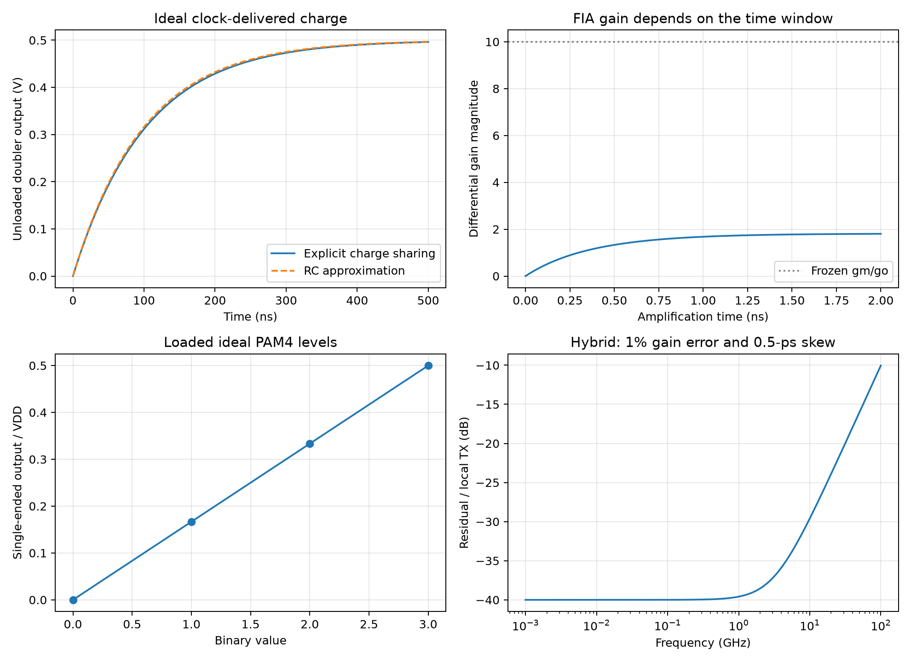

# CMOS Inverter Charge-Domain Circuits

This note covers the voltage multipliers and charge-steering circuits in Razavi's inverter series Part 3, and the autozeroed switched-capacitor integrator in Part 5. The [series map](CMOS-Inverter-Applications.md) defines P1–P5 and their original PDFs. All source pages were reviewed; the equations below are independent ideal-model derivations. Their verification is analytical, without transistor-level or process reliability validation.

## Charge sharing is a state update

Let a flying capacitor $C_X$ arrive with an open-circuit top-plate voltage $V_T$ and share charge with an output capacitor $C_Y$ initially at $V_k$. Assume ideal switches, complete settling, no parasitic capacitance and no load during the event. Conservation of top-plate charge gives

$$
C_YV_k+C_XV_T=(C_Y+C_X)V_{k+1},
\qquad V_{k+1}=aV_k+(1-a)V_T,
\qquad a=\frac{C_Y}{C_Y+C_X}.
$$

With event period $T_e=1/f_e$, the exact envelope time constant is

$$
\tau_{\mathrm{exact}}=-\frac{T_e}{\ln a}
\approx\frac{C_Y}{f_eC_X},\qquad C_X\ll C_Y.
$$

The corresponding slow-switching-limit resistance is $R_{\mathrm{SSL}}\approx1/(f_eC_X)$. This describes discrete, fully settled charge packets. At high switching frequency the finite switch/driver resistance and available settling time become limiting; indefinitely increasing $f_e$ does not indefinitely reduce actual output resistance.

## Voltage doubler and complementary multiplier

P3 pp. 12–14, Figs. 1–3 develop the multiplier. A basic doubler first charges $C_X$ to $V_{DD}$ with its bottom plate at ground. During transfer the driver raises the bottom plate to $V_{DD}$, giving an unloaded top voltage of $2V_{DD}$. The clock driver supplies energy during this step. The voltage rise is not an energy source independent of the supply.

The complementary implementation uses two flying capacitors with opposite clocks and cross-coupled boosted gate drives, transferring two packets per clock cycle. For equal flying capacitors and an ideal small-load limit,

$$
f_e=2f_{ck},\qquad R_{out}\approx\frac{1}{2f_{ck}C_X},
\qquad \overline V_{out}\approx2V_{DD}-I_LR_{out}.
$$

The inter-event load discharge gives approximately

$$
\Delta V_{out,pp}\approx\frac{I_L}{2f_{ck}C_Y}.
$$

This ripple expression excludes clock feedthrough and ESR. If a top-plate parasitic $C_P$ is grounded while the node is floating, its bottom-driven boost is reduced to

$$
\Delta V_{top}=\frac{C_X}{C_X+C_P}\Delta V_{bottom}.
$$

The source's charge-pump example explicitly uses **0.25 V**, overriding the series' usual 0.95-V supply. With $C_X=C_N=100$ fF, $C_Y=2$ pF and $f_{ck}=100$ MHz, the packet model gives $\tau\approx100$ ns and $\tau_{exact}=102.48$ ns. The source's roughly 300-ns, three-time-constant estimate is an RC approximation; it does not model nonlinear transistor startup. An independently chosen 1-µA load would give a 50-mV mean drop and about 2.5-mV ripple. These loaded values are illustrative calculations, not source measurements.

Higher-order multiplier stages change charge delivery, internal losses and device stress. A cascade does not obey a universal output-current scaling rule based only on its stage count. For implementation, tabulate every device's $V_{GS}$, $V_{GD}$, $V_{DS}$ and body-junction bias through startup, steady state and shutdown, including clock skew and overshoot. A boosted gate-to-ground voltage alone does not determine reliability.

## Charge steering and floating reservoirs

P3 pp. 13–14, Figs. 4–5 compare NMOS charge steering, complementary charge steering and the floating inverter amplifier. In the NMOS predecessor, the reported $2C_T/C_X$ gain follows its particular source-capacitor discharge and output-load assumptions. It is not the gain of every capacitor-powered amplifier.

For complementary upper and lower reservoirs $C_{T1}$ and $C_{T2}$, the rail-to-rail charge path sees

$$
C_{eq}=\frac{C_{T1}C_{T2}}{C_{T1}+C_{T2}}.
$$

A capacitor directly between floating rails replaces that series combination, with a different common-mode charge constraint and time-varying device operating point. The [FIA note](Floating-Inverter-Amplifier.md) derives its endpoint gain, reservoir energy and sampled noise. A reservoir-to-output capacitance ratio alone cannot determine its gain.

## Autozeroed switched-capacitor integrator: retain capacitor charge

P5 pp. 12–13, Fig. 10(c) has a sampling capacitor $C_1$, a feedback/storage capacitor $C_2$ and an autozero capacitor $C_3$. Write $C_S=C_1$, $C_F=C_2$. Node $X$ is the summing node, $X'$ is the inverter gate, and $C_3$ connects $X$ to $X'$. Switch $S_3$ shorts the inverter gate to its output during autozero.

| Phase | Connections and retained state |
|---|---|
| $CK_1$ sample/autozero | $C_S$ left plate receives $v_{in}$; right plate $X$ is grounded. $S_3$ closes and establishes the inverter trip-point bias. $C_F$'s right plate is at the output, but **its left plate floats**. Its stored charge survives even though the output returns to its bias level. |
| $CK_2$ integrate | $C_S$ left plate switches to ground; $C_F$ left plate connects to $X$; $S_3$ opens. Stored sample charge and previous feedback charge produce the new output. |

Clocks are nonoverlapping. The output is an integration result only in the second phase. Treating the reset output voltage as the integrator's accumulated state would discard the memory actually retained by $C_F$.

Use incremental voltages relative to the autozero biases. Initially assume $C_3$ perfectly retains its bias and the inverter's effective settled gain is a constant $A>0$, so $v_o=-Av_x$. Let $Q_{old}$ be the charge on the floating left plate of $C_F$ before integration. Summing the sampled and retained charge gives

$$
C_S(v_x+v_{in})+C_F(v_x-v_o)=Q_{old}.
$$

Define the charge-equivalent state $u_{old}=-Q_{old}/C_F$ and $r=C_S/C_F$. Then

$$
\boxed{v_{new}=\frac{u_{old}+rv_{in}}{1+(1+r)/A}}.
$$

$u_{old}$ is not automatically the previous output. If the previous integration had the same settled gain, $Q_{old}=C_F(v_{x,old}-v_{o,old})$, and therefore

$$
u_{old}=(1+1/A)v_{old},\qquad
v_{new}=\lambda v_{old}+kv_{in},
$$

$$
\lambda=\frac{1+1/A}{1+(1+r)/A},\qquad
k=\frac{r}{1+(1+r)/A}.
$$

As $A\to\infty$, $\lambda\to1$ and $k\to r$. With sampling index chosen at the integrated output,

$$
H(z)=\frac{kz^{-d}}{1-\lambda z^{-1}}\longrightarrow
\frac{rz^{-d}}{1-z^{-1}},
$$

where $d=0$ for the input sampled in the same indexed cycle or $d=1$ if indexing assigns it to the following output cycle. This indexing delay is a convention; the physical two-phase timing must be stated separately.

Finite inverter input capacitance $C_g$ makes the gate transfer through $C_3$ approximately $\alpha=C_3/(C_3+C_g)$, reducing the inverter-to-summing-node gain to $A_{eff}\approx\alpha A_{inv}$. It also adds the series-equivalent capacitance $C_3C_g/(C_3+C_g)$ at $X$. Substituting $A_{eff}$ alone is insufficient if that extra charge significantly changes the summing-node equation. Leakage, bias retention, injection, output loading and incomplete settling require phase-specific KCL.

The source reports $C_S=C_F=0.2$ pF, $C_3=0.1$ pF, 1-GHz sampling and 0.5-mW consumption. These do not establish a universal integration accuracy or input noise. Sampled $kT/C_S$, autozero noise and amplifier noise require their actual covariance and transfer to the final sample; correlated phase noise should not be added as independent variances without checking.

## Reproducible models and implementation checks

Run [the analysis script](code/razavi_sixth_batch_analysis.py). It compares discrete sharing with its envelope, and independently stamps the finite-gain integrator charge equation. The model does not reproduce source transistor waveforms.

For a physical pump, sweep load, frequency, flying/output capacitance, switch resistance, parasitics and clock skew; record startup, efficiency, ripple and maximum terminal stresses. For the integrator, save $C_F$ charge through both phases, sweep gain and observation time, test impulse accumulation and long-run leakage, and extract noise covariance at the actual integration sample. Check PVT, mismatch and settling before assigning design accuracy.

Sources: P3 Figs. 1–5; P5 Fig. 10(c), with page/figure checks and source/conversion distinctions in [the sixth-batch record](sources/razavi-sixth-batch-verification.md).
