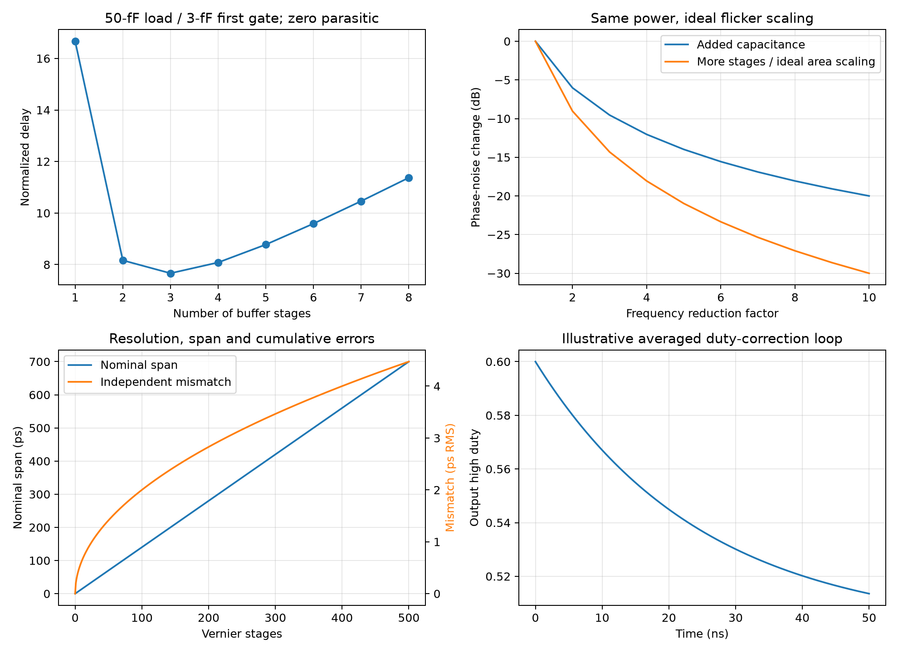

# CMOS Inverter Clock and Timing Circuits

Clock circuits use both inverter gain and finite switching delay. This note connects buffers, oscillators, dividers, phase conditioning and time converters in the fully reviewed [five-part series](CMOS-Inverter-Applications.md), cited as P1–P5. All reported transistor results remain source simulations; the project verifies explicit ideal models and arithmetic without a PDK.

## 1. Definitions and a tapered clock buffer

| Symbol | Meaning / units |
|---|---|
| $C_{in},C_L,F=C_L/C_{in}$ | First gate capacitance, final load (F), total electrical effort |
| $N,h=F^{1/N}$ | Number of driven stages and equal stage effort |
| $t_d,p,\tau$ | Stage delay (s), dimensionless parasitic delay, reference delay (s) |
| $f_0,f_m,T$ | Carrier/offset frequency (Hz), clock period (s) |
| $K_f$ | Frequency sensitivity (Hz/V or Hz/A, explicitly named) |
| $D$ | Fraction of a period above a defined crossing threshold |
| $\Delta t,\phi=2\pi f_0\Delta t$ | Timing error (s), phase error (rad) |

In a first-order RC scaling model, inverter resistance scales inversely with width and gate capacitance scales with width. Equal efforts minimize the sum of delays for a fixed $N$:

$$
t_{chain}=N\tau(F^{1/N}+p).
$$

Treating $N$ as continuous and substituting $h=F^{1/N}$ gives $h(\ln h-1)=p$. Thus $h=e$ only for $p=0$; positive parasitic delay pushes the optimum upward. Choose an integer stage count and check both edge polarities and required inversion [P1, pp. 7–8, Fig. 2].

Power depends on switched nodes, not on this delay optimum alone. For actual gate sizes $C_{in},hC_{in},\ldots,h^{N-1}C_{in}$ and $C_L=h^NC_{in}$, the chain's output loads sum to

$$
C_{outputs}=hC_{in}+\cdots+h^{N-1}C_{in}+C_L.
$$

The external source additionally charges the first $C_{in}$; intrinsic drain/interconnect capacitance and short-circuit current add costs. With a periodic clock and one rising transition per period, $P_{dynamic}=fC_{outputs}V_{DD}^2$ in the ideal chain. For random data use the expected count of 0→1 transitions per second.

P1 Eqs. (1)–(4) include the first input capacitor in a geometric sum; the power boundary therefore includes its driver. Its 3-fF→50-fF example has roughly three stages, reported 22-ps delay and 740-μW power at 10 GHz/0.95 V. The geometric $e$ formula does not exactly represent the implemented 1:3:9 widths and final 50-fF load.

For voltage noise $\delta v$ at a crossing with slope $S$, $\delta t\approx-\delta v/S$. Independent stage timing variances add only after transfer and correlation are specified. Source 100-fs peak-to-peak noise over 100 ns, bandwidth 10 MHz–300 GHz, and its division by six are record-dependent; they do not establish a universal 17-fs RMS value.

## 2. Ring oscillation, scaling and control noise

An odd-inversion loop cannot retain a rail state consistent around the loop. With $M$ similar delay stages, $f_0\approx1/(2Mt_d)$. A plain four-inverter loop can instead retain alternating rail levels. P2 pp. 14–15, Figs. 4–5 couples rings or adds cross-coupled pairs to select differential/quadrature modes; overly strong coupling produces static latch behavior. Here “latch-up” in the article describes unwanted latching, not an established parasitic SCR latch-up event.

P2 p. 12, Eq. (1) gives the flicker-dominated phase model

$$
S_\phi(f_m)=\frac{f_0^2}{2MI_D^2f_m^2}[S_N(f_m)+S_P(f_m)].
$$

The specified $I_D$ and drain-current spectra are sampled under the Fig. 1(b) device bias condition. A $1/f_m$ flicker current spectrum yields $1/f_m^3$ phase noise. Preserve the source convention when reproducing the prefactor; for project one-sided phase PSD, SSB phase noise is $\mathcal L(f_m)=S_\phi^{(1)}(f_m)/2$ in the small-phase limit. PSD bandwidth and amplitude convention must be stated before integrating timing jitter.

Under ideal long-channel scaling, with all else fixed:

| Change | $f_0$ | Power | Flicker phase PSD |
|---|---:|---:|---:|
| Add $n$ times node capacitance | $1/n$ | Constant | $1/n^2$ |
| Increase stage count by $n$ | $1/n$ | Constant | $1/n^3$ |
| Scale both width/length by $\sqrt n$ | Approximately $1/n$ | Approximately constant | Approximately $1/n^3$ |
| Scale widths by $m$ at fixed length | Approximately constant | $m$ | Approximately $1/m$ |

The area scaling keeps $W/L$ and ideal device current fixed while increasing gate area by $n$. Junction capacitance, short-channel physics, loads and bias invalidate exact scaling. The source illustrates 46→15.7-GHz carrier reduction and about −48→−62 dBc/Hz at 1-MHz offset. Normalize comparisons with **power**, not current: a −3.7-dB predicted change is obtained from $(14.1/15.7)^2(340/660)$ only if both denominator values use the same quantity/units. P2 mixes earlier power/current wording; this precision is insufficient for a universal oscillator FoM.

A current source powering a ring creates a CCO. Average charge per cycle gives $I\approx Mf_0C_LV_X$, so the static estimate is $R_X\sim1/(Mf_0C_L)$ [P2, p. 15, Fig. 6]. With bypass $C_B$, $\omega_p\sim Mf_0C_L/C_B$ if $f_0$ is held fixed during the resistance estimate. The source labels this bypass $C_1$ but prose demands a large $C_L$; increasing **bypass $C_1$** lowers that pole. A truly incremental model uses $dI/dV_X$, including $df_0/dV_X$, and the finite output resistance/noise of the source.

Frequency-control noise integrates to phase:

$$
S_\phi(f_m)=\left(\frac{K_f}{f_m}\right)^2 S_u(f_m),\quad
\sigma_t^2=\frac{1}{(2\pi f_0)^2}\int_{f_a}^{f_b}S_\phi^{(1)}(f_m)\,df_m.
$$

A supply-insensitive source can reduce supply pushing while its flicker noise worsens phase noise. Mirror-reference current belongs in the power budget. An inverter-array DCO raises enabled drive while disabled branches still load each node; code monotonicity, tuning steps and low-code noise require actual parasitics [P2, pp. 15–16, Figs. 7–8].

## 3. Pierce crystal oscillator: compare the same impedance form

P2 pp. 16–17, Fig. 9 puts $C_1,C_2$ from inverter gate/output nodes $A,B$ to ground and a crystal between $A,B$. A large feedback resistor establishes DC bias. With inverter $G_m$ and negligible $g_o$, inject port current $i$ at A and remove it at B:

$$
sC_1v_A=i,\qquad sC_2v_B+G_mv_A=-i.
$$

Hence

$$
\boxed{Z_{active}=\frac{1}{sC_1}+\frac{1}{sC_2}+\frac{G_m}{s^2C_1C_2}}.
$$

Its real part at $s=j\omega$ is negative. Source $G_m=10$ mS, $C_1=C_2=10$ pF gives −4.053 kΩ at 25 MHz, agreeing with its approximately −4-kΩ result.

The crystal port is $Z_{xtal}=[R_s+sL_s+1/(sC_s)]\parallel1/(sC_p)$. Series resonance is $1/\sqrt{L_sC_s}$; unloaded parallel resonance is approximately that times $\sqrt{1+C_s/C_p}$. The printed $L_s=12.6$ mH, $C_s=3.4$ fF give 24.316 MHz and 24.351 MHz, not exactly the nominal 25 MHz. Capacitor loading changes the oscillation frequency further.

P2 says −4 kΩ can cancel a parallel-equivalent crystal resistance near $2\times10^{11}$ Ω. These are incompatible series/parallel comparisons. At the actual candidate frequency compare **total admittance** $Y_{active}+Y_{xtal}$: its imaginary part must vanish and its real part must be negative for infinitesimal startup. Alternatively convert both ports to the same series form. Finite $g_o$, $R_F$, load and nonlinear amplitude must be included; the large parallel resistance cannot simply be subtracted from −4 kΩ. The source's roughly 300-μs startup and buffered phase-noise plot remain transistor results.

## 4. Burst recovery, feedforward division and quadrature

P2 pp. 17–18, Fig. 11 uses two rings reset alternately by $D,\bar D$, followed by NAND combination. While one ring is inhibited, the other generates clock cycles. This is transition-triggered restarting, with a finite reset-release transient. It does not continuously correct frequency offset during a long run. For $L$ bits and fractional mismatch $\epsilon$, $|\Delta t|\approx L|\epsilon|/R_b$. Reset strength changes the first edge; matched NAND paths reduce deterministic timing asymmetry. A source 15-GHz example reports 200-fs peak-to-peak jitter, without establishing arbitrary-run BER or RMS jitter.

P2 pp. 18–19, Fig. 13 adds a feedforward inverter from the **first dynamic storage node X** to the **second node Y**, bypassing the main inverter/T-gate path. It accelerates the high-rate transition but fights the stored/main-path value at low rates. The source's 23–54-GHz valid range is therefore bounded on both sides. Correct average frequency alone is insufficient: verify alternating state, duty cycle and output phase for each initial state.

P2 Fig. 14 controls the four main inverter branches of a quadrature ring with alternating CK polarities, retaining weak cross-coupled inverters. It reports division at 60 GHz, failure above about 62 GHz. Clocked-device width 2× main and coupling strength about 0.5× main are source design choices, not PVT-independent constraints. Source PI Figs. 15–16 reuse the earlier [phase interpolator](Phase-Interpolator-Design.md): preserve the averaging **output complement**, overlap/slew condition, finite-feedback summing node and arctangent code law. The 385–690-fs spacing is a source result, not a uniform 16-code resolution.

## 5. Differential phase conditioning and resonant drive

P4 pp. 12–13, Fig. 10 makes one inverter path and one always-on transmission-gate path before restoring both outputs. Equal nominal delay does not imply equal slew or rising/falling delay; the gate path has no voltage gain. Weak cross-coupled output inverters encourage complementary switching but risk latching if oversized.

Fig. 12 instead joins **X1 to Y2** and **Y1 to X2** with always-on T-gates, connecting approximately same-phase nodes of opposing paths. A local two-source model with output resistance $r$ and joining resistance $R_E$ gives

$$
v_1-v_2=\frac{R_E}{R_E+2r}(u_1-u_2).
$$

Equal-slope edges therefore reduce small timing skew by that factor. It is a local linear illustration; actual inverter nonlinearities and capacitances determine the source's tenfold reduction at 20 GHz. Input 20° is 2.778 ps; its reported pre-correction 27° is 3.75 ps, not the original input skew.

P3 pp. 17–18, Fig. 12 uses shunt inductor $L_0$ **between A and B**, series $L_1,L_2$ to 100-fF output loads, and a cross-coupled inverter pair. Odd-mode half shunt inductance is $L_0/2$. Positive feedback increases swing but can create a free-running/injection-locked oscillator. Source values $L_0=160$ pH, $L_1=L_2=35$ pH, Q=10 at 56 GHz yield about 740-mVpp single-ended swing and 6 mW. The ideal full-rail capacitive benchmark $2fC_LV_{DD}^2=10.108$ mW has a different swing/model boundary. Narrowband peaking does not universally attenuate input phase modulation; characterize sideband transfer and added oscillator/buffer noise.

## 6. Duty correction: static bias and a closed loop

For input rising/falling slopes $S_r>0,S_f<0$, adding gate offset $\Delta v$ shifts crossings by $-\Delta v/S_r$ and $-\Delta v/S_f$. Thus the interval above threshold expands by $\Delta v(1/S_r-1/S_f)$; the inverting output's high interval shrinks. For equal slope magnitudes this is $2\Delta v/S$ [P1, pp. 12–13, Fig. 11]. A current injection creates $\Delta v\approx I R_{in}$ only in its local bias model. Source 180 mV and 10-ps/0.95-V edges predict 3.789 ps; clamp behavior and terminal stress must be checked for shifted inputs beyond rails.

P5 pp. 11–12, Fig. 6 makes controlled starved inverters. Raising $V_c$ strengthens pull-down and weakens pull-up, narrowing their **high** output interval in the displayed Fig. 6(b), despite the prose calling it an increase. Ordinary inverters between starved stages preserve cumulative correction polarity. The final ordinary inverter makes the controlled chain's sensed high-duty $D_E$ increase with $V_c$.

The charge pump discharges during E high by $I_D$ and charges during E low by $I_U$. Average control dynamics are

$$
C_c\frac{dV_c}{dt}=I_U(1-D_E)-I_DD_E.
$$

At lock $D_E=I_U/(I_U+I_D)$; equal currents give 50%. With $K_D=dD_E/dV_c>0$, the restoring pole is $(I_U+I_D)K_D/C_c$. Pump mismatch biases the lock duty, while leakage, ripple, rail compliance and delays modify it. The analysis script equivalently models the starved output duty with negative sensitivity and opposite pump observation sign. Source $I_U=I_D=50$ μA, $C_c=0.5$ pF at 10 GHz yields about 51%, 1.2 mW; this result does not demonstrate exact 50% over PVT.

## 7. TDC and DTC resolution, range and calibration

P3 pp. 17–19, Figs. 13–15 uses a Vernier TDC with two delay chains. If $d_B-d_A=\Delta>0$ and input lead is $\delta$, the $k$th stage difference is $\delta-k\Delta$ under a consistent edge convention. Nominal magnitude range is $N\Delta$, with quantization variance $\Delta^2/12$ only for a uniform independent quantization error. Accumulated mismatch is $\sum_j(d_{Bj}-d_{Aj}-\Delta)$; independent unit error variance gives $N\sigma_\Delta^2$, and common correlated error can grow as $N^2$.

Inverting chains alternate edge polarity. Stage arbiters must compare corresponding transitions with the correct polarity; metastability and bubbles require encoding/calibration. A single one-direction catch-up chain does not inherently measure both error signs. Swapping leading/lagging inputs with a sign detector gives magnitude plus sign; a centered/pre-delayed architecture instead needs the entire signed span.

At 7 GHz, $3T_{VCO}=428.571$ ps. With 1.4-ps steps this requires **307** magnitude intervals; a contiguous range from −428.571 to +428.571 ps requires **613** intervals. The source states ±3 periods but calls 430 ps its full scale and quotes 306 stages; the sign architecture and endpoint rounding are not specified. Treat those as incomplete range definitions, not a complete signed TDC.

A capacitive DTC changes delay approximately by $\Delta t\approx R_{eff}\Delta C$ or by $\Delta C\,\Delta V/I$ in a constant-current edge model. Both are local approximations. At 350-fs nominal steps, 430 ps requires 1,229 increments, not a demonstrated physical capacitance ratio of exactly 1,230: total node capacitance also contains baseline gate/drain/wiring components. Putting all increments on one node slows its edge and magnifies voltage-to-time noise. Multiple stages reduce local loading but introduce interstage gain/slope mismatch.

For code $k$ define $DNL_k=(t_{k+1}-t_k)/\Delta-1$ and $INL_k=[t_k-t_0-k\Delta]/\Delta$ relative to the named endpoint or fitted reference. A nonlinear delay error $a_2u^2$ mixes shaped high-frequency code noise into low frequencies. A DTC reduces a fractional-N TDC's range only after timing alignment and calibration; its distortion and added jitter remain loop inputs.

## 8. Verification and implementation tests

The [script](code/razavi_sixth_batch_analysis.py) checks buffer effort, oscillator scaling, active crystal-port KCL, duty-loop sign, phase-alignment KCL and TDC arithmetic. These ideal models are not reproductions of the source GHz waveforms. For implementation, sweep startup/initial states, both clock edges and duty cycles, run length/frequency offset, PVT/mismatch, code endpoints, arbiter metastability and noise observation duration. Use actual terminal voltages for overshoot and resonant loads. The [verification record](sources/razavi-sixth-batch-verification.md) separates source errors from OCR issues.
