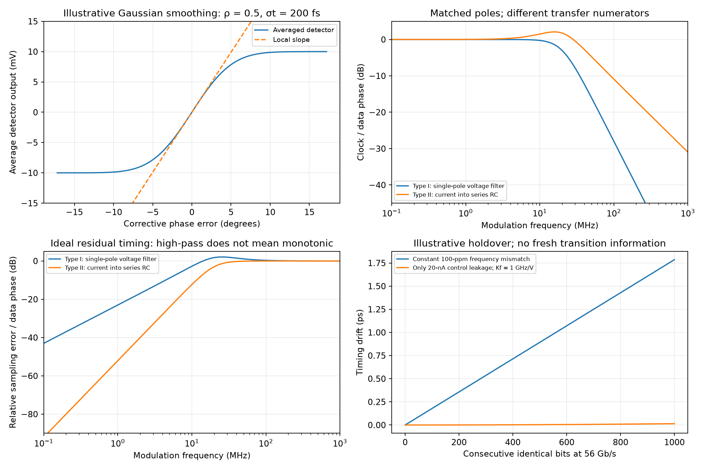

# Clock and Data Recovery

Clock and data recovery (CDR) aligns receiver sampling with incoming data transitions despite clock-frequency error, channel distortion and timing noise. This note studies Razavi's 56-Gb/s full-rate analog CDR [1], reconstructs the Alexander detector and current-steering circuits, derives separate loop models, and extends the analysis to transition density, holdover and relative timing error. All six original PDF pages, printed pp. 11–15 and 116, were read and visually checked. Independent analytical checks are complete; source simulations are not project PDK, post-layout or silicon results.

Related: [CTLE](Continuous-Time-Linear-Equalizer.md), [DFE and CML latch](Decision-Feedback-Equalizer-and-CML-Latch.md), [phase interpolator](Phase-Interpolator-Design.md), [VCO](Millimeter-Wave-VCO-Design.md) and [frequency synthesizer](Millimeter-Wave-Frequency-Synthesizer.md). The [fifth-batch record](sources/razavi-fifth-batch-verification.md) preserves source locators, diagram/model differences and conversion defects.

## 1. Scope and two different receiver architectures

The source targets 56-Gb/s NRZ data, 0.3-Vpp single-ended input swing and <10-mW CDR power. Its simulations use 28-nm CMOS, slow–slow, 0.95 V and 75 °C [1, p. 11]. The full-rate oscillator operates at 56 GHz, with $T_b=17.8571$ ps.

In a receiver with CTLE plus DFE, the CDR can supply clocks while the DFE makes data decisions. For a less lossy channel, the CDR detector's flip-flops can also deliver retimed data. Input swing alone does not define eye height, ISI, transition density, common mode or BER margin.

The earlier PI article [2] uses transmitted 28-GHz quadrature clocks and a half-rate CDR that adjusts a phase interpolator. The present article instead adjusts the frequency/phase of its own 56-GHz VCO. A 28-GHz PI is not a drop-in component of this full-rate feedback path; a half-rate detector, clock map and phase-control mechanism must first be specified.

| Symbol | Definition / units |
|---|---|
| $\phi_{in},\phi_{CK},e$ | Input timing phase, clock phase and corrective error (rad), after defining the sampling-edge reference |
| $a,b$ / $V_A,V_B$ | Boolean XOR values / physical gate voltages |
| $K_{pd}$ | Local averaged voltage-detector gain (V/rad) |
| $K_f,K_\omega$ | Local VCO slope (Hz/V), $K_\omega=2\pi K_f$ (rad/s/V) |
| $G_m,K_i$ | Transconductance (A/V), $K_i=G_mK_{pd}$ (A/rad) |
| $\omega_p,\omega_n,\zeta$ | Voltage-filter pole (rad/s), loop natural frequency (rad/s), damping ratio |
| $H,E$ | Clock/input phase transfer and relative-error transfer $E=1-H$ |

## 2. Sampling, storage and the Alexander detector

A random-data detector must distinguish phase errors only when the data provides useful transitions. A conventional PLL PFD cannot simply substitute for it: treating every absent data edge as a missing reference edge would change the clock during long runs.

Source Fig. 5 uses four flip-flops:

- FF1 samples $D_{in}$ on rising CK; FF3 delays FF1's output by one CK cycle.
- FF2 samples $D_{in}$ on rising $\overline{CK}$, hence falling CK.
- FF4 samples FF2's output on rising CK. It aligns the intervening half-cycle sample with the two rising-edge samples.
- After a rising CK edge, FF3 provides earlier sample $S_1$, FF4 provides middle sample $S_2$, and FF1 provides newest sample $S_3$. Ideal sampling/storage uses the pre-edge inputs of FF3/FF4; clock-to-Q races and skew are physical constraints.

The aligned XOR outputs are $a=S_1\oplus S_2$ and $b=S_2\oplus S_3$. Lowercase $a,b$ denote logical values; $V_A,V_B$ denote analog gate outputs.

| Sample pattern | $a,b$ | Source Fig. 4/5 label | Information |
|---|---|---|---|
| $S_1=S_2\ne S_3$ | 0,1 | Late | One correction polarity |
| $S_1\ne S_2=S_3$ | 1,0 | Early | Opposite correction polarity |
| $S_1=S_2=S_3$ | 0,0 | Long run | No transition information |
| $S_1=S_3\ne S_2$ | 1,1 | Not the simple single-transition example | Differential output cancels, but this pattern can flag glitches/noise or invalid sample placement |

The late/early labels here retain the source's convention. The implemented correction sign must be checked from the chosen sampling edge, physical XOR voltage polarity and measured VCO tuning sign. For a standard two-centers-plus-boundary interpretation, the outer samples occupy neighboring bit centers and the middle sample probes their boundary. Consequently, rising CK can provide retimed center samples while falling CK probes transitions. The article's generic description of transition-aligned rising edges is an alternative clock convention, not a reason to move all detector samples onto data boundaries.

Logical “alignment” does not guarantee simultaneously valid analog voltages. FF setup/hold, clock-to-Q, metastability and unequal input-path delays affect the XOR average and locked phase. Compare both transition directions and data histories after settling. Delaying the two samples is essential; comparing raw events taken at different instants would produce meaningless phase signatures.

## 3. Explicit CML latch and symmetric XOR connections

### CML latch

Source Fig. 10 reuses the earlier equalizer latch. Each output node $X,Y$ connects to $V_{DD}$ through 500 Ω. NMOS $M_1$ has drain $X$, gate $D$; $M_2$ has drain $Y$, gate $\overline D$. Their joined sources reach ground through $M_5$, gate CK. Regenerating $M_3$ has drain $Y$, gate $X$; $M_4$ has drain $X$, gate $Y$. Their joined sources reach ground through $M_6$, gate $\overline{CK}$.

High CK enables sensing through $M_1,M_2$; the opposite phase enables cross-coupled storage/regeneration. A master/slave combination supplies an edge-triggered FF; actual CK edge polarity depends on latch order. Source widths are $W_{1\ldots4}=5$ µm, $W_{5,6}=2.5$ µm and $L=30$ nm. The figure annotates $W_{5\ldots7}$ but only draws $M_1$–$M_6$; no seventh device connection is inferred. Clock-dependent tail current, bias/common mode and the complete FF implementation still require a PDK/netlist.

Finite sensing and prior state influence reversal; regenerative gain alone does not establish correct full-rate operation. XOR and routing loads must be present in the FF speed/noise test. See the [DFE note](Decision-Feedback-Equalizer-and-CML-Latch.md) for local sensing/regeneration equations and overdrive recovery.

### Current-steering XOR

Fig. 11 is a symmetric two-tail arrangement, not a six-device series stack. NMOS $M_1,M_2,M_3$ share the left tail $I_1$; $M_4,M_5,M_6$ share right tail $I_2$. The drains of $M_1,M_2,M_4,M_5$ connect to $V_{DD}$; drains of $M_3,M_6$ join at $V_{out}$. Gates are respectively $A,B,V_b,\overline A,\overline B,V_b$. The reference $V_b$ is the input common-mode voltage. A pull-up load connects $V_{out}$ to supply.

If $A=B=0$, both left signal gates are below $V_b$ and $M_3$ steers $I_1$ into the output. If $A=B=1$, $M_6$ steers $I_2$ there. For unequal inputs, at least one high signal gate in each triplet diverts its tail away from the output. For equal $I_1=I_2=I_{SS}$ and complete steering,

$$
I_{out}=I_{SS}[(1-A)(1-B)+AB]=I_{SS}[1-(A\oplus B)].
$$

Thus **current** is XNOR-like; with a resistive pull-up, $V_{out}=V_{DD}-R_DI_{out}$ is XOR-like. Confusing current and voltage polarity reverses the loop correction. The two gates forming detector outputs $V_A,V_B$ together provide a differential signal, with Fig. 7 driving $G_{m1}$ from $V_B-V_A$.

Source dimensions are 1 µm/30 nm and $I_1=I_2=200$ µA for each XOR. It replaces the resistor with a 25-µm/120-nm diode-connected PMOS load to target approximately 500-mV output common mode and retain $M_3,M_6$ saturation. This load is nonlinear: its dynamic conductance and capacitance affect output swing and PD gain. Increasing signal-device widths improves steering but adds load to the FFs. Symmetric topology does not remove skew from routing, input common-mode differences or unequal FF delays.

## 4. Finite bang-bang gain and transition density

An ideal early/late detector reports polarity, not error magnitude. A finite observed average slope arises from clock/data jitter, metastability and analog waveform effects. Source Fig. 12 averages thousands of random-data cycles, reporting an approximately 50° / 2.5-ps linear span, asymmetry and a narrow dead region near 60° [1, pp. 14–15]. At 56 GHz, 50° is 2.480 ps; 10° is 0.496 ps. Its roughly 10° possible displacement is a source observation, not a universal metastability bound.

For an independent illustrative model, define corrective phase error $e$, useful-transition probability $\rho$, signed full-decision voltage magnitude $V_D$, and Gaussian phase uncertainty $\sigma_\phi$. Assume no correction without a transition and an unbiased ideal sign decision on each transition:

$$
\overline V_d(e)=\rho V_D\operatorname{erf}\!\left(\frac{e}{\sqrt2\sigma_\phi}\right),\qquad
K_{pd}=\left.\frac{d\overline V_d}{de}\right|_0
=\rho V_D\frac{\sqrt{2/\pi}}{\sigma_\phi}.
$$

Balanced independent NRZ bits have transition probability 1/2; a periodic 1010 pattern has probability 1. A bursty/encoded pattern can differ substantially. The Gaussian model describes a smoothed average, not metastability resolution or a transistor noise simulation. An illustrative $\rho=0.5$, $V_D=20$ mV, $\sigma_t=200$ fs and $\sigma_\phi=2\pi\cdot56\text{ GHz}\cdot\sigma_t$ gives $K_{pd}=0.11338$ V/rad.

Increasing jitter can widen the average characteristic while reducing its local gain. A gain extracted with one jitter distribution or transition density should not be reused unchanged in another test. Dead zones and asymmetric waveforms also shift the locked operating point and create nonlinear limit cycles. A small-signal linearized loop is meaningful only around a stated stationary operating condition.

## 5. The source's voltage-filter model

Source Fig. 9(b) uses a voltage-output PD with gain $K_{pd}$ (V/rad), a unity-DC single-pole filter $F(s)=1/(1+s/\omega_p)$ and oscillator gain $K_\omega/s$ (rad/V). Define positive effective loop gain $\kappa=K_{pd}K_\omega$ after verifying negative-feedback polarity. Then

$$
L_I(s)=\frac{\kappa}{s(1+s/\omega_p)},\qquad
H_I(s)=\frac{\phi_{CK}}{\phi_{in}}
=\frac{\kappa\omega_p}{s^2+\omega_ps+\kappa\omega_p}.
$$

Matching the denominator to $s^2+2\zeta\omega_ns+\omega_n^2$ gives

$$
\boxed{\omega_n=\sqrt{\kappa\omega_p},\qquad
\zeta=\frac12\sqrt{\frac{\omega_p}{\kappa}}.}
$$

The original prose following Eq. (1), printed p. 13, omits the factor 1/2 in $\zeta$. The expression above follows directly from the displayed block diagram and characteristic polynomial. It is an independent discrepancy record, not a formal publisher erratum.

Relative sampling-phase error is

$$
\phi_e=\phi_{in}-\phi_{CK},\qquad
E_I(s)=1-H_I(s)=\frac{s^2+\omega_ps}{s^2+\omega_ps+\kappa\omega_p}.
$$

Low-frequency data timing fluctuations mostly track into the clock and leave little relative error. Fast data jitter leaves a larger sampling error. $E_I$ is high-pass in its limiting behavior but can peak; the sketch of a monotonic high-pass is not a universal exact magnitude response. Increasing gain at fixed filter pole reduces damping and can increase peaking. “Wider bandwidth is better” requires a noise, stability and jitter-tolerance tradeoff.

This type-I model has one open-loop phase integrator. For a constant frequency error $\Delta\omega$, the linear steady phase offset is $e_{ss}=\Delta\omega/\kappa$, provided the PD remains in range. The illustrative 20-MHz natural-frequency, $\zeta=1/\sqrt2$ model in the plot gives a 22.69° offset for 100-ppm mismatch at 56 GHz. These chosen loop parameters do not reproduce the source's circuit.

## 6. The drawn transconductor/series-RC model is different

Source Fig. 7 instead draws a **current-output** transconductor injecting into $V_{cont}$, with $R_1$ from that node to the top of $C_1$, and $C_1$ to ground. The oscillator senses the node above the resistor. There is no explicit shunt resistor from the control node to ground. For an ideal high-output-resistance transconductor,

$$
i=G_mK_{pd}(\phi_{in}-\phi_{CK})=K_i e,\qquad
C_1\frac{dv_C}{dt}=i,\qquad v_{cont}=v_C+R_1i.
$$

Consequently,

$$
Z(s)=R_1+\frac1{sC_1},\qquad
L_{II}(s)=\frac{K_iK_\omega}{s}\left(R_1+\frac1{sC_1}\right).
$$

It has two integrators at low frequency and a proportional zero. Its parameters and closed-loop transfer are

$$
\omega_n^2=\frac{K_iK_\omega}{C_1},\qquad
2\zeta\omega_n=K_iK_\omega R_1,
$$

$$
H_{II}(s)=\frac{2\zeta\omega_ns+\omega_n^2}{s^2+2\zeta\omega_ns+\omega_n^2},\qquad
E_{II}(s)=\frac{s^2}{s^2+2\zeta\omega_ns+\omega_n^2}.
$$

These are not source Eq. (1)'s numerator or damping relation. For the same poles, type I and type II have different tracking and residual-error responses. The ideal type-II loop eliminates constant frequency error in the linear model, but actual acquisition and bang-bang behavior still need testing.

With finite transconductor output resistance $r_o$ to an AC bias reference,

$$
Z_{eff}(s)=r_o\parallel\left(R_1+\frac1{sC_1}\right)
=r_o\frac{1+sR_1C_1}{1+s(R_1+r_o)C_1}.
$$

Now the open loop has one low-frequency integrator, but the filter is **lead–lag**, not automatically the pure single-pole filter of Fig. 9. Only additional approximations or a different output-sensing/buffer arrangement can make the models coincide. The source provides $R_1=1$ kΩ, $C_1=4$ pF and $G_m=0.6$ mS [1, p. 15], giving a series-RC zero at 39.7887 MHz. It does not provide enough transistor/bias/output-resistance and local VCO-gain data to infer a unique physical loop bandwidth or reconcile all models. For an explicitly illustrative $r_o=10$ kΩ, the pole is 3.61716 MHz; this value is not extracted from the source.

The ideal series capacitor also explains why zero detector current can preserve the control state. With finite $r_o$, leakage, bias drift or unmatched XOR/Gm outputs, it can drift. Do not simultaneously assume ideal holdover and a dissipative single-pole voltage filter without defining its DC bias/hold mechanism.

## 7. Relative jitter, noise and long runs

If data timing and intrinsic oscillator phase noise are independent, a linearized loop gives

$$
S_{\phi,CK,1}=|H|^2S_{\phi,in,1}+|1-H|^2S_{\phi,VCO,1}+\cdots,
$$

$$
S_{\phi,e,1}=|1-H|^2S_{\phi,in,1}+|1-H|^2S_{\phi,VCO,1}+\cdots.
$$

Detector/Gm/filter noise terms need their own injection transfers; correlations require cross terms. The equations use one-sided phase PSD in rad²/Hz. Integrate in linear units and convert to time with $\sigma_t=\sqrt{\int S_{\phi,1}df}/(2\pi f_{CK})$. SSB phase noise is $S_{\phi,1}/2$ under small-phase assumptions.

A clock can have substantial absolute jitter while following the data accurately enough to maintain low **relative** sampling error. Conversely, a very clean free-running clock may fail to follow incoming jitter. In a linear sinusoidal illustration with timing amplitude $A_t$, residual amplitude is $|1-H(j\omega_j)|A_t$. Available timing margin divided by this transfer gives a preliminary tolerance envelope; BER, ISI, frequency acquisition and cycle slips limit its applicability.

For a long run of $n$ identical bits, $a=b=0$ and no new transition phase information is available. Even an ideal held control voltage retains any preexisting frequency mismatch. At fractional error $\epsilon$,

$$
\Delta t\simeq\epsilon\,nT_b.
$$

At 100 ppm and 1,000 bits, drift is 1.7857 ps. An illustrative 0.5-ps drift budget allows only about 280 such bit periods at that mismatch. Equal detector outputs remove intended correction, not oscillator noise, mismatch or supply drift.

For residual current $I_{err}$ into an otherwise held capacitor,

$$
\Delta v_C=\frac{I_{err}t}{C_1},\qquad
\Delta t_{leak}\simeq\frac{K_fI_{err}t^2}{2C_1 f_{CK}}.
$$

An illustrative 20 nA, 4 pF, $K_f=1$ GHz/V and 100 ns gives 0.5-mV control drift and 0.4464-ps timing drift. This model omits finite $r_o$, noise and restoring feedback during transitions. Random input is not a guarantee of bounded run length; line encoding/scrambling and actual run statistics belong in the interface specification.

## 8. VCO topology and source simulation outcomes

Source Fig. 13's oscillator has grounded-source cross-coupled NMOS: $M_1$ drain $X$, gate $Y$; $M_2$ drain $Y$, gate $X$. A center-tapped differential inductor spans $X,Y$; its center tap connects to supply through 300 Ω. Each output has a 60-fF capacitor to ground and a MOS varactor controlled at its tied source/drain by $V_{cont}$. Drawn core devices are 4 µm/30 nm; varactors 4 µm/200 nm. A second similarly loaded stage is a common-source differential buffer with gates driven by $X,Y$, isolating the core from PD kickback. It is not another cross-coupled oscillator and does not show the earlier 30-GHz oscillator's tail mirror.

The figure labels each full center-tapped coil 200 pH. Under the full differential-inductance interpretation, a half tank has 100 pH and an ideal 60-fF-only resonance is 64.97 GHz; varactors/device/routing capacitance lower it. Confirm EM port and half-circuit conventions before using the drawn value as a 56-GHz design equation. The source sets common mode near $V_{DD}/2$ and reports 3-mA consumption for oscillator plus buffer, or 2.85 mW at 0.95 V. The two XORs' four 200-µA tails alone add 0.76 mW, before latch, load/bias, Gm and clock-distribution costs. No final total power establishing <10 mW is supplied.

| Source observation | Locator / conditions | Interpretation |
|---|---|---|
| Settling about 100 ns | p. 15, Fig. 14; 1 kΩ / 4 pF / 0.6 mS | One reported acquisition case, not frequency-capture range |
| Control ripple about 70 mVpp | Fig. 14 | Source attributes much to varactor coupling at twice oscillator frequency; not all a low-frequency tuning disturbance |
| Recovered-clock eye spread about 400 fspp | Fig. 15 | Finite simulation timing spread; not RMS or BER |
| FF3 retimed-data spread about 520 fspp | Fig. 16 | Source data-output observation, distinct from clock jitter |
| Electronic-noise clock spread about 150 fspp | pp. 15, 116, Fig. 17; periodic 28-GHz data pattern, noise up to 200 GHz, 100-ns observation | Transition-rich 1010-type test for a 56-Gb/s/full-rate loop; not a 28-GHz VCO or random-data jitter result |

The last test changes transition density and potentially detector gain from the random-data condition. A 100-ns record contains approximately 5,600 UI; its extremes do not fix an RMS/peak-to-peak conversion. Save edge timestamps and characterize record/sample dependence. Similarly, labeling twice-carrier ripple “benign” requires checking nonlinear mixing, buffer loading and actual timing sensitivity; the plotted voltage magnitude alone is insufficient.

## 9. Analytical verification and implementation plan

Run [the calculation script](code/razavi_fifth_batch_analysis.py):

```powershell
python code/razavi_fifth_batch_analysis.py
```

It verifies Alexander sample-pattern logic and current/voltage XOR polarity, stamps state equations for both loop models independently of their transfer polynomials, checks finite-output-resistance filter KCL, evaluates Gaussian average slope and integrates leakage-induced frequency drift. The 20-MHz natural frequency and $\zeta=1/\sqrt2$ comparison uses intentionally matched poles; the type-II comparison selects $R=2.813$ kΩ to obtain those poles and is not the source's 1-kΩ design.



Implementation verification should include:

1. A complete FF/PD/Gm/VCO netlist with clock polarity, DC operating point, output impedance, local tuning sign/gain and loaded RC connections. Recompute the loop from that circuit and measure calibrated jitter transfer and peaking.
2. PD characteristics over thousands of cycles and multiple random seeds, rising/falling transitions, transition densities, input swings/common modes, channel/CTLE distortions and PVT; assess asymmetry, dead zone and metastability resolution.
3. Frequency-offset acquisition/capture, startup bias, loss of transitions, maximum runs, return from holdover and false lock. The phase-only bang-bang detector does not by itself establish robust frequency acquisition.
4. Recovered-clock phase and latency-aligned data decisions, including ISI, DFE interaction, kickback, unequal paths and code/clock glitches. Count errors; an open finite eye does not establish a low BER.
5. Jitter transfer, generation and tolerance with documented input modulation, bandwidth, observation length and noise settings. Use actual timestamp statistics, verify noise/time-step convergence and keep random-data versus periodic-pattern results separate.
6. Complete receiver power and extracted clock/inductor/routing loads, including all eight latch halves, XOR/Gm bias and oscillator buffer; measure terminal stress and startup over PVT.

These are pending tests, not completed simulations. Extending the analytical models beyond the source improves understanding but does not supply the unavailable device deck or establish silicon performance.

## References

[1] B. Razavi, “The Design of a Clock and Data Recovery Circuit,” *IEEE Solid-State Circuits Magazine*, vol. 18, no. 3, Summer 2026, printed pp. 11–15, 116; six PDF pages. DOI [10.1109/MSSC.2026.3706674](https://doi.org/10.1109/MSSC.2026.3706674). [Original PDF](https://www.seas.ucla.edu/brweb/papers/Journals/BR_SSCM_3_2026.pdf). Full article and all original pages reviewed 2026-10-05. Unrelated CEDA/news material above the continuation on p. 116 is excluded. No formal publisher correction for this article was established here.

[2] B. Razavi, “The Design of a Phase Interpolator,” Fall 2023, printed pp. 6–10. DOI [10.1109/MSSC.2023.3315653](https://doi.org/10.1109/MSSC.2023.3315653). [Original PDF](https://www.seas.ucla.edu/brweb/papers/Journals/BR_SSCM_4_2023.pdf). Fully reviewed in this batch; its half-rate environment is kept separate.

[3] B. Razavi, “The Design of an Equalizer—Part Two,” Winter 2022, printed pp. 7–12. DOI [10.1109/MSSC.2021.3126997](https://doi.org/10.1109/MSSC.2021.3126997). [Original PDF](https://www.seas.ucla.edu/brweb/papers/Journals/BR_SSCM_1_2022.pdf). Previously reviewed in the third batch; the CML latch connection analysis is reused after original Fig. 10 comparison. Other historical bibliography items in [1] were not separately read in this batch.
