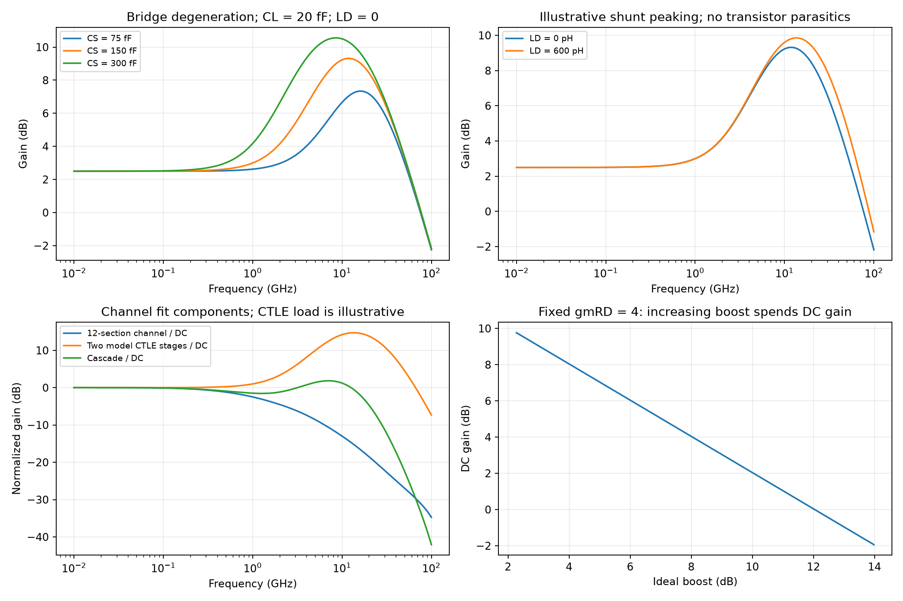

# Continuous-Time Linear Equalizer

A continuous-time linear equalizer (CTLE) shapes a receiver's analog frequency response to reduce channel-induced intersymbol interference (ISI). This note studies the differential RC-degenerated CTLE and scalable copper-channel model in Razavi's Fall 2021 article [1]. All six PDF pages were read and visually reviewed. Channel and CTLE equations are independently checked; circuit dimensions, source eye diagrams and source power are not project transistor simulations.

## 1. System boundary and channel assumptions

The source targets 56-Gb/s NRZ data, approximately 20-dB channel loss at 28 GHz, 800-mV differential peak-to-peak transmitted swing, BER below $10^{-12}$ and a 10-mW CTLE-plus-DFE budget. Simulations use 28-nm CMOS, SS, 75 °C and $V_{DD}=0.95$ V [1, p. 7]. The unit interval (UI) is 17.857 ps, and the Nyquist frequency is half the bit rate, 28 GHz. These definitions apply to binary NRZ; baud rate and bit rate differ for PAM-4.

The alternating 1010 pattern has its fundamental at the Nyquist frequency, but the transition after a long run can have a worse instantaneous eye margin than its eventual periodic response [1, p. 8, Fig. 3]. Evaluate both frequency response and history-dependent waveforms.

### Reconstruct the article's channel

One section of Fig. 1(a) (p. 7) is a passive ladder:

| Location | Component / impedance |
|---|---|
| Input to intermediate node $X$ | 5.55 Ω in parallel with 470 pH; $Z_1=5.55\,s(470\,\mathrm{pH})/[5.55+s(470\,\mathrm{pH})]$ |
| $X$ to ground, branch 1 | Series 2 kΩ and 200 fF |
| $X$ to ground, branch 2 | Series 100 Ω and 80 fF |
| $X$ to section output | Series 77.3 pH |
| Section output to ground | 30.9 fF |

The section's intermediate shunt admittance is

$$
Y_X=\frac{s(200\,\mathrm{fF})}{1+s(2\,\mathrm{k\Omega})(200\,\mathrm{fF})}
+\frac{s(80\,\mathrm{fF})}{1+s(100\,\Omega)(80\,\mathrm{fF})}.
$$

Cascade twelve sections between a 50-Ω source and 50-Ω load. For ABCD convention $[V_{left},I_{left}]^T=\mathbf T[V_{right},I_{right}]^T$, with current flowing rightward,

$$
\mathbf T_{section}=
\begin{bmatrix}1&Z_1\\0&1\end{bmatrix}
\begin{bmatrix}1&0\\Y_X&1\end{bmatrix}
\begin{bmatrix}1&s(77.3\,\mathrm{pH})\\0&1\end{bmatrix}
\begin{bmatrix}1&0\\s(30.9\,\mathrm{fF})&1\end{bmatrix}.
$$

If $\mathbf T_{section}^{12}=[A,B;C,D]$, then

$$
H_{ch}=\frac{V_L}{V_{source}}=\frac1{A+B/R_L+R_S(C+D/R_L)}.
$$

At DC the ladder approaches a wire and $H_{ch}(0)=1/2$ from the terminations. The independently computed **loss relative to DC** at 28 GHz is 21.548 dB, consistent with the article's approximately 21 dB. For matched equal reference impedances, $S_{21}=2H_{ch}$; avoid counting the fixed −6.02-dB voltage divider as an extra channel insertion loss. A separate 25-node circuit solution agrees with the twelve-section ABCD result.

This model represents the fitted channel of the article, not an arbitrary cable or PCB. Real connectors, package discontinuities and dielectric dispersion need measured or EM-derived magnitude **and phase**. A CTLE cannot safely invert a deep spectral notch without severe noise/headroom cost. A DFE can cancel suitable postcursor effects without an analog inverse, but cannot universally recover information removed by every channel zero; precursor ISI, decisions and timing still matter.

## 2. Explicit CTLE topology and symbols

Fig. 4(a) (p. 9) has two NMOS devices with differential input gates, separate source bias-current sinks, and drain resistors $R_D$ to the supply. A **single** $R_S\parallel C_S$ bridge connects the two source nodes. Differential output is the drain voltage difference. Fig. 7 inserts a series inductor $L_D$ between each drain resistor and the supply for shunt peaking.

| Symbol | Definition / model assumption |
|---|---|
| $v_{in},v_{out}$ | Differential gate input / drain output (V), sign chosen for inversion |
| $g_m$ | Transconductance of each NMOS (S) |
| $R_S,C_S$ | Full source-to-source bridge resistance (Ω), capacitance (F) |
| $Z_S(s)$ | $R_S/(1+sR_SC_S)$; half-circuit degeneration is $Z_S/2$ |
| $R_D,C_L,L_D$ | Per-drain load resistance, total model load capacitance, peaking inductance |
| $B$ | Ideal high/low-frequency boost factor $1+g_mR_S/2$ |
| $\omega_z,\omega_p$ | Magnitudes of zero and degeneration-pole angular frequencies (rad/s) |

Initial analysis neglects output conductance, body effect, MOS capacitances, finite bias-source resistance and nonlinear input swing. Perfect differential symmetry fixes the half-circuit symmetry plane. The bridge's factor of two must not be replaced with a per-source resistor convention from a different topology.

## 3. Derive boost from source-node KCL

For one half-circuit, $v_g=v_{in}/2$ and

$$
i_d=g_m(v_g-v_s)=\frac{2v_s}{Z_S},\qquad v_d=-R_Di_d.
$$

Therefore [1, p. 9, Eqs. (1)–(3)]

$$
\boxed{H(s)=-g_mR_D\frac{1+sR_SC_S}{B+sR_SC_S}},\quad
B=1+\frac{g_mR_S}{2},\quad
\omega_z=\frac1{R_SC_S},\quad \omega_p=\frac{B}{R_SC_S}.
$$

At low frequency, degeneration reduces signal transconductance and gain to $-g_mR_D/B$. At high frequency, $C_S$ bypasses the source bridge so the ideal gain approaches $-g_mR_D$. Boost and pole/zero separation both equal $B$. With fixed $g_mR_D$, spending more gain on boost reduces low-frequency gain. Raising $g_m$ also costs bias current or capacitance and must preserve source-bias and drain headroom.

For $g_m=10$ mS, $R_D=400$ Ω, $R_S=400$ Ω and $C_S=150$ fF, the ideal model gives $B=3$ (9.542 dB), DC magnitude 1.333, $f_z=2.653$ GHz and $f_p=7.958$ GHz. These are equation-model values, not the source's approximately unity loaded DC gain and smaller practical boost. Channel-length modulation, loading and device capacitances change the result.

## 4. Pole placement and output loading

Let $K=g_mR_D$ and ignore the output pole temporarily. Then

$$
|H(j\omega)|^2=K^2\frac{\omega^2+\omega_z^2}{\omega^2+\omega_p^2}.
$$

At the degeneration pole,

$$
\frac{|H(j\omega_p)|}{K}=\sqrt{\frac{1+B^{-2}}2}.
$$

For $B=2$ or 3, this is 0.791 or 0.745. Thus placing the pole at 28 GHz leaves the response approximately 2–2.5 dB below the ideal high-frequency plateau. Requiring fraction $\eta$ of that plateau at $\omega_N$ gives the independently rearranged expression

$$
\frac{\omega_p}{\omega_N}=\sqrt{\frac{1-\eta^2}{\eta^2-B^{-2}}},\quad \eta>B^{-1}.
$$

For $\eta=0.95$ and $B=2,3$, the ratios are 0.3866 and 0.3510 [1, pp. 9–10, Eqs. (5)–(8)]. This motivates a pole near one-third of Nyquist only when the assumed boost and output bandwidth hold. An exact pole at $28/3$ GHz with $g_m=10$ mS and $R_S=400$ Ω would need approximately 127.9 fF; the article chooses a practical 150 fF and then optimizes its transistor circuit.

With a series drain inductor and shunt load capacitance, an independent passive load model gives

$$
Z_D(s)=\frac{R_D+sL_D}{1+sC_L(R_D+sL_D)},\qquad
H(s)=\frac{-g_mZ_D(s)}{1+g_mZ_S(s)/2}.
$$

The inductor changes both numerator and poles, extending response or creating peaking. Its series resistance, self-capacitance and supply return require an EM model. With $L_D=0$, $Z_D=R_D/(1+sR_DC_L)$: if this output pole is below the degeneration pole, the ideal high-frequency plateau cannot be reached [1, Fig. 5]. Increase $C_S$ only after understanding this ordering; a stronger/lower-frequency boost can worsen the composite pulse.

The familiar cascade bandwidth factor

$$
f_{3dB,total}=f_0\sqrt{2^{1/N}-1}
$$

applies to $N$ identical **single-pole low-pass** limits. Two yield 0.6436 of a single stage, consistent with the article's approximately 35% reduction [1, Eq. (4)]. Complete CTLEs contain zeros, nonidentical loads and peaking; multiply their actual transfers rather than applying this factor blindly. See [biquad cascade analysis](Tow-Thomas-Biquadratic-Filter.md) for why different response shapes give different factors.

The channel uses the article's ladder values. CTLE curves use an illustrative 20-fF per-drain capacitance and ideal $g_m$, with no transistor parasitics; the normalized cascade is an analytical demonstration, not a reproduction of the source circuit.

## 5. Noise, programming and nonlinear recovery

A CTLE multiplies incoming signal and incoming noise by the same linear transfer; boosting high-frequency signal also boosts noise in that band. Internal noise sources enter at different nodes and must be referred to the DFE interface with their own transfers.

For the ideal bridge alone, a one-sided Norton thermal-noise PSD $4kT/R_S$ gives differential input-equivalent noise

$$
S_{v,RS,eq}(f)=\frac{4kT}{R_S}|Z_S(j2\pi f)|^2
=\frac{4kTR_S}{1+(2\pi fR_SC_S)^2}.
$$

This uses one physical bridge resistor and the same symmetry/KCL assumptions as the gain derivation. It is not the entire CTLE noise: add MOS channel/flicker noise, drain resistors and bias-source/common-mode conversion; then integrate the output PSD over stated limits. Scalar boost does not establish the receiver's sampled noise or BER.

Changing $C_S$ mainly moves the ideal pole and zero; for any nonzero ideal capacitance, the asymptotic $B$ remains fixed by $g_mR_S$. “Programmable boost” via $C_S$ means boost **at a finite frequency such as Nyquist**, after output loading. Lower $C_S$ reduces equalization there; an excessively strong setting on a low-loss channel produces overequalization and ISI [1, pp. 11, 160]. Changing $R_S$ can also change asymptotic boost and DC gain.

Capacitor-bank switch resistance makes the bypass branch $R_{on}+1/(sC_S)$, leaving residual high-frequency degeneration $R_S\parallel R_{on}$. Off-state capacitance changes the minimum boost code. Verify signal-dependent switch resistance, source common mode, mismatch and control-code transitions.

Large swings after a long run can drive the CTLE out of the small-signal model, so a pulse-derived DFE coefficient is a starting point. Source bias currents, overdrive and voltage drops must coexist: it allocates about 2.5 mW per stage, 1.25 mA per transistor, an approximately 170-mV overdrive and a 500-mV drain-resistor drop [1, p. 10]. No general low-supply CTLE can promise an arbitrary boost at unity DC gain.

## 6. Source outcome and a receiver-level verification plan

Source Fig. 7 compares no inductor with 600-pH peaking, reporting an improvement in boost from 5.4 to 6.2 dB and peak frequency from 15 to approximately 20 GHz. The first stage sees the next stage's Miller loading. The second is loaded by representative input devices rather than another active CTLE, so its bandwidth is different [1, pp. 10–11, Figs. 7–8]. These source descriptions must not be treated as identical-stage model parameters.

The two-stage source response reports approximately 14-dB boost at 25 GHz and approximately 8-dB remaining channel-plus-CTLE loss at 28 GHz. Fig. 9's eye is described as 250 mV high and 13 ps wide. Part Two [2, p. 7] describes its starting CTLE as approximately 13-dB boost at Nyquist and a 220-mV / 13.6-ps eye. Keep these distinct reported operating summaries rather than inventing an identical saved simulation deck. The CTLE power is approximately 5 mW, leaving the rest of the specified budget for the DFE.

For implementation, fit channel amplitude and phase including package/connectors; verify loaded CTLE AC response, source/drain headroom and DC offsets over PVT; sweep boost codes and peaking; and run long-run-to-alternating patterns as well as PRBS. Extract the transmitted-symbol pulse response and optimal sampling phase, include output noise and clock jitter, and pass the actual waveform to the DFE/latch. Post-layout parasitics and common-mode behavior remain necessary checks. An apparently open CTLE eye does not prove $10^{-12}$ BER.

The [script](code/razavi_third_batch_analysis.py) compares channel ABCD with nodal KCL, CTLE half-circuit KCL with the derived transfer, and pole/cascade arithmetic. The [review record](sources/razavi-third-batch-verification.md) separates source facts and model extensions. Related: [DFE and CML latch](Decision-Feedback-Equalizer-and-CML-Latch.md), [broadband T-coil I/O](Broadband-IO-and-T-Coil-Design.md), [source-degeneration noise](Degenerated-Resistor-Noise.md).

## References

[1] B. Razavi, “The Design of an Equalizer—Part One,” *IEEE Solid-State Circuits Magazine*, Fall 2021, printed pp. 7–11, 160; six PDF pages. [DOI: 10.1109/MSSC.2021.3111426](https://doi.org/10.1109/MSSC.2021.3111426). [Original PDF](https://www.seas.ucla.edu/brweb/papers/Journals/BR_SSCM_4_2021.pdf). The VLSI symposium report above the final continuation is excluded.

[2] B. Razavi, “The Design of an Equalizer—Part Two,” *IEEE Solid-State Circuits Magazine*, Winter 2022, printed pp. 7–12. [DOI: 10.1109/MSSC.2021.3126997](https://doi.org/10.1109/MSSC.2021.3126997). [Original PDF](https://www.seas.ucla.edu/brweb/papers/Journals/BR_SSCM_1_2022.pdf). Both articles were fully reviewed; historical references listed in their bibliographies were not independently read here.
