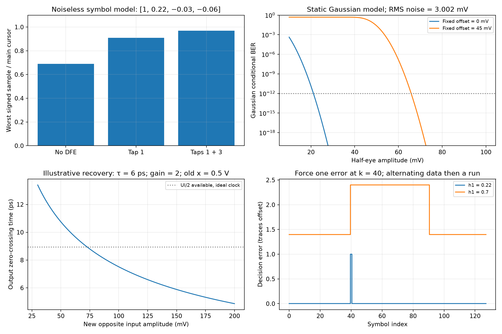

# Decision-Feedback Equalizer and CML Latch

A decision-feedback equalizer (DFE) subtracts estimated tails of previously decided symbols before making the next decision. This note studies the full-rate direct DFE and current-mode logic (CML) latch in Razavi's Winter 2022 article [1]. All six original PDF pages were read and visually reviewed. The symbol, probability and timing models below are independently evaluated; the source's transistor simulations are reported separately from project analytical calculations.

## 1. Scope, symbols and cancellation mechanism

The source targets 56-Gb/s binary nonreturn-to-zero (NRZ) data through a channel with approximately 20-dB loss at 28 GHz, an 800-mV differential peak-to-peak transmitted swing, BER below $10^{-12}$ and a 10-mW CTLE-plus-DFE budget. Its simulations use 28-nm CMOS, SS, 75 °C and $V_{DD}=0.95$ V [1, p. 7]. The unit interval is $T_b=17.857$ ps. The preceding [CTLE note](Continuous-Time-Linear-Equalizer.md) defines the channel and continuous-time equalization.

| Symbol | Meaning / units |
|---|---|
| $a_k,\hat a_k$ | Transmitted / decided binary symbol, normalized to ±1 |
| $p_j,h_j$ | Sampled symbol-response coefficient (V), normalized coefficient $h_j=p_j/p_0$ |
| $r_k,x_k$ | Received / summer differential sample (V) |
| $c_j$ | Feedback voltage per normalized decision (V) |
| $n_k,o$ | Decision-referred random noise / fixed chip offset (V) |
| $\Delta V,\sigma_n,\sigma_{OS}$ | Half-eye amplitude, RMS decision noise, chip-to-chip offset standard deviation (V) |
| $T_{CK-Q},T_{FB},T_{setup}$ | Clock-to-Q, feedback settling, setup time (s) |
| $x,C_L,g_{m,reg}$ | Latch differential output (V), per-node load (F), regenerating-device transconductance (S) |

Choose sampling phase and polarity so that the main cursor $p_0>0$. For a linear channel followed by a linear CTLE, with precursors omitted initially,

$$
r_k=p_0a_k+\sum_{j=1}^{J}p_ja_{k-j}+n_k,
\qquad x_k=r_k-\sum_{j=1}^{J}c_j\hat a_{k-j},
\qquad \hat a_k=\operatorname{sign}(x_k-o).
$$

If past decisions are correct and $c_j=p_j$, each implemented postcursor cancels. The summer retains the main cursor, noise and uncanceled ISI. Negative $p_j$ requires adding the delayed decision: the source's “positive feedback” third tap denotes this signed cancellation. It does not, by itself, establish an unstable continuous-time analog loop. The slicer makes the complete DFE nonlinear and history dependent; it is not a continuous-time LTI inverse filter. Precursors depend on future symbols and cannot be canceled by ordinary causal past-decision taps.

Substitution makes the error mechanism explicit:

$$
x_k=p_0a_k+n_k+\sum_j(p_j-c_j)a_{k-j}
       +\sum_jc_j(a_{k-j}-\hat a_{k-j}).
$$

A wrong binary decision injects a subsequent disturbance of magnitude $2|c_j|$. DFE avoids applying an analog inverse to the incoming noise, but wrong decisions can propagate. For correct past decisions, the conservative noiseless signed margin is $p_0-\sum_j|p_j-c_j|$, before precursors and offset. With normalized coefficients $[1,0.22,-0.03,-0.06]$, the analytical margins are 0.69 without DFE, 0.91 with tap 1, and 0.97 with taps 1 and 3. These are symbol-model margins, not measured eye voltages.

## 2. Obtain taps from the sampled symbol response

The source applies a small 2-ps pulse with 0.1-ps edges, much shorter than one UI. Its channel postcursor ratios are 60%, 41% and 30%; after CTLE they become 22%, −3% and −6% [1, pp. 8–9, Fig. 4]. These impulse-based estimates guide initial taps. The source also warns that CTLE nonlinearity during recovery from long runs can require adjustment.

For an ideal rectangular NRZ symbol, the relevant continuous-time symbol pulse is

$$
p(t)=\int_0^{T_b}g(t-u)\,du,\qquad
h_j=\frac{p(t_0+jT_b)}{p(t_0)},
$$

where $g(t)$ is the channel-plus-CTLE impulse response and $t_0$ is the selected sampling phase. Finite TX edges and a sampling aperture further modify this pulse. In general $h_j$ is not $g(t_0+jT_b)/g(t_0)$.

For the independent illustrative first-order model $g(t)=e^{-t/\tau}/\tau$ for $t\ge0$, $\tau=T_b$, $t_0=T_b/2$, the impulse first-cursor ratio is 0.3679, while the integrated NRZ symbol ratio is 0.9744. This arbitrary phase is not an optimized receiver; it demonstrates why a narrow impulse and a full symbol need different normalization. Estimate actual symbol cursors at the chosen phase, tune with data histories, and include remaining precursor and omitted-tap ISI in the decision budget.

## 3. Feedback deadline and explicit CML latch

The full-rate direct first-tap path must satisfy [1, p. 8, Eq. (1)]

$$
\boxed{T_{CK-Q}+T_{FB}+T_{setup}\le T_b=17.857\ \mathrm{ps}}.
$$

Budget clock skew, jitter and PVT margin as well. $T_{FB}$ includes summer settling and routing, not just wire propagation. Higher taps need accurate delayed history and routing. Half-rate or speculative architectures alter implementation and scheduling; they do not automatically satisfy the deadline of this direct topology. The source chooses CML because its proposed 28-nm StrongARM implementation cannot meet this example's timing; this is not a universal speed ranking of latch families.

Source Fig. 5 (p. 9) connects the devices as follows:

| Device / branch | Connections and function |
|---|---|
| $M_1,M_2$ | Drains at $X,Y$; gates at $D_{in}^+,D_{in}^-$; joined sources at $M_5$ drain: input sensing pair |
| $M_3,M_4$ | $M_3$ drain at $Y$, gate at $X$; $M_4$ drain at $X$, gate at $Y$; joined sources at $M_6$ drain: cross-coupled regeneration |
| $R_D$ | Each output to $V_{DD}$, 500 Ω |
| $M_5,M_6$ | Sources to ground; clock-controlled sensing / regeneration current paths |
| Bias network | Diode-connected $M_7$, $I_R=0.5$ mA, each clock-device gate biased through $R_B=5$ kΩ |
| Clock injection | $CK,\overline{CK}$ AC-coupled to $M_5,M_6$ gates through $C_1,C_2=75$ fF |

The source uses $W_{1-4}=5$ µm, $W_{5-7}=2.5$ µm and $L=30$ nm. $M_5,M_6$ have nominal 0.5-mA biases; the active path reaches approximately 1 mA when the other is off. Complete steering through 500 Ω gives approximately 500-mV output swings and about 1-mW latch power. These source dimensions are not a portable sizing solution.

The master senses with $CK$ high and $M_5$ conducting, then regenerates with $CK$ low and $M_6$ conducting. The slave uses the opposite phase; together they form the full-rate FF. At 56 GHz the source clocks approach sinusoids, so transition time and simultaneous conduction reduce the ideal half-cycle sensing window. Shared coupling capacitors and bias networks must drive the total gate load of all latches, with adequate common mode and saturation headroom.

Near the balanced state during regeneration, an ideal symmetric per-node-capacitance model gives

$$
C_L\frac{dx}{dt}=(g_{m,reg}-1/R_D)x,\qquad
\tau_{reg}=\frac{C_L}{g_{m,reg}-1/R_D}.
$$

Regeneration requires $g_{m,reg}R_D>1$. Finite output resistance adds conductance; clock-dependent bias and internal poles can invalidate a constant exponential. The latch carries an output state from its history, rather than being assumed to fully reset every cycle as a simplified StrongARM model might.

## 4. Overdrive recovery can dominate the eye requirement

After a long run, the input may reverse with a much smaller amplitude. During sensing, the latch must first reverse its old output state before regeneration reinforces the new polarity. Source Figs. 6–7 (p. 10) require the outputs to cross within $T_{CK}/2$. A differential input separation $V_0=70$ mV barely achieves crossing; 100 mV is more robust. Offset and noise can turn the marginal crossing into an error.

An independent illustrative tracking model with input reversed to $-v$ is

$$
x(t)=-Gv+(x_0+Gv)e^{-t/\tau},\qquad
t_{cross}=\tau\ln\left(1+\frac{x_0}{Gv}\right).
$$

For $\tau=6$ ps, $G=2$ and $x_0=0.5$ V, crossing takes 9.119 ps at 70 mV and 7.517 ps at 100 mV; the ideal available half UI is 8.929 ps. These parameters illustrate the mechanism and are not fitted to the source transistor waveform. Increasing small-signal gain alone does not certify recovery: initial state, slew, finite clock transitions and final regeneration time matter.

The article describes allocating another 100 mV for FF behavior. Do not blindly add that number to every static eye budget: establish how the actual differential waveform and prior output state define sensitivity, then test the combined offset/noise/timing case. A static threshold test does not cover this history-dependent failure.

## 5. Separate per-chip BER, offset yield and dynamic sensitivity

The source uses $\tfrac12Q[(\Delta V-4V_{OS})/V_{n,rms}]<10^{-12}$ and approximates the required argument as seven [1, p. 8, Eqs. (2)–(3)]. Its phrase “$4\sigma$ variance” has incorrect dimensions. Interpret $V_{OS}$ in this budget as offset standard deviation, so $4\sigma_{OS}$ is a voltage bound; variance is measured in V². Here $Q$ is the standard normal upper-tail probability, $Q(z)=\tfrac12\operatorname{erfc}(z/\sqrt2)$.

For equally likely binary levels $\pm\Delta V$, fixed offset $o$ and Gaussian decision noise with standard deviation $\sigma_n$, the exact static conditional BER is

$$
P_e(o)=\frac12\left[
Q\!\left(\frac{\Delta V-o}{\sigma_n}\right)
+Q\!\left(\frac{\Delta V+o}{\sigma_n}\right)\right].
$$

A sufficient bound for both tails is

$$
\Delta V\ge |o|+Q^{-1}(10^{-12})\sigma_n,
\qquad Q^{-1}(10^{-12})=7.0345.
$$

This bound is slightly conservative relative to a one-dominant-tail approximation. Manufacturing offset yield is a separate calculation: a Gaussian offset lies within ±$4\sigma_{OS}$ with probability approximately 99.9937%. Conditional BER for those chips is not a guarantee for all manufactured chips, and neither model captures metastability or feedback error bursts.

The article's pair-mismatch model uses $A_{VTH}=4$ mV·µm and $WL=5\times0.03$ µm², giving $\sigma_{pair}=10.328$ mV. The regeneration-pair contribution is referred through the source's approximate factor $g_{m1,2}R_D-g_{m1,2}/g_{m3,4}\simeq2$ [1, p. 10]. Assuming independent contributions,

$$
\sigma_{OS}=\sqrt{\sigma_{pair}^2+(\sigma_{pair}/2)^2}
=11.547\ \mathrm{mV},\qquad 4\sigma_{OS}=46.188\ \mathrm{mV}.
$$

This factor is not simply the unloaded gain $g_mR_D$. The source rounds the offset bound to about 45 mV. It reports 1.5-mV RMS FF noise and 2.6-mV RMS CTLE-plus-summer noise, the latter integrated up to 100 GHz [1, pp. 10–11, Fig. 8]. Independent root-sum-square gives 3.002 mV. Using the unrounded mismatch and conservative quantile above gives a required static **full** eye of 134.606 mV; source rounded arithmetic gives 132 mV.

Combine only consistently referred noise values. Continuous-time PSD requires a stated one-sided or two-sided convention and integration limits; clocked-latch noise requires a decision-time extraction. A 100-GHz integration limit is not proof of a brick-wall receiver bandwidth. Sampling can filter and fold noise, and correlated contributions require covariance terms rather than simple RSS. Timing, residual ISI, clock jitter and dynamic recovery further reduce the usable eye.

## 6. Summer implementation and source outcome

Source Fig. 9 (p. 11) uses an NMOS input pair $M_1,M_2$ sensing CTLE outputs, drains at $A,B$ through 500-Ω resistors to supply, a 1-mA tail and $W=10$ µm. Feedback pair $M_3,M_4$ shares the drain nodes, has a 250-µA tail and $W=2.5$ µm, and connects to opposite FF output polarities to subtract the positive first postcursor. Each output includes an estimated 5-fF layout capacitance. The 0.25 tail-current ratio approximates the initial 0.22 cursor; partial steering, output loading and nonlinearity prevent an exact equality between current ratio and voltage tap coefficient.

Fig. 11 adds a source-to-source $R_S=100$ Ω, $C_S=200$ fF bridge and separate 0.5-mA bias currents for the input pair, adding linear equalization. Fig. 13 adds two FFs to obtain three-UI history and a 60-µA third-tap pair. Because $h_3=-0.06$, this pair adds rather than subtracts the delayed decision. The source omits $h_2=-0.03$; the remaining cursor must fit the residual ISI budget. Verify each physical FF delay and output polarity explicitly.

The source's final eye is approximately 500 mV high and 15.2 ps wide, or 0.8512 UI at 56 Gb/s [1, p. 12, Fig. 14]. It checks that the FF output matches the original transmitted data. DFE power is about 4.5 mW, which with the 5-mW CTLE fits the stated equalizer budget. This does not establish the power of a complete receiver including CDR and all clock generation, or of a transceiver including TX.

The plots are independent analytical illustrations. Forcing one decision error in an alternating sequence followed by a run produces one total error with $h_1=0.22$, but 51 errors with an illustrative $h_1=0.7$. This demonstrates possible propagation; it does not predict the article's BER. The static Gaussian plot conditions on fixed offset and omits timing/ISI errors.

## 7. Verify decisions as well as the eye

The source aligns summer and clock crossings, checks negative first-tap polarity and runs about 20 ns before extracting a steady-state eye from the last few nanoseconds [1, p. 10]. An open eye alone does not establish correct clock phase, latency or decided bits.

For a transistor implementation, reproduce these checks and add:

1. Fit the loaded channel/CTLE symbol response and sweep sampling phase, TX edge time, tap values and omitted precursors/postcursors.
2. Measure first-tap clock-to-Q, feedback settling and setup over PVT and post-layout routing, with skew/jitter margins and sinusoidal clock waveforms.
3. Apply long runs followed by alternating data, test both polarities and extract latch reversal and regeneration times with offset Monte Carlo.
4. Refer CTLE, summer and time-varying latch noise to the same decision interface; include correlations and sampling effects where relevant.
5. Compare latency-aligned decisions with transmitted bits, inject isolated wrong decisions and check burst length, adaptation behavior and error recovery.
6. Record full receiver power boundaries, voltage headroom and actual extracted package/coil/clock parasitics.

A 20-ns record at 56 Gb/s contains only about 1,120 bits. Even zero errors cannot demonstrate BER below $10^{-12}$. Under an independent stationary-error model, the one-sided 95% zero-error bound needs approximately $-\ln(0.05)/10^{-12}=2.996\times10^{12}$ bits, or **53.5 seconds** of hardware observation at 56 Gb/s. Bursts violate the independence assumption; practical low-BER verification needs a justified statistical method and dynamic error testing. No project PDK, post-layout or measured BER is claimed.

The [analytical script](code/razavi_third_batch_analysis.py) verifies symbol cancellation, Gaussian/mismatch arithmetic, pulse normalization, illustrative recovery and forced-error behavior. The [third-batch review record](sources/razavi-third-batch-verification.md) records original locators, Marker defects and the article's formal corrections to [T-coils](Broadband-IO-and-T-Coil-Design.md) and [bandgap wiring](Low-Voltage-Bandgap-Reference.md). Related: [StrongARM](StrongARM-Comparator-Design.md), [comparator noise](Comparator-Noise-Calculation.md), [z-transform](Z-Transform-for-Analog-Designers.md).

## References

[1] B. Razavi, “The Design of an Equalizer—Part Two,” *IEEE Solid-State Circuits Magazine*, Winter 2022, printed pp. 7–12; six PDF pages. [DOI: 10.1109/MSSC.2021.3126997](https://doi.org/10.1109/MSSC.2021.3126997). [Original PDF](https://www.seas.ucla.edu/brweb/papers/Journals/BR_SSCM_1_2022.pdf). The “Corrections to Previous Articles” section spans pp. 11–12. Historical works in its bibliography were not separately read for this note.

[2] B. Razavi, “The Design of an Equalizer—Part One,” *IEEE Solid-State Circuits Magazine*, Fall 2021, printed pp. 7–11, 160; six PDF pages. [DOI: 10.1109/MSSC.2021.3111426](https://doi.org/10.1109/MSSC.2021.3111426). [Original PDF](https://www.seas.ucla.edu/brweb/papers/Journals/BR_SSCM_4_2021.pdf). Independently reviewed in this batch; its CTLE eye summary is retained separately from Part Two's reported starting point.
