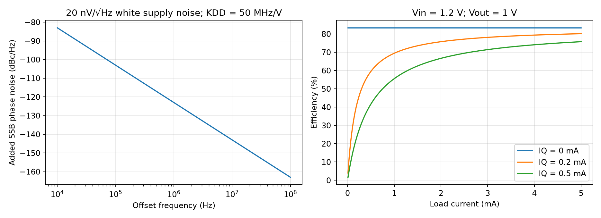

# LDO Regulator Design

A low-dropout (LDO) regulator controls a pass transistor to hold its output against supply and load changes. This note starts from Razavi's Spring 2022 PMOS LDO for an LC oscillator [1] and extends it with explicit noise conventions, supply-feedthrough paths and transient constraints. All five original PDF pages were read and visually reviewed. Source transistor simulations are labeled as such; project verification is analytical only.

## 1. Circuit, polarity and operating conditions

Source Fig. 2 (printed p. 8) connects PMOS $M_0$ from source $V_{in}$ to drain $V_{out}$, with gate $P$. Divider $R_1$ (upper) and $R_2$ (lower) produce $\beta V_{out}$, where $\beta=R_2/(R_1+R_2)$. The error amplifier senses feedback at its noninverting input and $V_{ref}$ at its inverting input and drives $P$.

A rise in output raises $P$, lowers PMOS $V_{SG}$ and reduces supplied current. This polarity closes a negative-feedback loop. In high loop gain, $V_{out}\simeq V_{ref}/\beta$. Reference error and noise remain at the output, scaled by approximately $1/\beta$.

The article's example uses 28-nm CMOS, slow–slow (SS), 75 °C, $V_{in}=1.2$ V, $V_{out}=1$ V, load current up to 5 mA and approximately 0.5-pF oscillator load. It asks for 40-dB supply rejection through 10 MHz and initially less than 50 nV/√Hz at 1 MHz, then tightens the noise requirement through a phase-noise budget [1, pp. 7–8]. These are unusually demanding conditions; this circuit's GHz loop bandwidth is not a generic LDO requirement.

| Symbol | Meaning / unit |
|---|---|
| $A(s)$ | Gate-drive gain from $\beta v_{out}-v_{ref}$, dimensionless |
| $g_m,g_o$ | Pass-device transconductance and output conductance (S) |
| $G_L,C_L$ | Incremental load conductance (S), output capacitance (F) |
| $H_A(s)$ | Direct supply-to-gate feedthrough of the error amplifier |
| $K_{DD,\omega}$ | Oscillator supply sensitivity (rad/s/V); $K_{DD,f}=K_{DD,\omega}/2\pi$ in Hz/V |
| $S_{v,1},e_v$ | One-sided voltage PSD (V²/Hz), ASD $\sqrt{S_{v,1}}$ (V/√Hz) |
| $\mathcal L(f)$ | Linear single-sideband (SSB) phase-noise ratio per Hz |

Small-signal derivations assume a stable operating point with the pass transistor in saturation and fixed bias. They omit nonlinear oscillator supply sensitivity, package coupling and large-signal slew unless stated.

## 2. Translate oscillator requirements into supply requirements

For a small voltage disturbance, the oscillator's angular-frequency deviation is $\delta\omega=K_{DD,\omega}v$. Phase is its time integral:

$$
\phi(s)=\frac{K_{DD,\omega}}s v(s),\qquad
S_{\phi,1}(f)=\left(\frac{K_{DD,f}}f\right)^2S_{v,1}(f).
$$

Using explicitly one-sided phase PSD and small phase modulation,

$$
\boxed{\mathcal L(f)=\frac12S_{\phi,1}(f)}.
$$

An allowed 1-dB degradation to an existing $-110$-dBc/Hz floor means

$$
\mathcal L_{added}\le(10^{1/10}-1)10^{-110/10}.
$$

The **original page** uses $K_{VCO}=2\pi\times50$ MHz/V, not $2\pi\times250$ MHz/V [1, p. 7]. With the article's assumption that supply sensitivity resembles tuning sensitivity, its Eq. (2) gives 32.18 nV/√Hz at 1 MHz. With the explicitly one-sided voltage PSD and SSB convention above, the corresponding limit is **45.51 nV/√Hz**. The article does not specify its PSD side convention, so these are convention-dependent budgets, not evidence by themselves of a numerical typo. Keeping 32 nV/√Hz is conservative under the convention used here. Also distinguish PSD from ASD: an expression for $S_v$ has V²/Hz units even when prose quotes its square root.

For an actual oscillator, extract $K_{DD}$ directly at its operating point. Supply pushing need not equal tuning gain, and amplitude-to-phase conversion or other supply paths can matter. In a phase-locked loop (PLL), integrate the supply-induced phase PSD after applying the appropriate oscillator-noise suppression transfer; the open-loop $1/f^2$ relation alone does not give the PLL output budget.

### Periodic ripple gives spurs

For peak input ripple $V_m\cos(2\pi f_mt)$ and LDO feedthrough magnitude $|H|$, the phase-modulation index is

$$
m_\phi=\frac{K_{DD,f}|H|V_m}{f_m}.
$$

For $m_\phi\ll1$, each first sideband has amplitude ratio $m_\phi/2$ and power ratio $(m_\phi/2)^2$. At $f_m=10$ MHz, $K_{DD,f}=50$ MHz/V and $|H|=0.01$ (40-dB rejection), a $-60$-dBc sideband permits **40-mV peak** input ripple [1, p. 7, ripple discussion; independently evaluated]. This discrete-spur budget differs from random-noise density and integrated jitter.

## 3. Supply rejection and load regulation from KCL

Define $Z_p=1/(G_L+g_o+sC_L)$, $G_m=g_mZ_p$ and $G_o=g_oZ_p$. Take positive $i_L$ as current drawn out of the output. Linearized output KCL gives

$$
v_{out}=G_m(v_{in}-v_P)+G_ov_{in}-Z_pi_L.
$$

Write the gate response as

$$
v_P=A(s)(\beta v_{out}-v_{ref})+H_A(s)v_{in}.
$$

Then $T(s)=\beta A(s)G_m(s)$ and

$$
\boxed{\frac{v_{out}}{v_{in}}=\frac{G_m(1-H_A)+G_o}{1+T}},\qquad
\frac{v_{out}}{v_{ref}}=\frac{AG_m}{1+T},\qquad
\frac{v_{out}}{i_L}=-\frac{Z_p}{1+T}.
$$

These are functional plant equations: amplifier poles, compensation, pass parasitics and load dynamics must be included in the corresponding transfer functions. Source Eq. (3) (p. 8) approximates supply feedthrough by $1/(\beta A)$, assuming $|T|\gg1$, negligible $g_o$ and negligible direct amplifier supply response. With $\beta=0.9$, 40-dB rejection requires $|A(10\,\mathrm{MHz})|>111$ under those assumptions. A single-dominant-pole amplifier would need approximately 1.1-GHz gain-bandwidth product. Direct supply tracking ($H_A$), reference PSRR and parasitic feedthrough can substantially change this inference.

Noise injected at the reference or amplifier input is not suppressed like an output current disturbance. For example, equivalent input voltage noise sees approximately $1/\beta$ at low frequency. A high loop gain cannot make an intrinsically noisy reference quiet. Evaluate all noise contributions and correlations through their own transfer functions.

## 4. Dropout, stability and compensation

The nominal dropout is 0.2 V at 5 mA. PMOS saturation requires $V_{SD}\gtrsim V_{OV}$ in a long-channel approximation; actual short-channel behavior must come from the PDK. Increasing pass width lowers required overdrive but increases gate and junction capacitances, demands more drive current and changes stability. In dropout, the pass device enters a different operating region, gain drops, regulation fails and the saturation-based model must be replaced.

The source's uncompensated loop crosses unity at 4.1 GHz with phase about $-230^{\circ}$, indicating instability. A series $R_C=500$ Ω and $C_C=1$ pF around the pass stage, between $P$ and $X$ as drawn in Fig. 5, yields approximately 2-GHz unity crossing and 53° phase margin [1, pp. 9–10, Figs. 4–6]. These are source simulations, not results generated by this repository.

In a simplified two-stage Miller model, pole splitting can move the output pole toward $g_{m0}/C_L$. The feedforward zero is in the left half-plane if $R_C>1/g_{m0}$, with approximate angular frequency

$$
\omega_z\simeq\frac1{C_C(R_C-1/g_{m0})}.
$$

At $R_C=1/g_{m0}$ that model removes the finite zero; smaller resistance gives a right-half-plane zero. A capacitor connected around a gain stage requires a full small-signal model for an accurate result. See [Miller compensation](Miller-Compensated-Two-Stage-Amplifier.md).

The article identifies maximum oscillator capacitance as its worst phase-margin case. Other LDOs can have their worst condition at light load, heavy load, a different output capacitance or a different process corner. Sweep load current, load conductance, capacitance, compensation tolerance, supply and temperature together; a single nominal margin is insufficient.

## 5. Transients and power accounting

Source Figs. 9–10 (printed pp. 10, 17) apply a 10-ns supply ramp and a 0→5-mA load ramp over 1 ns, with approximately 2-ns correction of the load disturbance. This result includes concurrent transistor response. A capacitance-only bound is

$$
\Delta v=\frac1{C_L}\int\big(i_{pass}-i_L\big)dt,
\qquad |\Delta v|\simeq\frac{\Delta I\,t_d}{C_L}
$$

only if the pass current remains unchanged for delay $t_d$. For 0.5 pF and 5 mA, a 10-mV allowance corresponds to just **1 ps** of completely uncompensated current mismatch. This exposes the inadequacy of an isolated-capacitor delay model; it does not predict an actual multi-volt droop in a 1-V circuit. Fast gate drive, load-transition shape, pass-current response and saturation limits must be simulated together.

At nominal maximum load,

$$
P_{load}=1\times5\,\mathrm{mA}=5\,\mathrm{mW},\quad
P_{pass}=(1.2-1)5\,\mathrm{mA}=1\,\mathrm{mW}.
$$

The input delivers 6 mW before quiescent current. Source p. 7 calls $5\,\mathrm{mA}\times1.2\,\mathrm V$ power “provided to the load”; distinguish input power from the actual 5-mW load power. In general,

$$
\eta=\frac{V_{out}I_L}{V_{in}(I_L+I_Q)}.
$$

Using an illustrative $I_Q=200$ µA gives 6.24-mW input and 80.13% efficiency. The source amplifier's approximately 200-µA bias is not proof that all reference/divider/startup currents sum to that value. Efficiency degrades strongly at light load if $I_Q$ remains fixed.

The left plot assumes open-loop oscillator supply pushing, white one-sided voltage noise and small modulation; the right plot uses explicitly stated illustrative quiescent currents.

## 6. Evidence and implementation tests

Source Fig. 8 (p. 10) reports output noise below approximately 20 nV/√Hz above a few hundred kHz. This does not include arbitrary application reference noise, package coupling or oscillator-specific pushing. Check the complete path before converting it to jitter.

For transistor-level implementation, preserve the operating point while injecting into the feedback loop; sweep supply, process, temperature, load and capacitance. Test supply sine disturbances through 10 MHz, integrated output noise, dropout curves, enable/startup, load steps of both polarities and gate slew. State noise integration limits, output extrema, recovery tolerance and ringing explicitly. Compare the actual $K_{DD}$ and PLL transfer with the phase-noise budget.

The [analytical script](code/razavi_second_batch_analysis.py) independently checks plant KCL, noise-side conventions, ripple and power arithmetic. The [source review record](sources/razavi-second-batch-verification.md) records original-page anchors and conversion defects. No stability simulation or oscillator measurement was performed in the project. Related: [bandgap reference](Low-Voltage-Bandgap-Reference.md), [phase-noise calculations](Phase-Noise-Calculations.md).

## References

[1] B. Razavi, “The Design of An LDO Regulator,” *IEEE Solid-State Circuits Magazine*, Spring 2022, printed pp. 7–10, 17; five PDF pages. [DOI: 10.1109/MSSC.2022.3167308](https://doi.org/10.1109/MSSC.2022.3167308). [Original PDF](https://www.seas.ucla.edu/brweb/papers/Journals/BR_Magzine5.pdf). The unrelated quantum-electronics text on the shared final page is excluded.
