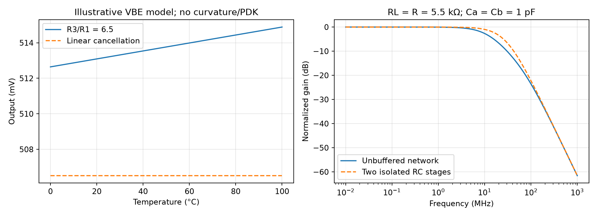

# Low-Voltage Bandgap Reference

This note studies a current-mode, sub-1-V bandgap reference: generate complementary-to-absolute-temperature (CTAT) and proportional-to-absolute-temperature (PTAT) currents, add them, and convert the result to a programmable output voltage. The starting circuit is Razavi's Summer 2021 design [1]. All eight PDF pages were read and visually reviewed. Equations and plots below are independently evaluated models; no project PDK simulation, trimming yield or silicon result is claimed.

## 1. Scope and topology

The source targets a 28-nm implementation with a nominal 1-V supply (±5%), a 0.5-V output, less than 5-mV variation over 0–100 °C, supply rejection above 40 dB, and power below 1 mW [1, printed p. 6]. A reference with low temperature drift can still have an incorrect absolute voltage. Treat accuracy, drift, noise, supply feedthrough and startup as separate requirements.

The core of source Fig. 2 (p. 7) has these connections:

| Element | Connection / role |
|---|---|
| PMOS $M_1,M_2$ | Sources at $V_{DD}$; common gate $P$; drains at $X,Y$ |
| Diode-connected PNP $Q_1$ | Emitter at $X$; base and collector at ground |
| Diode-connected PNP $Q_2$ | Emitter at $Z$; base and collector at ground; emitter area $n$ times $Q_1$ |
| $R_1$ | Between $Y$ and $Z$; carries the PTAT branch current |
| $R_2,R_3$ | $X$ to ground and $Y$ to ground, respectively; $R_2=R_3$ |
| Amplifier $A_1$ | Noninverting input $Y$, inverting input $X$, output $P$; regulates $Y\simeq X$ |
| PMOS $M_3$ | Source $V_{DD}$, gate $P$; mirrors the summed current into the output path |
| $R_L$ | Output to ground; current-to-voltage conversion |

Source Fig. 14 (p. 10) adds a regulated output mirror: $M_3$ drains into $N$, PMOS $M_4$ connects source $N$ to drain $V_{out}$, and $A_2$ senses $Y$ at its noninverting input and $N$ at its inverting input to drive $M_4$'s gate. This keeps the drain voltages of $M_2$ and $M_3$ close. Device well connections and a complete process implementation are not fully specified by this functional description.

At equilibrium, matched mirror currents and equal shunt resistors make the two BJT currents equal. Equal current through unequal emitter areas creates a $V_{BE}$ difference. Positive $Y-X$ raises $P$, reducing PMOS current; the intended operating point therefore has negative feedback. There is also an undesired near-zero-current equilibrium, addressed in Section 6.

## 2. Symbols and assumptions

| Symbol | Definition / unit |
|---|---|
| $T,V_T$ | Absolute temperature (K), thermal voltage $kT/q$ (V) |
| $n$ | Effective emitter-area ratio $A_{Q2}/A_{Q1}$ |
| $I,V_{BE1}$ | Mirror branch current (A), $Q_1$ emitter-to-base voltage (V) |
| $a,b$ | $R_3/R_1$, $R_L/R_3$; dimensionless ratios |
| $V_{OS}$ | Input offset using the sign convention of source Eq. (7) |
| PSRR | $20\log_{10}|\delta V_{DD}/\delta V_{out}|$; positive rejection in dB |

Initial derivation assumes equal BJT currents, ideal exponential junctions, infinite amplifier gain, matched mirrors, no base-current loading, equal resistor temperature coefficients and no output loading besides $R_L$. Curvature, mismatch, finite $\beta$, finite output resistance and amplifier noise invalidate parts of this idealization.

## 3. Temperature cancellation from KCL

For the same collector current, $I_S$ scales with emitter area. Consequently,

$$
\Delta V_{BE}=V_{BE1}-V_{BE2}=V_T\ln n.
$$

Since $Y=X=V_{BE1}$, the voltage across $R_1$ is $\Delta V_{BE}$. KCL at $Y$ gives

$$
I=\frac{V_T\ln n}{R_1}+\frac{V_{BE1}}{R_3},\qquad
\boxed{V_{out}=b\left(V_{BE1}+aV_T\ln n\right)}.
$$

The output can be below the approximately 1.2-V classical bandgap sum because $b$ scales the voltage after current addition [1, p. 7, Eqs. (1)–(7)]. Headroom remains necessary in the BJT branches and PMOS mirrors; reducing $V_{out}$ does not eliminate it.

If resistor ratios are temperature independent, first-order cancellation at $T_0$ requires

$$
a=-\frac{dV_{BE1}/dT}{(k/q)\ln n}.
$$

For an illustrative $V_{BE1}(25\,^{\circ}\mathrm C)=0.75$ V with slope $-1.5$ mV/K and $n=16$, $a=6.278$. The source chooses $R_1=2$ kΩ, $R_2=R_3=13$ kΩ and $R_L=5.5$ kΩ, hence $a=6.5$. This linear model predicts $I(25\,^{\circ}\mathrm C)=93.31$ µA and $V_{out}=0.5132$ V; it is an illustration, not a fit to the source's transistor models.

Two details matter when reusing the article: four unit devices for $Q_1$ and 64 for $Q_2$ give **$n=16$**, and the initial approximately 35-µA PTAT current is **not** the final summed mirror current [1, pp. 7–10, Figs. 2, 10, 14].

### Resistor temperature coefficients and trimming

Allow $a(T)$ and $b(T)$ to vary. Direct differentiation gives the independent extension

$$
\frac{dV_{out}}{dT}=b\left[V_{BE1}'+a\frac{k}{q}\ln n+a'V_T\ln n\right]
+b'\left[V_{BE1}+aV_T\ln n\right].
$$

Thus matching the temperature coefficients of $R_1,R_3$ and $R_L$ matters as well as choosing their nominal ratios. A change to $b$ mostly trims absolute output; a change to $a$ adjusts cancellation and also shifts the output. Two-point trim requires accounting for this coupling. Neither removes BJT curvature automatically. Larger $n$ improves the PTAT separation only logarithmically while increasing area and layout complexity.

## 4. Offset, headroom and supply rejection

With the source's offset convention,

$$
V_{out}=b\left[V_{BE1}+aV_T\ln n-(1+a)V_{OS}\right]
\quad\text{[1, p. 7, Eq. (7)]}.
$$

The chosen ratios amplify offset magnitude by $b(1+a)=3.173$. An illustrative 1.7-mV offset therefore changes the output by 5.39 mV, comparable to the entire temperature-drift budget. Mismatch and finite-gain error need an absolute-accuracy budget separate from a nominal temperature sweep.

Larger BJT area lowers current density and $V_{BE}$, easing the low-supply requirement; it costs area and does not guarantee matching or eliminate finite-$\beta$ error. The minimum supply must support the largest cold-corner $V_{BE}$ plus mirror saturation and amplifier input/output headroom. Regulating the output mirror adds its own headroom constraint.

Source pp. 9–10, Eqs. (9)–(14), analyze supply rejection in a preliminary PTAT circuit. Its estimate

$$
\left|\frac{\delta V_{DD}}{\delta V_{out}}\right|\simeq A_1\frac{R_1}{R_L}
$$

leads to $A_1>700$ for the preliminary $R_1/R_L\simeq0.14$. This ratio belongs to that preliminary output scaling; substituting the final $R_L=5.5$ kΩ into the old numerical conclusion is inconsistent. Moreover, the amplifier's direct supply response matters: if $P$ tracks $V_{DD}$, PMOS $V_{SG}$ changes little. A five-transistor OTA and a two-stage OTA can therefore give different supply rejection even with comparable signal gain [1, Figs. 7–9]. Source graphs showing negative dB plot feedthrough, the inverse of the positive PSRR convention above.

**Source erratum, checked 2026-10-05:** Razavi's later Equalizer Part Two [2, p. 12] corrects Fig. 9 of the bandgap article: the gates of $M_c$ and $M_d$ must connect to the drains of $M_a$ and $M_b$, respectively. Use this corrected OTA wiring when reconstructing the circuit. The core CTAT/PTAT and passive-filter derivations above are unaffected. The [third-batch record](sources/razavi-third-batch-verification.md) preserves the correction's locator; the original PDF and raw conversion remain unchanged.

Finite $M_3$ output resistance causes temperature-dependent error if its $V_{SD}$ differs from $M_2$'s. The source observes approximately 40-mV output drift despite a relatively flat core current; the regulated mirror reduces this to approximately 2.5 mV [1, pp. 10–11, Figs. 12–15]. The final graph is around **0.5133–0.5151 V**, so low drift does not establish a 0.500-V absolute output. The reported total supply current is approximately 0.5 mA.

## 5. Noise filtering is a loaded network

The source adds a passive filter [1, p. 12, Figs. 16–18]. Define current injected into node $U$, $R_L\parallel C_a$ from $U$ to ground, series $R$ from $U$ to $V_{out}$, and $C_b$ from $V_{out}$ to ground. Independent node equations are

$$
I=\left(\frac1{R_L}+sC_a\right)V_U+\frac{V_U-V_{out}}R,
\qquad \frac{V_U-V_{out}}R=sC_bV_{out}.
$$

Elimination yields

$$
\boxed{\frac{V_{out}}I=\frac{R_L}{1+s(R_LC_a+R_LC_b+RC_b)+s^2R_LRC_aC_b}}.
$$

For $R=R_L=5.5$ kΩ and $C_a=C_b=1$ pF, the poles are 11.05 and 75.76 MHz. They are not two isolated 28.94-MHz RC poles: the second section loads the first. Increasing capacitance reduces high-frequency noise but slows reference startup and recovery. Include resistor thermal noise, mirror/amplifier noise, capacitor leakage and the actual downstream input when evaluating output-noise PSD and settling; this current-transfer model is not the complete noise model.

The temperature plot uses a linear BJT model with no curvature; the filter plot compares two different explicitly defined networks.

## 6. Startup and a useful verification plan

The zero-current state can satisfy the core loop without producing a reference. Source Figs. 19–20 (pp. 12, 16) use a comparator against an approximately 0.4-V supply-derived threshold, an inverter, and an NMOS that pulls $P$ down while $V_{out}$ is low. Lowering $P$ starts the PMOS currents; once the desired output is reached, the startup path releases the core. The threshold must remain feasible over supply and process and must not load the settled reference.

In the source, a 900-ns supply ramp fails without startup, while a 1-ms ramp starts with or without it. Success for one ramp is not proof that the zero-current equilibrium is harmless.

For a PDK implementation, test these concrete cases:

1. Sweep 0–100 °C, supply 0.95–1.05 V, process corners and realistic output loading; record absolute error, drift and headroom separately.
2. Run mismatch Monte Carlo for resistor ratios, BJT areas and amplifier offset; test the proposed trim procedure rather than only nominal curves.
3. Initialize near zero current, sweep supply-ramp duration and minimum voltage, and test brownout/restart. Require arrival at the intended equilibrium without sustained startup current.
4. Inject small supply AC disturbances and calculate feedthrough with both amplifier supply paths present; measure output noise integrated over the application bandwidth.
5. Check both loops' stability with bias-preserving loop injection and the complete passive filter/load; test startup settling and output load steps.

The [analytical script](code/razavi_second_batch_analysis.py) verifies branch KCL, cancellation/offset arithmetic and the two-node filter. See the [source review record](sources/razavi-second-batch-verification.md). Related notes: [5T OTA](5T-Differential-Amplifier-Analysis.md), [LDO](LDO-Regulator-Design.md).

## References

[1] B. Razavi, “The Design of a Low-Voltage Bandgap Reference,” *IEEE Solid-State Circuits Magazine*, Summer 2021, printed pp. 6–12, 16; eight PDF pages. [DOI: 10.1109/MSSC.2021.3088963](https://doi.org/10.1109/MSSC.2021.3088963). [Original PDF](https://www.seas.ucla.edu/brweb/papers/Journals/BR_SSCM_3_2021.pdf). The unrelated Circuit Intuitions material above the continuation on p. 16 is excluded.

[2] B. Razavi, “The Design of an Equalizer—Part Two,” *IEEE Solid-State Circuits Magazine*, Winter 2022, “Corrections to Previous Articles,” printed pp. 11–12, with the bandgap Fig. 9 wiring correction on p. 12. [DOI: 10.1109/MSSC.2021.3126997](https://doi.org/10.1109/MSSC.2021.3126997). [Original PDF](https://www.seas.ucla.edu/brweb/papers/Journals/BR_SSCM_1_2022.pdf).
