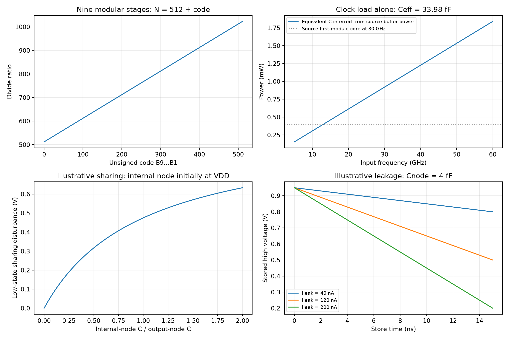

# Millimeter-Wave Frequency Divider

This note studies the modular divide-by-2/3 chain and clocked CMOS ($C^2$MOS) implementation in Razavi's Fall 2022 article [1]. All six original PDF pages were read and visually checked. Boolean recurrence, charge sharing, leakage and power calculations are independent models; source transistor speed/noise results are reported separately. No project PDK simulation or post-layout timing is claimed.

## 1. Scope and architecture

The source targets a 28–32-GHz PLL with a 50-MHz reference, programmable divide ratio 560–640, input-frequency tolerance up to 35 GHz, rail-to-rail sinusoidal clocks and less than 5-mW divider power. Simulations use 28-nm CMOS, SS, 0.95 V, 75 °C and drawn channel length 30 nm [1, p. 6]. The 35-GHz requirement allows the VCO to overshoot its nominal range during acquisition.

The [VCO article](Millimeter-Wave-VCO-Design.md) has a different reference assumption; the later [synthesizer](Millimeter-Wave-Frequency-Synthesizer.md) uses 100 MHz and ratios around 300. A nine-module chain's 512–1023 range covers the divider article's 560–640, but cannot directly realize 280–320. Eight modules span 256–511 and can support that later integer-N range. Module count and static control word must be chosen for the actual PLL case.

| Symbol | Meaning / units |
|---|---|
| $N,n,B_j$ | Total integer divide ratio, number of modules, static module control bits |
| $MC_j$ | Dynamic modulus-control signal; final $MC_n=1$ |
| $CK,\overline{CK}$ | Complementary clock phases with physical skew and transition times |
| $C_{clk},C_Q,C_N$ | Clock load, dynamic output-node load, internal-node capacitance (F) |
| $I_{leak},t_{store}$ | Leakage current (A), duration in store mode (s) |
| $\phi_{in},\phi_{out}$ | Input/output phase fluctuations (rad) |

The chain is a multimodulus divider (MMD), not a fixed multiplication of independent divide-by-2/3 blocks. Later stages return modulus-control pulses upstream. These pulses determine when an earlier stage uses a divide-by-three cycle.

## 2. State transitions and unity-step programming

For the simple Fig. 1(b) dual-modulus FF circuit (p. 6), define $q_1,q_2$ as the true internal FF states, with the complement of $q_1$ feeding the second AND gate. At each rising clock edge,

$$
q_1[k+1]=MC\,q_2[k],\qquad
q_2[k+1]=(1-q_1[k])(1-q_2[k]).
$$

With $MC=1$, the cycle is $00\rightarrow01\rightarrow10\rightarrow00$, giving divide by three. With $MC=0$, $q_1$ becomes zero and $q_2$ alternates, giving divide by two. Complemented output labels in the source must not be confused with these true state variables. This ideal synchronous recurrence excludes propagation delay, race-through and metastability.

In Figs. 2–3, dynamic modulus control combines with static bit $B$. Two modules give

$$
N=4+B_1+2B_2,
$$

or divide ratios 4, 5, 6 and 7. In the divide-by-five example, the first module supplies one divide-by-two and one divide-by-three interval during one output cycle, totaling five input periods. The returned control phase is essential.

For the source's modular architecture with final $MC_n=1$ [1, p. 7, Fig. 3],

$$
\boxed{N=2^n+\sum_{j=1}^{n}2^{j-1}B_j},\qquad
2^n\le N\le2^{n+1}-1.
$$

Equivalently, separate the first module from the tail: $N=2N_{tail}+B_1$, terminating at $N_1=2+B_1$. Iterating gives the weighted word. This arithmetic applies to the stated control-pulse architecture, not arbitrary asynchronous cascades. Nine stages yield 512–1023; code $N-512$ is 48 for 560, 63 for 575 and 128 for 640. $B_1$ is the least significant bit. The analytical script enumerates all 512 codes and checks the simple FF state cycle; it does not simulate all transistor-level chain transitions.

Programming while a modulus cycle is active can produce malformed or unintended output periods. Establish when the word is captured, reset/initialization behavior and any glitch-free update protocol before using dynamic channel changes.

## 3. Explicit clocked-inverter topology and its tradeoff

Source Fig. 4 compares two clocked-inverter latches. For the first latch, data input is $P$ and dynamic output is $Q$:

| Style | Pull-up path | Pull-down path |
|---|---|---|
| $C^2$MOS A | $V_{DD}\rightarrow M_2$ (PMOS, gate $P$) $\rightarrow M_4$ (PMOS, gate $\overline{CK}$) $\rightarrow Q$ | $Q\rightarrow M_3$ (NMOS, gate $CK$) $\rightarrow M_1$ (NMOS, gate $P$) $\rightarrow GND$ |
| $C^2$MOS B | $V_{DD}\rightarrow M_4$ (PMOS, gate $\overline{CK}$) $\rightarrow N\rightarrow M_2$ (PMOS, gate $P$) $\rightarrow Q$ | $Q\rightarrow M_1$ (NMOS, gate $P$) $\rightarrow$ internal node $\rightarrow M_3$ (NMOS, gate $CK$) $\rightarrow GND$ |

Both sense as inverters with $CK$ high and store with $CK$ low. The second latch uses opposite clock phases. The divide-by-two test closes an inversion loop through the two latches and an output inverter, followed by a buffer. Raw latches do not provide complementary outputs; additional inversions are needed in the full module.

Style A puts clocked devices adjacent to $Q$, adding their junction capacitance directly to the signal node. Style B moves them toward supply/ground and can lower signal-node loading, but leaves charged internal nodes connected through data-controlled devices during store mode. Source reference widths are $W_{1,5}=0.5$ µm, $W_{2,6}=1$ µm and clocked $W_{3,4,7,8}=2$ µm. These values and dimensions are source process examples, not generic speed guarantees.

The source isolated divide-by-two test reaches approximately 61 GHz for A and 105 GHz for B at a 2-µm clock-device width [1, pp. 7–8, Figs. 4–7]. A shows an optimum as increased width raises output capacitance; B keeps improving until clock-device resistance is no longer dominant. These isolated results omit the additional logic, fanout and extracted interconnect of a complete MMD. The article therefore develops a 60-GHz schematic-level module with an expectation of 35-GHz operation after layout; that expectation is not demonstrated post-layout performance.

## 4. Charge sharing, timing and phase noise

During B-style storage, a data change can connect $Q$ to internal node $N$. Before leakage or active restoring conduction, charge conservation gives

$$
V_{share}=\frac{C_QV_{Q,0}+C_NV_{N,0}}{C_Q+C_N}.
$$

For a stored low and a previously high internal node, the disturbance is $C_NV_{DD}/(C_Q+C_N)$. An illustrative 4-fF output, 2-fF internal capacitance and 0.95-V supply yield 0.3167 V. These arbitrary capacitances explain the source's transition kinks, not their exact amplitude. Body effect, nonlinear capacitance, leakage, partially conducting transistors and finite clock overlap alter the transient.

An inverter may restore valid logic after a kink yet suffer worse edge timing. For a local crossing with slope $dv/dt$, a small voltage disturbance gives $\delta t\simeq-\delta v/(dv/dt)$. Noise and deterministic charge-sharing disturbances require separate PSD and waveform treatment; a restored logic level alone does not establish low jitter.

At 30 GHz the source compares the actual first-module waveform with an ideal smooth 10-ps-edge excitation to an inverter, finding about 4-dB phase-noise penalty [1, p. 9, Fig. 10]. Its input-referred additive noise is approximately −135 dBc/Hz at 1 MHz after adding $20\log_{10}3\simeq9.54$ dB. The article compares this with approximately −110-dBc/Hz VCO noise for that example, not with every final VCO configuration.

For ideal division,

$$
\phi_{out}=\phi_{in}/N,\qquad
S_{\phi,out}=S_{\phi,in}/N^2.
$$

Input-referred additive divider noise is therefore $N^2S_{\phi,add,out}$. Since $f_{out}=f_{in}/N$, corresponding **time** jitter is unchanged by noiseless division: $\phi_{out}/(2\pi f_{out})=\phi_{in}/(2\pi f_{in})$. Real latches and buffers add jitter. A feedback divider's noise then passes through the PLL's closed-loop response; standalone phase-noise attenuation does not establish full synthesizer jitter.

## 5. Full module timing and clock power

Source Fig. 8 uses four latches, three NAND functions, inversions and output buffers. Its clocked NAND is a gated parallel PMOS pull-up and series NMOS pull-down; Fig. 8(b) supplies terminal order and clock polarities. Reconstruct those polarities from the original figure and module clock lines when implementing: the simple FF recurrence is not a complete transistor netlist. Extra NAND/inverter delay and modulus-return setup now join the limiting paths.

The first module uses B-style latches for speed. The second uses A style because slower operation makes charge sharing more pronounced and permits smaller clock devices [1, p. 10, Fig. 12]. This choice depends on actual load and waveform, not just the logic style's nominal maximum frequency. In the source divide-by-five example, $CK_{out}$ must drive the CK inputs of the first and third latches of the next module. Swapping $CK_{out}$ and its complement breaks the intended modulus sequence.

For a capacitive clock load with one full charging event per cycle,

$$
P_{clk}\simeq f_{in}C_{clk}V_{DD}^2.
$$

Compare styles at equal total clock load and include driving power, short-circuit current and routing. The source first-module core draws approximately 0.4 mW at 30 GHz in divide-by-two mode; two clock inverters draw approximately **0.92 mW**, more than the core [1, pp. 9–10, Fig. 11]. The latter corresponds to 33.98-fF equivalent switched capacitance if all that power is assigned to the capacitive formula; it is not an extracted gate capacitance. Buffer widths are NMOS 4 µm / PMOS 8 µm. The source expects clock-path layout parasitics to nearly double this cost.

The second module draws approximately 0.2 mW. Later modules run progressively slower but still need reliable static levels. The source reports a complete chain below 3 mW; audit clock buffers and bias/load boundaries before using this subtotal in a receiver/PLL power budget.

## 6. Slow stages are limited by retention

Source final Fig. 13 (p. 16) shows the last module at 30-GHz input and divide ratio 575. The implied output is **52.174 MHz**, not exactly 50 MHz; a locked 50-MHz reference would require $575\times50$ MHz = 28.75 GHz. Its approximately 300-mV internal droop is restored by following inverters, but the observation is a source waveform, not a retention-yield guarantee.

For constant leakage during an ideal store interval,

$$
\Delta V\simeq\frac{I_{leak}t_{store}}{C_Q},\qquad
I_{leak,max}\simeq\frac{C_Q\Delta V_{allow}}{t_{store}}.
$$

At $C_Q=4$ fF, $t_{store}=10$ ns and allowed droop 0.3 V, the illustrative limit is 120 nA. Source 50-MHz output corresponds to a 10-ns half period; actual store windows depend on stage waveform and modulus. High temperature, leakage corners, clock pauses and initial states matter. Enlarging $C_Q$ improves retention but costs switching power and speed. Static latches or keepers can improve hold behavior but require contention and timing analysis.

## 7. Verification plan and evidence

The [analytical script](code/razavi_fourth_batch_analysis.py) checks the simple divide-by-2/3 state cycle, nine-bit ratio mapping and explicit charge/power equations. For a process implementation, simulate all target codes with edge-count and pulse-width checks; sweep frequency through acquisition overshoot and down to retention limits; test sinusoidal amplitude/common mode, duty and complementary-clock skew; and include routed NAND/modulus/buffer delays. Run slow/hot leakage and fast/race corners, programmed updates and clock interruption. Extract additive jitter with a specified carrier, source, offset range and noise reference plane. Count complete clock-generation and buffer power.

See the [fourth-batch source review](sources/razavi-fourth-batch-verification.md). Related: [CML/DFE timing](Decision-Feedback-Equalizer-and-CML-Latch.md), [VCO](Millimeter-Wave-VCO-Design.md), [PLL](Millimeter-Wave-Frequency-Synthesizer.md).

## References

[1] B. Razavi, “The Design of a Millimeter-Wave Frequency Divider,” *IEEE Solid-State Circuits Magazine*, Fall 2022, printed pp. 6–10, 16; six PDF pages. [DOI: 10.1109/MSSC.2022.3205805](https://doi.org/10.1109/MSSC.2022.3205805). [Original PDF](https://www.seas.ucla.edu/brweb/papers/Journals/BR_SSCM_Fall_2022.pdf). The unrelated Shop Talk material above the p. 16 continuation is excluded. The historical Vaucher and Suzuki articles in its bibliography were not independently read for this note.
