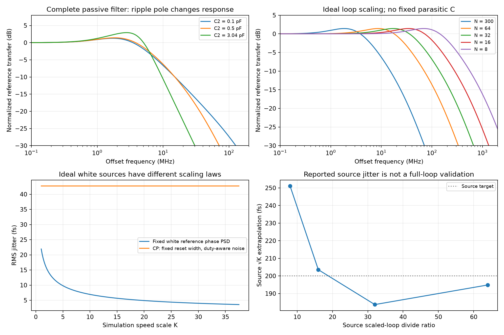

# Millimeter-Wave Frequency Synthesizer

This note studies a charge-pump phase-locked loop (PLL) around a 28–32-GHz LC oscillator, using Razavi's Spring 2023 Analog Mind article [1]. It derives the averaged loop from charge and phase relations, distinguishes noise sources during simulation scaling, and records discrepancies in the source equations. Full-text and original-page review cover all eight PDF pages, printed pp. 6–13. Independent calculations are verified; no project transistor-level, electromagnetic, post-layout or silicon result is claimed.

Related notes: [VCO design](Millimeter-Wave-VCO-Design.md), [frequency divider](Millimeter-Wave-Frequency-Divider.md), [LDO and oscillator supply coupling](LDO-Regulator-Design.md), and [discrete-time loop analysis](Z-Transform-for-Analog-Designers.md). The [batch verification record](sources/razavi-fourth-batch-verification.md) separates original-source observations, conversion artifacts and analytical checks.

## 1. Specification and configuration boundaries

The source targets 28–32 GHz, a 100-MHz reference with −170-dBc/Hz phase noise, output phase noise below −100 dBc/Hz at 1-MHz offset, reference spurs below −50 dBc, integrated jitter below 200 fs over 10 kHz–1 GHz, and 10-mW power. Its circuit simulations use 28-nm CMOS, the slow–slow corner, 0.95 V and 75 °C [1, p. 6]. These are design targets and source simulation conditions, not measured guarantees.

At 30 GHz, $N=f_{out}/f_{ref}=300$. Covering 28–32 GHz with this reference requires $N=280$–320. Eight modular divide-by-2/3 stages can cover 256–511; the divider article's nine-stage range 512–1023 instead belongs to its 50-MHz-reference case. The VCO article's opening 200-MHz/$N=300$ example would give 60 GHz, outside its stated band. Each configuration must be defined separately before composing a PLL.

The synthesizer's Fig. 2 is not an identical drawing of the earlier VCO's final implementation: its core devices are 4 µm/30 nm rather than 8 µm/30 nm, varactors are 16 µm/200 nm rather than 8 µm/200 nm, and bottom switches are 120 nm rather than 200 nm. It still shows an ideal 2-mA tail and omits the earlier bottom-plate pull-up resistors. Reused phase-noise curves discuss earlier tail/noise experiments. Neither the figure nor those curves establishes an identical saved simulation deck. This article's local tuning gain is 2.08 GHz/V; it should not be silently replaced by another article's gain.

## 2. Connections, signs and units

The static NOR-based phase/frequency detector (PFD) in Fig. 3 retains its state at low frequencies. An UP pulse sources charge-pump current $I_p$ into the oscillator control node $V_c$; a DOWN pulse removes it. A positive reference-leading phase error must increase oscillator frequency. The feedback divider returns output phase divided by $N$.

The passive filter has $C_2$ from $V_c$ to ground, $R_1$ from $V_c$ to node $U$, and $C_1$ from $U$ to ground. Thus $C_1$ is behind the resistor; $C_2$ directly absorbs rapid pump edges.

Source Fig. 5(b) implements UP current with a diode-connected PMOS reference and a same-sized PMOS mirror connected to supply. The mirror drain feeds a series PMOS switch whose drain reaches the pump output. An inverter drives this switch's gate from UP, so asserted UP turns it on. The DOWN path runs from the output through an NMOS switch, gated directly by DOWN, into the drain of a ground-referenced NMOS current mirror. Its reference device is diode connected. Both references draw 0.5 mA; the PMOS mirrors are 10 µm/90 nm, NMOS mirrors 5 µm/90 nm, UP switch 10 µm/30 nm and DOWN switch 10 µm/90 nm. Those unequal switch/control paths explain why well-aligned PFD voltage pulses do not ensure equal pump-current pulse widths. Reset delay, output resistance, mirror noise and compliance remain physical design variables; the diagram is not a supplied foundry netlist.

| Symbol | Meaning / convention | Unit |
|---|---|---|
| $\phi_e$ | $\phi_{ref}-\phi_{out}/N$ | rad |
| $I_p$ | Magnitude of each nominal UP/DOWN current | A |
| $K_{pd}$ | Averaged current gain, $I_p/(2\pi)$ | A/rad |
| $K_f$ | Local oscillator frequency slope | Hz/V |
| $K_\omega$ | $2\pi K_f$ | rad/s/V |
| $Z(s)$ | Control-node voltage per injected pump current | Ω |
| $L(s)$ | Negative-feedback open-loop gain | dimensionless |
| $H(s)$ | Reference transfer normalized by $N$ | dimensionless |
| $S_{\phi,1}(f)$ | One-sided phase PSD for $f>0$ | rad²/Hz |
| $\mathcal L(f)$ | Linear SSB phase-noise density, $S_{\phi,1}/2$ | 1/Hz |
| $T_{res}$ | Locked-state pump overlap/reset duration | s |

The small-signal model assumes lock, approximately constant $N,I_p,K_f$, averaged pump action, linear passive components and negligible transport delay. It describes offsets well below clock/device limits. Acquisition, cycle slips, quantized divider changes, sampling/aliasing and nonlinear VCO tuning require additional models.

## 3. Derive the loop from charge and phase

A phase error $\phi_e$ corresponds to pulse duration $\phi_e/(2\pi f_{ref})$. Charge per reference period is $I_p\phi_e/(2\pi f_{ref})$, so average pump current is

$$
\overline i_{cp}=\frac{I_p}{2\pi}\phi_e=K_{pd}\phi_e.
$$

KCL at $V_c,U$ gives

$$
i_{cp}=sC_2V_c+\frac{V_c-U}{R_1},\qquad
\frac{V_c-U}{R_1}=sC_1U.
$$

Eliminating $U$ yields the exact ideal passive-filter impedance

$$
\boxed{Z(s)=\frac{1+sR_1C_1}{s(C_1+C_2)+s^2R_1C_1C_2}.}
$$

Oscillator phase is the integral of angular frequency, $\phi_{out}=K_\omega V_c/s$. Therefore

$$
L(s)=\frac{K_{pd}Z(s)K_\omega}{Ns},\qquad
H(s)=\frac{L(s)}{1+L(s)},\qquad
\frac{\phi_{out}}{\phi_{ref}}=NH(s).
$$

Intrinsic oscillator phase fluctuations pass through $V(s)=1/(1+L)$. A loop suppresses oscillator noise inside its bandwidth while multiplying reference phase by approximately $N$ there.

### Second-order approximation and a source discrepancy

For $C_2=0$, write $k=I_pK_\omega/(2\pi N)$. The characteristic polynomial is $s^2+kR_1s+k/C_1$, hence

$$
\omega_n^2=\frac{I_pK_\omega}{2\pi NC_1},\qquad
\zeta=\frac{R_1}{2}\sqrt{\frac{I_pK_\omega C_1}{2\pi N}},
$$

$$
H_2(s)=\frac{2\zeta\omega_ns+\omega_n^2}{s^2+2\zeta\omega_ns+\omega_n^2}.
$$

The normalized reference −3-dB frequency follows by setting $|H_2(j\omega)|^2=1/2$:

$$
f_{3dB}=\frac{\omega_n}{2\pi}
\sqrt{1+2\zeta^2+\sqrt{(1+2\zeta^2)^2+1}}.
$$

At $\zeta=1$, the multiplier is 2.4824, explaining the source's approximate $2.5\omega_n$. Source Eq. (8), printed p. 7, labels the loop transmission $H(s)$ and uses the prefactor $2\pi I_p$ where its Eqs. (4)–(5) and the definitions above require $I_p/(2\pi)$. The printed loop gain differs by $4\pi^2$. This note uses $L$ for open-loop gain and $H$ for normalized closed-loop reference transfer. The expressions here follow the phase/current derivation; this is an independent discrepancy record, not a publisher erratum.

### Complete filter example

Use the source values $I_p=0.5$ mA, $K_f=2.08$ GHz/V, $N=300$, $R_1=8.7$ kΩ, $C_1=15.2$ pF and $C_2=0.5$ pF [1, pp. 7–8]:

| Averaged-model quantity | Calculated value |
|---|---:|
| Natural frequency, $\omega_n/(2\pi)$ | 2.40356 MHz |
| Damping, ignoring $C_2$ | 0.998544 |
| Second-order reference bandwidth | 5.96108 MHz |
| Complete-filter reference bandwidth | 6.53829 MHz |
| Complete-loop unity-gain frequency | 4.75620 MHz |
| Phase margin, without transport delay | 68.6264° |
| Filter extra pole, $(C_1+C_2)/(2\pi R_1C_1C_2)$ | 37.7909 MHz |

Closed-loop bandwidth, open-loop unity frequency and oscillator-noise shaping frequency are different observables. The source's statement that $C_2$ up to approximately $0.2C_1$ has little effect should be checked with the complete response; the plot below shows changes in peaking and roll-off. For $C_2>0$, the characteristic polynomial is

$$
R_1C_1C_2s^3+(C_1+C_2)s^2+kR_1C_1s+k=0.
$$

For positive elements, the cubic Routh condition reduces to $C_1+C_2>C_2$, so this ideal averaged model is stable. That result provides no stability guarantee after adding clock sampling, PFD/reset delays, extra poles and nonlinear behavior. The base reference-bandwidth/reference-frequency ratio is about 0.0654; finite absolute device delays still matter under acceleration.

## 4. Noise reference and integration

For uncorrelated sources, an illustrative one-sided output phase PSD is

$$
S_{\phi,out,1}=N^2|H|^2S_{\phi,ref,1}
+|V|^2S_{\phi,vco,1}
+\left|\frac{K_\omega Z}{s(1+L)}\right|^2S_{i,cp,1}+\cdots.
$$

Additive phase noise at the divider output enters with transfer $-NH$. Filter-resistor thermal noise needs its own injection location and transfer; it is not pump-current noise. Supply, substrate and correlated sources also require their actual coupling paths.

Convert dBc/Hz to linear $\mathcal L$ before integrating:

$$
\boxed{\sigma_t=\frac{\sqrt{\int_{f_L}^{f_H} S_{\phi,out,1}(f)\,df}}{2\pi f_{out}}
=\frac{\sqrt{2\int_{f_L}^{f_H}\mathcal L_{out}(f)\,df}}{2\pi f_{out}}.}
$$

The source's rough reference-plus-VCO estimate, Eq. (1), gives 34.8691 fs with $N=300$, $\mathcal L_{ref}=10^{-17}$/Hz, 6-MHz bandwidth and 30-GHz output. It assumes an idealized phase-noise shape and equal contributions to obtain the numerical coefficient 8; this is not the integral of the exact $H$ and $V$ above. A reference-only rectangular 6-MHz low-pass approximation gives a different coefficient. The multiplied in-band reference floor is −120.458 dBc/Hz. A bandwidth selected from only the reference/VCO intersection ignores pump, filter and divider noise.

## 5. Two different scaling operations

### Preserve dynamics while reducing capacitor area

At fixed $N,K_\omega$, transform $I_p,C_1,C_2\rightarrow(I_p,C_1,C_2)/\alpha$ and $R_1\rightarrow\alpha R_1$. The exact impedance increases by $\alpha$ and $K_{pd}$ decreases by $\alpha$, leaving $L(s)$ unchanged. Smaller capacitors therefore need not change ideal loop dynamics, but pump phase noise generally increases as current decreases, and parasitics, compliance and leakage do not obey this ideal transformation [1, p. 8].

### Accelerate an otherwise similar averaged loop

For a simulation speed factor $K$, keep the VCO frequency/load and $I_p,R_1,K_\omega$ fixed, and transform

$$
f_{ref}\rightarrow Kf_{ref},\quad N\rightarrow N/K,\quad
C_1,C_2\rightarrow(C_1,C_2)/K.
$$

Then $Z_K(Ks)=Z(s)$ and $L_K(Ks)=L(s)$: natural frequencies scale by $K$ while damping is unchanged. Ideal time responses compress by $K$.

The source's smallest simulated ratio is $N=8$, reference 3.75 GHz, $K=37.5$; its PFD is reported usable below approximately 5 GHz in that example. Scaling $C_2$ to about 13 fF makes fixed wiring, pump and VCO-control parasitics consequential. Physical pulse widths and device noise do not automatically compress with the loop response.

### White reference noise and pump reset noise scale differently

If the reference has a fixed white phase PSD, $N^2$ decreases by $K^2$ while the shaping bandwidth increases by $K$. With correspondingly scaled, sufficiently broad integration limits, its phase variance decreases by $K$, and jitter decreases by $\sqrt K$. An intrinsic VCO $A/f^2$ phase PSD obeys a similar ideal variance law when the frequency axis and integration range scale. Flicker corners, fixed integration limits and nonuniform spectra require direct integration.

For pump thermal noise, the locked-state reset duty is a separate variable. Assume two independent current sources, fixed absolute overlap $T_{res}$, equal current and overdrive $V_{ov}$, and one-sided source noise

$$
S_{i,each,1}=4k_BT\gamma g_m,\quad g_m\simeq2I_p/V_{ov},\quad
d=T_{res}f_{ref},\quad S_{i,cp,1}\simeq2dS_{i,each,1}.
$$

This duty-averaged white approximation neglects cyclostationary folding and pulse correlations. Well inside loop bandwidth,

$$
S_{\phi,cp,1}\simeq\left(\frac{2\pi N}{I_p}\right)^2 2dS_{i,each,1}.
$$

Under acceleration, $N^2$ decreases by $K^2$ but $d$ increases by $K$. The pump phase-noise plateau therefore decreases by $K$, rather than $K^2$. Its shaping bandwidth increases by $K$, so its broadly integrated white-noise variance is **constant** in this model. A blanket $\sqrt K$ extrapolation of total jitter is not justified by the fixed-reset-width model.

At $N=8$, 3.75 GHz, $T_{res}=25$ ps, 348.15 K, $V_{ov}=0.2$ V, $I_p=0.5$ mA and $\gamma=1$, the algebra of source Eq. (12) evaluates to −127.397 dB, near its −128-dB estimate. If $4k_BTg_m$ is one-sided PSD and the plotted density is SSB, dividing by two gives −130.407 dBc/Hz. Source Eq. (14) separately doubles the integral for both sidebands. Preserve this 3-dB convention ambiguity instead of mixing the definitions.

Doubling $N$ while halving $f_{ref}$, with fixed $T_{res}$, doubles this pump plateau (+3.01 dB). The p. 13 expectation of +6 dB considers $N^2$ without its own duty-factor change. The actual reported change from −129 to −125 dBc/Hz cannot be established from either simplified rule alone. Device noise, folding and extraction convergence need evaluation.

Source Eq. (9), p. 9, labels the scaling quantity $f_{REF}$ where the discussion needs loop bandwidth; Eq. (10) includes $S_{REF}^2$ in a phase-variance expression, with inconsistent dimensions. The laws above use PSD to the first power and explicit integration.

## 6. Reference spurs and pulse alignment

For small sinusoidal control ripple of peak amplitude $V_m$ at $f_m$, phase-modulation index $\beta=K_fV_m/f_m$. Each first sideband/carrier amplitude is approximately $\beta/2$, giving

$$
\mathrm{spur}_{dBc}\simeq20\log_{10}\left(\frac{K_fV_m}{2f_m}\right).
$$

At $f_m=100$ MHz, $K_f=2.08$ GHz/V, a −50-dBc limit permits approximately **0.3041 mV peak** of this sinusoidal ripple. Deterministic harmonics are discrete tones, not noise PSD. For nonsinusoidal ripple, apply the relation separately to each harmonic in the small-modulation regime.

Fixed charge per pulse and capacitances divided by $K$ can increase ripple amplitude by $K$ while ripple frequency increases by $K$, preserving $\beta$. Spur invariance is conditional on filter response, charge mismatch, pulse widths, loading and clock waveforms. Source p. 10's roughly 100-mV peak-to-peak control waveform includes VCO-carrier feedthrough through varactors; it is not all a reference-frequency tone.

In the scaled $N=8$ simulation, the source adds a transmission gate in the DOWN path to compensate approximately 6-ps skew, improving a −48-dBc spur to −51 dBc [1, pp. 10–11]. Reproduce pulse timing and integrated UP/DOWN charge, not just average current equality, when investigating this mechanism.

## 7. What the source simulations establish

The source progressively decreases acceleration [1, pp. 10–13, Figs. 12–23]. Values below retain the source's reporting conventions:

| $N$ / $K=300/N$ | Reference | $C_1$ / $C_2$ | Reference bandwidth | Spur | PN plateau | Reported jitter | Source $\sqrt K$ projection |
|---|---|---|---:|---:|---:|---:|---:|
| 8 / 37.5 | 3.75 GHz | 405 fF / 13 fF | 182 MHz | −51 dBc after timing fix | −129 dBc/Hz | 41 fs | 251.1 fs |
| 16 / 18.75 | 1.875 GHz | 810 fF / 27 fF in prose; 26 fF in Fig. 19 | 103 MHz | −52 dBc | −125 dBc/Hz | 47 fs | 203.5 fs |
| 32 / 9.375 | 937.5 MHz | 1.62 pF / 54 fF | 54 MHz | about −51 dBc | −120 dBc/Hz | 60 fs | 183.7 fs |
| 64 / 4.6875 | 468.75 MHz | 3.24 pF / 108 fF | 26 MHz | about −51 dBc | −113 dBc/Hz | 90 fs | 194.9 fs |

The $N=8$ loop settles in about 15 ns. Its reference response peaks 2.6 dB around 80 MHz; measured-in-simulation bandwidth is 182 MHz versus the source's 225-MHz scaled prediction. Its oscillator-noise shaping frequency is about 147 MHz, a different transfer. The $N=16$ reference response peaks 2.1 dB. The reported 41-fs extraction excludes reference noise.

The article uses convergence toward about 200 fs as an unscaled estimate. It does not directly establish a complete $N=300$, 100-MHz-reference implementation meeting the jitter target. The duty-aware pump model above also limits the universal use of its extrapolation. Finite integration bounds, device changes, folding and flicker noise require source-by-source comparison; the table is not an independent reproduction.

## 8. Reproducible analytical models and implementation checks

Run [the calculation script](code/razavi_fourth_batch_analysis.py):

```powershell
python code/razavi_fourth_batch_analysis.py
```

It independently stamps the two filter nodes and compares their KCL solution with $Z(s)$, checks the second-order closed-loop polynomial, verifies stable complete-filter roots, and tests both exact loop-scaling identities. Numerical integration confirms reference variance ratio $1/37.5$ versus fixed-reset pump variance ratio 1. The illustrative white-noise integrals span 100 Hz–100 GHz for the base model, with limits scaled for the accelerated model; they are mathematical scaling checks, not validity claims for an averaged physical loop over that entire range. Base reference/pump examples give 21.93/42.71 fs. They do not reproduce the source's 41 fs or validate the specified 10-kHz–1-GHz integration.



For an implementation, verify:

1. **Operating point and acquisition:** VCO band/code coverage, actual divider code range, pump compliance, UP/DOWN polarity, startup, lock from frequency offsets and cycle slips; sweep PVT and control-node load.
2. **Dynamics:** compare phase/frequency steps and calibrated small reference modulation with the averaged response; inspect overshoot, settling and peaking. Include physical clock/reset delays and fixed parasitic capacitance before trusting accelerated results.
3. **Spurs:** measure pulse overlap/skew and integrated charge mismatch; separate reference harmonics from carrier feedthrough. Use coherent spectral windows, state the resolution and window, and check longer records. A 5-ns window has 200-MHz bin spacing.
4. **Noise:** include reference, divider, pump, resistor, VCO and supply paths with documented PSD conventions. Establish a settled periodic operating point; increase periodic-noise sidebands until each contribution and integrated jitter converge. The source's approximately $5N$ sideband heuristic is a starting estimate, not a convergence guarantee.
5. **Scaling:** compare multiple $N$ values using the same physical noise definitions and the intended integration bounds. Calibrate injected phase PSD; raw injected voltage spectra are not automatically phase-noise spectra. Separate duty-dependent pump noise from fixed reference PSD.
6. **Budget:** include reference distribution, divider clock buffers, pump/PFD and VCO bias/buffers in the 10-mW assessment. Check the full target band and tuning codes, not only a nominal 30-GHz point.

For numerical planning, 500 ns divided by a nominal 5-ps step is **100,000 steps**, whereas source p. 8 says approximately 500,000. An adaptive simulator may take a different count, but that does not change the stated arithmetic. Actual device decks, noise settings and EM extraction are not available here; all implementation checks remain pending.

## References

[1] B. Razavi, “The Design of a Millimeter-Wave Frequency Synthesizer,” *IEEE Solid-State Circuits Magazine*, vol. 15, no. 2, Spring 2023, printed pp. 6–13, DOI [10.1109/MSSC.2023.3269456](https://doi.org/10.1109/MSSC.2023.3269456). [Original PDF](https://www.seas.ucla.edu/brweb/papers/Journals/BR_SSCM_2_2023.pdf). Full article and all original pages reviewed 2026-10-05. The website's pp. 7–17 citation conflicts with the PDF. No formal publisher erratum for this article was established in this review.

[2] B. Razavi, “The Design of a Millimeter-Wave VCO,” Summer 2022, DOI [10.1109/MSSC.2022.3184443](https://doi.org/10.1109/MSSC.2022.3184443), printed pp. 6–12. [Original PDF](https://www.seas.ucla.edu/brweb/papers/Journals/BR_SSCM_2_2022.pdf). Fully reviewed in this batch; configuration differences are retained above.

[3] B. Razavi, “The Design of a Millimeter-Wave Frequency Divider,” Fall 2022, DOI [10.1109/MSSC.2022.3205805](https://doi.org/10.1109/MSSC.2022.3205805), printed pp. 6–10, 16. [Original PDF](https://www.seas.ucla.edu/brweb/papers/Journals/BR_SSCM_Fall_2022.pdf). Fully reviewed in this batch; the nine-stage divider is not directly the $N=300$ feedback divider.
