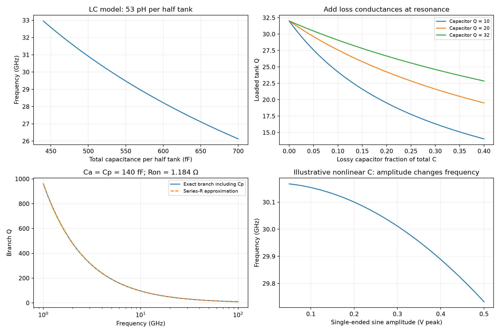

# Millimeter-Wave VCO Design

This note studies the cross-coupled NMOS LC voltage-controlled oscillator (VCO), lossy tuning network and tail-current source in Razavi's Summer 2022 article [1]. All seven original PDF pages were read and visually checked. Independent circuit, charge and numerical models support the analysis; the article's EMX and transistor results are source simulations, not project PDK or measured results.

## 1. Scope and explicit topology

The source targets 28–32 GHz, phase noise of −100 dBc/Hz at 1-MHz offset and power below 2 mW in 28-nm CMOS, SS, $V_{DD}=0.95$ V and 75 °C [1, p. 6]. VCO output frequency, output swing, tuning gain, load and phase noise must be assessed together.

Fig. 1 has NMOS $M_1$ drain at $X$ and gate at $Y$, $M_2$ drain at $Y$ and gate at $X$, and joined sources at the tail-current sink. Each output connects to supply through a parallel $L_h,C_1,R_p$ tank. Supply is AC ground in the initial differential model. Fig. 4 adds a MOS varactor at each output, with its gate at the output and tied source/drain at $V_{cont}$. Process-specific bulk and varactor models remain implementation requirements.

| Symbol | Definition / units |
|---|---|
| $L_d,L_h$ | Differential inductance, half-circuit inductance $L_h=L_d/2$ (H) |
| $C_{tot},R_p,Q_L$ | Total per-side capacitance (F), per-side parallel loss (Ω), inductor Q |
| $I_{SS},V_0,A$ | Tail current (A), single-ended peak-to-peak swing (V), single-ended sine amplitude $A=V_0/2$ |
| $K_f,K_\omega$ | Local frequency gain (Hz/V), angular gain $K_\omega=2\pi K_f$ (rad/s/V) |
| $\mathcal L(f),S_{\phi,1}(f)$ | Linear SSB phase noise (1/Hz), one-sided phase PSD (rad²/Hz), $S_{\phi,1}=2\mathcal L$ for small phase fluctuations |
| $C_a,C_p,R_{on}$ | Switched capacitor, off-state parasitic capacitor (F), switch resistance (Ω) |

**Cross-article boundary:** the VCO article states a 200-MHz reference and divide ratio 300, which would imply 60 GHz, not its 28–32-GHz oscillator. At 30 GHz / 200 MHz the ratio is 150. The later [divider](Millimeter-Wave-Frequency-Divider.md) uses 50 MHz, whereas the [synthesizer](Millimeter-Wave-Frequency-Synthesizer.md) uses 100 MHz and approximately 300. Preserve these separate design cases and the VCO article's inconsistency rather than combining them into one nominal PLL.

## 2. Startup, amplitude and tank loss

In the differential small-signal mode, let $v_X=v/2$, $v_Y=-v/2$. Each device contributes drain current $-g_mv/2$ and loss contributes $v/(2R_p)$. With identical devices and infinite tail impedance, initial amplitude grows only if

$$
g_mR_p>1.
$$

Equivalently the active differential port has resistance $-2/g_m$, while the passive differential loss is $2R_p$. Include finite output resistance, varactor/switch losses and actual loads before assessing startup margin. This local criterion does not establish nonlinear amplitude, reliable startup over PVT or correct mode selection.

At resonance,

$$
f_0=\frac1{2\pi\sqrt{L_hC_{tot}}},\qquad
R_p\simeq\omega_0L_hQ_L.
$$

For complete ideal tail-current steering, each drain current switches between zero and $I_{SS}$. Its fundamental amplitude is $2I_{SS}/\pi$, giving

$$
\boxed{V_0\simeq\frac4\pi I_{SS}R_p}.
$$

This is single-ended peak-to-peak swing. Differential peak-to-peak swing is twice that for equal opposite outputs. Gradual switching, triode operation, output loading and voltage clipping change the estimate. Source Fig. 3 shows outputs swinging above supply; assess actual terminal stresses and clamp/junction conduction rather than assuming output voltage is restricted to the supply rails.

Source Table 1 (p. 7) uses differential EM excitation of a single-turn octagonal inductor. A metal-9/metal-8 stack with 110-µm diameter, 20-µm line width and $L_d=106$ pH gives $Q_L=32$ at 30 GHz, versus 29 for metal-9 alone. Thus $L_h=53$ pH, $R_p=319.69$ Ω and the 2-mA square-steering estimate is 0.8141 Vpp. The source's 500-fF preliminary tank also includes device capacitance. The ideal total capacitance required at 28/32 GHz is 609.6/466.7 fF per side; do not add a differential 106-pH inductance to a per-side 500-fF capacitance without converting conventions.

## 3. Phase noise and control-voltage sensitivity

The source's thermal-noise approximation is [1, p. 6, Eqs. (1)–(2)]

$$
S_{src}(\Delta f)=\frac{\pi^2kT(\gamma+1)}{2R_pI_{SS}^2}
\left(\frac{f_0}{2Q\Delta f}\right)^2
=\frac{2\pi kT(\gamma+1)}{I_{SS}V_0}
\left(\frac{f_0}{2Q\Delta f}\right)^2.
$$

It neglects triode operation, flicker upconversion, finite tail-source noise and tuning-network noise. The equation describes its thermal region, not the entire spectrum. Reproducing its algebra at 350 K, $\gamma=1$, 30 GHz, 2 mA, $R_p=319.69$ Ω and $Q=32$ gives −110.87 dB at 1 MHz. The source variously quotes −112 dBc/Hz (p. 7), −114 dBc/Hz (p. 8) and approximately −111-dBc/Hz simulation. Preserve this numerical discrepancy and the source's unstated PSD side convention rather than treating every difference as a device effect. Its 0.8-Vpp example requires $Q\simeq9.24$ for a $10^{-10}$/Hz equation value.

For independently defined one-sided control-voltage PSD $S_{v,1}$,

$$
S_{\phi,1}(f)=\left(\frac{K_f}{f}\right)^2S_{v,1}(f),\qquad
\boxed{\mathcal L(f)=\frac12\left(\frac{K_f}{f}\right)^2S_{v,1}(f)}.
$$

A sinusoidal control ripple $V_m\cos(2\pi f_mt)$ creates phase-modulation index $\beta=K_fV_m/f_m$. For $\beta\ll1$, each sideband/carrier amplitude is $\beta/2$, so spur level is $20\log_{10}|\beta/2|$. At $K_f=1.9$ GHz/V and $f_m=200$ MHz, −60 dBc requires $V_m\le0.2105$ mV **peak**, agreeing with the source [1, p. 8].

For SSB −110 dBc/Hz at 1 MHz, the one-sided control ASD bound with this gain is 2.354 nV/√Hz. The source quotes 4.4 nV/√Hz under its own expression; neither number should be used without checking normalization. Supply noise requires separately extracted supply pushing $K_{DD}=\partial f/\partial V_{DD}$, not automatically the varactor tuning gain. In a PLL, control disturbances also see the loop sensitivity. See [LDO budgets](LDO-Regulator-Design.md) and [phase noise definitions](Phase-Noise-Calculations.md).

## 4. Continuous tuning and weighted loss

Adding losses as conductances at resonance yields, for one ideal fixed capacitor and one lossy varactor,

$$
\frac1{Q_{tank}}\simeq\frac1{Q_L}
+\frac{C_{var}}{C_1+C_{var}}\frac1{Q_{var}}.
$$

This agrees with the form of source Eq. (3); capacitor fraction is relative to **total** capacitance. For $Q_L=32$, $Q_{var}=20$, $C_1/C_{var}=20$, the result is 29.735, a 7.08% reduction rather than the source's approximately 9%. Add further lossy branches with their capacitance-weighted inverse Q, subject to linear/high-Q approximations and the same frequency.

Source 16-µm / 200-nm varactors have Q about 20 and tune 28.8–29.7 GHz over 0.1–0.85 V; their maximum local gain is about 1.9 GHz/V. Halving width gives approximately 500-MHz continuous coverage and 980-MHz/V maximum gain. These are different source configurations, not an unchanged $K_f$. Small gain reduces sensitivity and loss but needs enough overlap to absorb PVT drift without switching a coarse code while locked.

If each code covers width $W$ and adjacent intervals overlap by $O$, $m$ curves cover at most $W+(m-1)(W-O)$ under equal-step assumptions. With $W=500$ MHz and $O=100$ MHz, ten curves cover 4.1 GHz. Real tuning curves are nonlinear and code-dependent; verify all gaps and overlap over PVT and output loading. Uniform frequency steps generally need unequal capacitance steps because $df/dC=-f/(2C)$.

## 5. Switched-capacitor resistance and off-state capacitance

The single-ended branch is $X\rightarrow C_a\rightarrow N$, with $R_{on}$ and $C_p$ from $N$ to ground when enabled. Its exact linear admittance is

$$
Y(s)=\frac{sC_a(1/R_{on}+sC_p)}{1/R_{on}+s(C_a+C_p)},\qquad
\frac{V_N}{V_X}=\frac{sR_{on}C_a}{1+sR_{on}(C_a+C_p)}.
$$

For sufficiently low switch impedance, $Q_{branch}\simeq1/(\omega R_{on}C_a)$ and $|V_N/V_X|\simeq1/Q$. Off-state capacitance remains

$$
C_{off}=\frac{C_aC_p}{C_a+C_p},\qquad
\frac{C_{on}}{C_{off}}\simeq1+\frac{C_a}{C_p}.
$$

Source 140-fF branches require about 1.184 Ω to reach Q 32 at 30 GHz. Enlarging a switch lowers resistance but raises $C_p$; at $C_p\simeq C_a$, half the switched capacitance remains off. The source's 10-µm / “30-µm” prose disagrees with Fig. 7's **30-nm** channel length; use the figure and do not treat the prose as a long-channel design.

For fixed capacitance 470 fF plus switched 140 fF at Q 32, the weighted loss formula gives $Q_{tank}=26.027$, a 1.795-dB $Q^{-2}$ phase-noise penalty. The source obtains approximately 27 / 1.5 dB by using 610 fF for $C_1$ in Eq. (3), although 610 fF already includes the switched 140 fF in its stated capacitance budget [1, p. 10]. This appears to reuse total capacitance as fixed capacitance. Exact transistor/EM loss is still needed.

Fig. 8's differential branch has $C_a$ from $X$ to $N$, $C_b=C_a$ from $Y$ to $M$, and one switch $S_0$ between $N,M$. Under differential symmetry its channel midpoint is AC ground, so each half sees $R_{on}/2$. The source halves switch width to 160 µm while retaining similar branch Q. Its illustrative halved parasitic gives $C_{off}\simeq140/3=46.67$ fF per side. Small ground switches $S_1,S_2$ set the DC bottom-plate level. Fig. 9 increases each capacitor to 175 fF and later splits the bank into ten units; routing, off-capacitance and code-dependent loss remain.

## 6. Flicker upconversion, amplitude and power boundaries

When “off” bottom plates swing negative, nominally disabled switches can conduct and inject flicker noise. Fig. 10 biases $N,M$ near $V_{DD}/2$ through 10-kΩ resistors, suppressing this source effect. Splitting into ten cells requires appropriate resistor scaling (100 kΩ per cell for the same aggregate conductance), adding area and routing. Include resistor noise, bias-source noise, switch gate/drain stress and off-state conduction in implementation checks.

Fig. 11 replaces the ideal tail sink with a mirror: $M_{REF}$ is diode connected to a reference current, shares its gate with tail device $M_T$, and both sources connect to ground. The source starts with a 5:1 ratio, 0.4-mA reference and 2-mA tail, finding over 20-dB low-offset degradation. Tail-current variation changes amplitude; nonlinear varactor/device capacitance changes effective resonant capacitance and converts AM to PM.

One independent illustration takes $C(v)=C_0+bv^2$, so stored charge is $q(v)=C_0v+bv^3/3$. The charge fundamental under $v=A\cos\theta$ gives

$$
C_{eff}=\frac1{\pi A}\int_0^{2\pi}q(A\cos\theta)\cos\theta\,d\theta
=C_0+\frac{bA^2}{4},\qquad
\frac{df}{dA}\simeq-\frac{fbA}{4C_{tot}}.
$$

This shows an amplitude-to-frequency path but is not a foundry varactor model or a complete oscillator noise theory. Tail thermal noise near twice the oscillation frequency also mixes through the periodic circuit; static low-frequency PSD alone misses it.

The source reduces mirror ratio to 2.5, increases reference current to 0.8 mA, and quadruples drawn widths and lengths of the mirror devices to reduce flicker. It then halves reference current and hence tail current, reporting another 3-dB phase-noise improvement and approximately 400-mVpp single-ended swing [1, p. 12, Fig. 12]. Lower current does not generally improve the thermal-noise term; this source change reduces a dominant nonlinear upconversion mechanism. Final core plus reference current is approximately 1.4 mA / 1.33 mW at 0.95 V, before rail-restoring buffers, bias generation, tuning controls and load costs.

## 7. Verification status and implementation plan

The [analysis script](code/razavi_fourth_batch_analysis.py) checks switch-node KCL, equivalent charge, loss weighting and numerical budgets. It does not establish oscillator startup, loaded PSS/PNOISE, EM Q or terminal reliability. For implementation, extract inductors and routing as passive multiports; run startup and frequency sweeps over all codes/PVT; test worst-case tuning overlap and $K_f,K_{DD}$; check tail/switch noise with converged sideband counts; and evaluate buffer loading, absolute swing and terminal stress over the full waveform. Budget final PLL noise/spurs rather than free-running phase noise alone.

The [fourth-batch verification record](sources/razavi-fourth-batch-verification.md) retains source locators, conversion defects and independent corrections. Related: [divider](Millimeter-Wave-Frequency-Divider.md), [synthesizer](Millimeter-Wave-Frequency-Synthesizer.md), [T-coil/EM boundaries](Broadband-IO-and-T-Coil-Design.md).

## References

[1] B. Razavi, “The Design of a Millimeter-Wave VCO,” *IEEE Solid-State Circuits Magazine*, Summer 2022, printed pp. 6–12; seven PDF pages. [DOI: 10.1109/MSSC.2022.3184443](https://doi.org/10.1109/MSSC.2022.3184443). [Original PDF](https://www.seas.ucla.edu/brweb/papers/Journals/BR_SSCM_2_2022.pdf). The final-page mailing advertisement is excluded. Historical references listed by the article were not separately read for this note.
