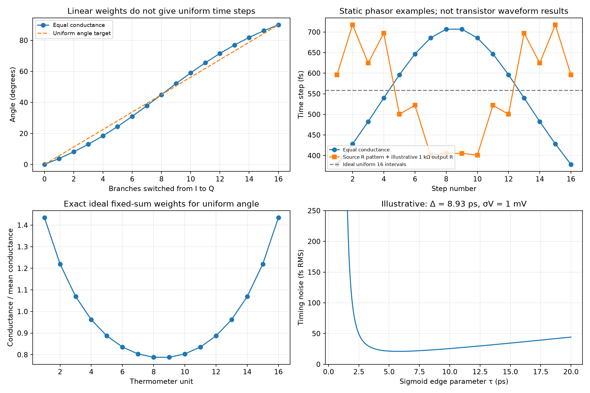

# Phase Interpolator Design

A phase interpolator (PI) combines neighboring clock phases to move sampling instants through an eye. This note studies Razavi's inverter/resistor PI for a 56-Gb/s receiver [1], derives waveform and phasor models, and extends the analysis to conductance predistortion, code ordering, timing noise and clock loading. All five original PDF pages, printed pp. 6–10, were read and visually checked. Independent calculations are verified; source transistor simulations are distinguished from project models. No project PDK, post-layout or silicon result is claimed.

Related: [clock and data recovery](Clock-and-Data-Recovery.md), [CML latch and DFE](Decision-Feedback-Equalizer-and-CML-Latch.md), [VCO phase noise](Millimeter-Wave-VCO-Design.md), and [PLL dynamics](Millimeter-Wave-Frequency-Synthesizer.md). Source/OCR qualifications and reproduction checks are in the [fifth-batch record](sources/razavi-fifth-batch-verification.md).

## 1. Environment and timing definitions

The source targets a 28-GHz PI with maximum phase step 0.4 ps, random jitter below 100 fs RMS and power below 2 mW per PI. It uses 28-nm CMOS, 0.95 V, slow–slow corner and 75 °C, nominal drawn channel length 30 nm except the fine-branch series stacks. The receiver accepts transmitted quadrature clocks and uses a half-rate CDR to command the PI [1, p. 6, Fig. 1]. This is a different architecture from the later 56-GHz full-rate oscillator-controlled CDR.

| Symbol | Definition / units |
|---|---|
| $T_b$ | 56-Gb/s data unit interval, 17.8571 ps |
| $T_{CK}$ | 28-GHz clock period, 35.7143 ps |
| $\Delta$ | I/Q quadrature separation, $T_{CK}/4=8.92857$ ps |
| $\omega$ | Clock angular frequency, $2\pi\cdot28$ GHz (rad/s) |
| $\alpha$ | Fraction of effective branch conductance selecting Q |
| $g_j,G_I,G_Q,G$ | Branch, I-group, Q-group and total conductance (S) |
| $\theta,t_d$ | Phase delay angle (rad) and time delay $\theta/\omega$ (s) |
| $R_F,X,v_o$ | Feedback resistor, summing node, PI output |
| $\sigma_v,\sigma_t$ | RMS voltage noise at a specified crossing and RMS timing error |

Source p. 8 estimates the required subdivision with $(17.4\text{ ps}/4)/(0.4\text{ ps})\approx11$. At its stated 28-GHz clock, the quadrant is **8.93 ps**, not a quarter of the 56-Gb/s data UI. Uniform spacing alone requires at least $\lceil8.92857/0.4\rceil=23$ intervals. Sixteen uniform intervals would be 558 fs; thirty-two would be 279 fs. The source's later fine branch can still meet its reported step target, but the initial conservative-factor argument does not use the stated clock period.

## 2. From opposing inverters to weighted waveforms

The simplest PI connects two inverter outputs together, one driven by I and one by Q [1, p. 6, Fig. 2]. During part of an edge, a pull-down device in one branch fights a pull-up in the other. The crossing depends on their current–voltage curves, N/P sizing, load and input slew. It is not generally a linear arithmetic average of logic voltages.

The source first uses four such inverters: $W_N=200$ nm and $W_P=400$ nm. Reducing $W_P$ to 300 nm corrects the central crossing but not all intermediate steps [1, p. 7, Figs. 3–4]. Optimizing one code is insufficient to establish differential nonlinearity (DNL) or integral nonlinearity (INL) across the code range.

Adding series resistors produces a more explicit voltage-to-current relation. Let $u_j(t)$ denote the already inverted branch waveform before its resistor. A local linear model uses effective resistance $R_j+r_{out,j}$ and $g_j=1/(R_j+r_{out,j})$. At a passive common node with capacitance $C_L$,

$$
C_L\frac{dv}{dt}=\sum_jg_j(u_j-v),\qquad
v(s)=\frac{\sum_jg_ju_j(s)}{G+sC_L}.
$$

For identical branches and negligible loading, this gives the voltage average of source Eqs. (1)–(2). With four equal branches, three I and one Q produce $(3u_I+u_Q)/4$. Common inversion changes an absolute edge/polarity reference, not the relative interpolation angle.

Large $R_j$ improves dominance over nonlinear inverter output resistance but raises delay/area and allows the branch waveforms to switch rapidly before the summed waveform crosses. If two fast edges are far apart, the sum has an intermediate plateau or kink. Small $R_j$ makes opposing branches load each other and slow their transitions, at the cost of nonlinear weighting and contention. Source Fig. 6 compares 10 kΩ with 1 kΩ; neither passive version provides its desired uniformity.

### When voltage averaging gives time averaging

If both input edges have the same **linear slope** over a common crossing interval, $u_I(t)=u_0+a(t-t_I)$ and $u_Q(t)=u_0+a(t-t_Q)$, a constant-weight average crosses at

$$
t_d=(1-\alpha)t_I+\alpha t_Q.
$$

This equality requires overlapping linear edge regions. For general rail-limited or sinusoidal waveforms, linear voltage weights do not give equally spaced crossing times. “Linear interpolation” must specify whether it refers to voltage, phase angle or time.

## 3. Quadrature phasors and nonuniform steps

For equal-amplitude sinusoidal clocks, choose $u_I=A\sin\omega t$ and $u_Q=A\sin(\omega t-\pi/2)$. Their sum is

$$
v=A[(1-\alpha)\sin\omega t-\alpha\cos\omega t]
=A\sqrt{(1-\alpha)^2+\alpha^2}\sin(\omega t-\theta),
$$

$$
\boxed{\theta=\operatorname{atan2}(\alpha,1-\alpha),\quad t_d=\theta/\omega.}
$$

For $M$ identical branches, switching $k$ branches from I to Q gives $\alpha=k/M$. In source Eq. (3), $m$ instead counts I branches, so $\theta(m)=\tan^{-1}[(16-m)/m]$ decreases as $m$ increases. Keep that code orientation separate from the increasing-$k$ convention used here.

The derivative

$$
\frac{d\theta}{d\alpha}=\frac{1}{(1-\alpha)^2+\alpha^2}
$$

is twice as large at midscale as at either endpoint. Equal 16-branch weights at 28 GHz give steps **378.38–706.85 fs**, with first angle 3.814°. Source Fig. 8 reports 385–690 fs. The agreement in mechanism and scale does not reproduce its nonlinear circuit: output resistance, input shape and active summation differ.

Amplitude is lowest at midscale, $A/\sqrt2$. With a fixed output-noise voltage PSD and otherwise equal conditions, a smaller zero-crossing slew raises timing sensitivity. A constant code-dependent delay from a common linear filter is harmless to relative angle spacing only if its gain, load and threshold remain code independent.

The source's four-branch conceptual 22.5° step is the uniform-time target. A sinusoidal $3\mathrm{I}+1\mathrm{Q}$ sum instead gives $\tan^{-1}(1/3)=18.435°$. Uniform-ramp and phasor models have different waveform assumptions; their phase laws should not be exchanged without checking the actual edges.

Small input phase fluctuations also depend on code. For a quadrature phasor $P=G_I+jG_Q$, first-order perturbation gives

$$
\delta\phi_o=\frac{G_I^2}{G_I^2+G_Q^2}\delta\phi_I
+\frac{G_Q^2}{G_I^2+G_Q^2}\delta\phi_Q.
$$

At equal weights, uncorrelated equal input phase-noise variances average to half the variance, while perfectly common input phase noise passes unchanged. More generally, include $2a_Ia_Q\operatorname{Cov}(\phi_I,\phi_Q)$ with the weighted variances. Amplitude imbalance couples separately through $\delta\theta=(G_I\delta G_Q-G_Q\delta G_I)/(G_I^2+G_Q^2)$. A PI cannot remove common clock jitter merely by averaging quadrature signals.

## 4. Feedback summation and its finite gain

Source Fig. 7 connects each small inverter through 1 kΩ to node $X$, the input of restoring inverter InvX. A feedback resistor connects output $v_o$ back to $X$. InvX has $W_N=2$ µm, $W_P=4$ µm and $R_F=12$ kΩ in the four-branch example. In Fig. 8 the 16-branch version uses $R_F=3$ kΩ, with small inverter widths 200/300 nm.

Around a specified bias point, let $v_o=-A(s)v_X$, output impedance be neglected initially, $g_F=1/R_F$, and node capacitance be $C_X$. KCL gives

$$
[G+g_F+sC_X]v_X-g_Fv_o=\sum_jg_ju_j,
$$

$$
\boxed{v_o=-\frac{A(s)\sum_jg_ju_j}{G+[1+A(s)]g_F+sC_X}.}
$$

Only when $|A g_F|\gg|G+g_F+sC_X|$ does $v_o\approx-R_F\sum g_ju_j$ and $v_X$ remain small. The source explicitly reports hundreds of millivolts at $X$, needed for a rail-to-rail output and fast movement through InvX's high-gain region [1, p. 7]. It is a feedback-assisted summing inverter, not an ideal fixed-potential virtual ground throughout a switching cycle.

A constant finite gain with fixed conductances applies a common complex factor and need not destroy the ideal phasor angle spacing. Code-dependent inverter conductance, gain compression, branch waves, threshold and capacitance do. Extracted transient crossing measurements are therefore required after choosing resistors. Removing the branch resistors can preserve rough interpolation but increases direct contention and removes convenient weight controls.

## 5. Predistortion, mismatch and a fine branch

For fixed total conductance and a desired angle $\theta_k$, the required cumulative Q fraction is

$$
F_k=\frac{\sin\theta_k}{\sin\theta_k+\cos\theta_k},\qquad
g_k=G(F_k-F_{k-1}).
$$

With $\theta_k=k\pi/(2M)$, all $g_k$ are positive. For $M=16$, this ideal conductance spread is 1.82068. Larger endpoint weights and smaller middle weights compensate the arctangent law. This is an independent phasor design; it does not determine optimal physical resistors with nonlinear output resistance and rail-limited edges.

The source uses the symmetric resistor sequence [1, p. 9, Fig. 10]:

$$
[R_1,\ldots,R_{16}]=[0.5,0.5,1,1,2,2,3,3,3,3,2,2,1,1,0.5,0.5]\ \mathrm{k}\Omega.
$$

It reports 420–636-fs steps: improved uniformity, but still above the 400-fs target. Physical conductance is affected by inverter output resistance as well as each resistor. The script's optional 1-kΩ output-resistance example illustrates this distinction; it is not a fit to source waveforms.

Thermometer coding switches one positive-weight unit at a time. In the static phasor model, with $G_Q$ increasing by $g_j>0$ and $G_I=G-G_Q$, $\theta=\operatorname{atan2}(G_Q,G_I)$ is monotonic even with unequal weights. This does not guarantee dynamic monotonicity under skew, mismatched transition shapes, MUX feedthrough, threshold shifts or quadrant changes. Nor does monotonicity establish small DNL.

To obtain finer steps without doubling all clock inputs, Fig. 11 adds Inv0 through $R_0=2$ kΩ. Each pull-up and pull-down path contains two series devices driven by the same input; a series stack changes resistance, capacitance and internal-node behavior, and is not generally equivalent to one foundry device of double channel length. The restoring inverter is enlarged to $W_N=4$ µm, $W_P=8$ µm. Source Fig. 12 reports 156–362-fs steps and calls the result 32X interpolation.

For a constant fine conductance $g_0$ and coarse cumulative weights $P_k$, a simple two-state code model has

$$
\alpha_{k,b}=\frac{P_k+b g_0}{G+g_0},\qquad b\in\{0,1\}.
$$

Ordering $(k,0)\rightarrow(k,1)\rightarrow(k+1,0)$ is monotonic only if $0<g_0<g_{k+1}$ for every coarse step. Exact half steps would require $g_0=g_{k+1}/2$, impossible for all nonuniform coarse weights with one fixed $g_0$. The fine branch also changes total load/weight, and endpoints can be redundant. A complete codebook must specify branch assignments, endpoint handling and quadrant transitions; “32X” alone does not define it.

## 6. Four quadrants and power

Fig. 13 adds transmission-gate selection of I/$\overline I$ and Q/$\overline Q$, followed by each branch's I/Q MUX. Complementary clocks and suitable control sequences cover 0–360°.

| Desired quadrant sweep | Neighboring phase pair, ordered forward |
|---|---|
| 0° → 90° | I → Q |
| 90° → 180° | Q → $\overline I$ |
| 180° → 270° | $\overline I$ → $\overline Q$ |
| 270° → 360° | $\overline Q$ → I |

With a fixed I-slot/Q-slot implementation, odd quadrants require reversing the thermometer sweep. Gray/boundary-aware control can reduce simultaneous switching, but does not by itself ensure a glitch-free output. Test maximum/minimum pulse width and code-update timing, especially at quadrant rollover. Complementary input skew and duty-cycle error create separate rising/falling phase maps.

The source's two cascaded MUX ranks increase input load to approximately 16 fF on each active I/Q phase and attenuate amplitude about 15%. Transmission-gate widths in Fig. 13(c) are 400/600 nm in the larger rank and 200/300 nm in the smaller rank. Using $P\simeq fCV_{DD}^2$ for two 16-fF clock loads gives **0.80864 mW** at 28 GHz and 0.95 V, close to the source's approximately 0.9-mW driver estimate. That is driver power, not total PI power; contention, restoration, code controls, complements and routing add costs. The article does not report a complete final power total establishing its <2-mW target.

## 7. Random jitter and quantization are separate

For a small voltage perturbation at a unique crossing,

$$
\delta t\simeq-\frac{\delta v}{dv/dt},\qquad
\sigma_t\simeq\frac{\sigma_v}{|dv/dt|}.
$$

The voltage noise must refer to the chosen node and observation bandwidth. Device noise, input clock jitter, supply coupling and code-update disturbances need actual transfers; independent variances add only when uncorrelated. Static resistor noise has one-sided current PSD $4k_BT/R$, but switching makes noise transfer time dependent and can fold high-frequency noise. A DC resistor sum is not a complete PI jitter prediction.

An independent illustrative edge model uses two equally weighted sigmoid transitions separated by $\Delta$: $v_j=V_{DD}[1+\tanh((t-t_j)/\tau)]/2$. At the midpoint, the summed slew is

$$
\left.\frac{dv}{dt}\right|_{mid}
=\frac{V_{DD}}{2\tau}\operatorname{sech}^2\!\left(\frac{\Delta}{2\tau}\right).
$$

Very fast separated edges leave a shallow plateau; excessively slow edges also reduce slew. At $\Delta=8.92857$ ps, $V_{DD}=0.95$ V and an illustrative 1-mV RMS crossing noise, the minimum occurs near $\tau=5.78$ ps and gives 20.99-fs RMS timing noise. This waveform model does not reproduce a PDK, PI noise bandwidth or source jitter.

For an ideal uniform quantizer with step $\delta$ and uniformly distributed error, $\sigma_q=\delta/\sqrt{12}$. A 362-fs step would give 104.5 fs; the worst nearest-code error is half the largest adjacent gap, 181 fs, within covered endpoints. The uniform-error assumption need not hold in a closed CDR: bang-bang updates can hunt deterministically between codes. Random circuit jitter, static quantization and deterministic limit cycles must be budgeted separately.

Source p. 10, Fig. 14 uses transient noise spanning 1 MHz–200 GHz and observes about 60-fs peak-to-peak crossing spread. It estimates RMS as approximately one sixth of that spread and reports <10 fs. A Gaussian process has no finite universal peak-to-peak/RMS ratio: observed extremes depend on record length, sample count, correlation and confidence. Treat this as the source's estimate, not independently established RMS jitter. Save individual crossing times, remove the intended period, separate drift/periodic structure, compute sample standard deviation and assess convergence over independent records/codes.

## 8. Verification and next implementation checks

Run [the analytical script](code/razavi_fifth_batch_analysis.py):

```powershell
python code/razavi_fifth_batch_analysis.py
```

It compares sinusoidal zero crossings with the angle formula, verifies exact ideal predistortion, checks static positive-weight monotonicity, stamps the feedback node and inverter relation independently, and evaluates slew/noise examples. The generated plot was visually inspected.



For implementation, measure every rising/falling crossing code at the same threshold and de-embed common latency; record DNL/INL, maximum gap and quadrants. Sweep I/Q amplitude/phase/duty error, input slew, PVT, resistor/device mismatch and actual load. Verify every code-update and rollover waveform, including minimum pulse width. Extract clock-driver plus PI power and the nonlinear contention currents. Run converged transient/periodic noise with realistic input jitter and correlation; verify actual sample timing in the intended half-rate CDR rather than connecting this PI directly to a full-rate 56-GHz loop. These checks remain pending.

## Reference

[1] B. Razavi, “The Design of a Phase Interpolator,” *IEEE Solid-State Circuits Magazine*, vol. 15, no. 4, Fall 2023, printed pp. 6–10; five PDF pages. DOI [10.1109/MSSC.2023.3315653](https://doi.org/10.1109/MSSC.2023.3315653). [Original PDF](https://www.seas.ucla.edu/brweb/papers/Journals/BR_SSCM_4_2023.pdf). Full article and original figures reviewed 2026-10-05. The Editor's Note and related-article appendix on shared p. 10 are excluded. Bibliography entries were not separately read; no formal publisher correction for this article was established here.
