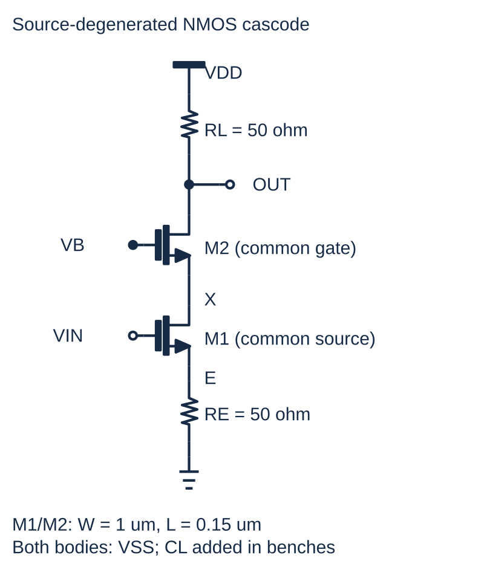
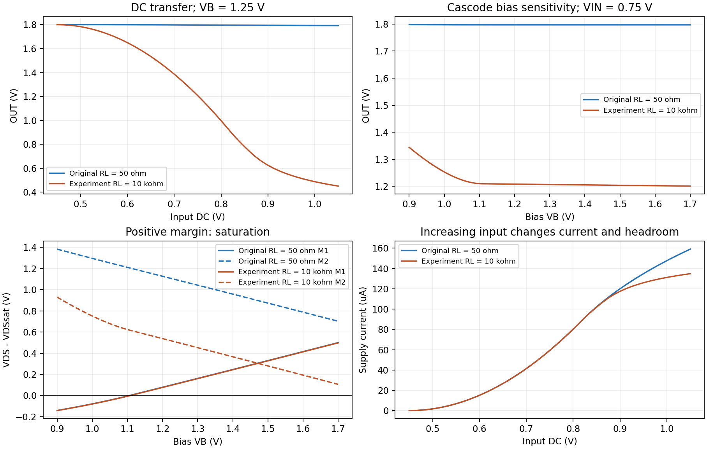
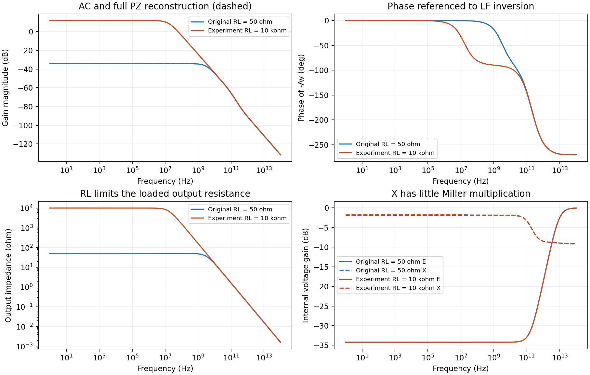
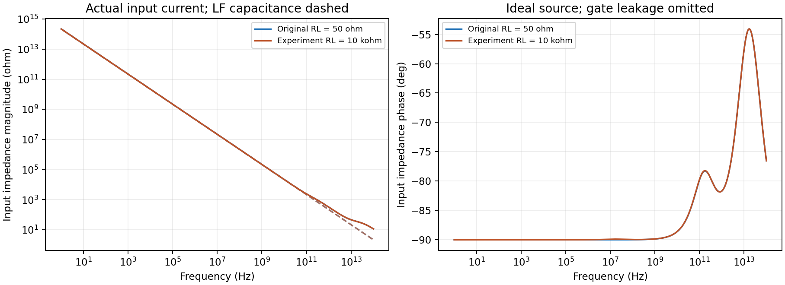
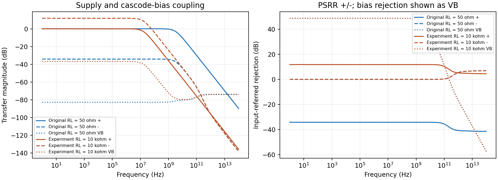
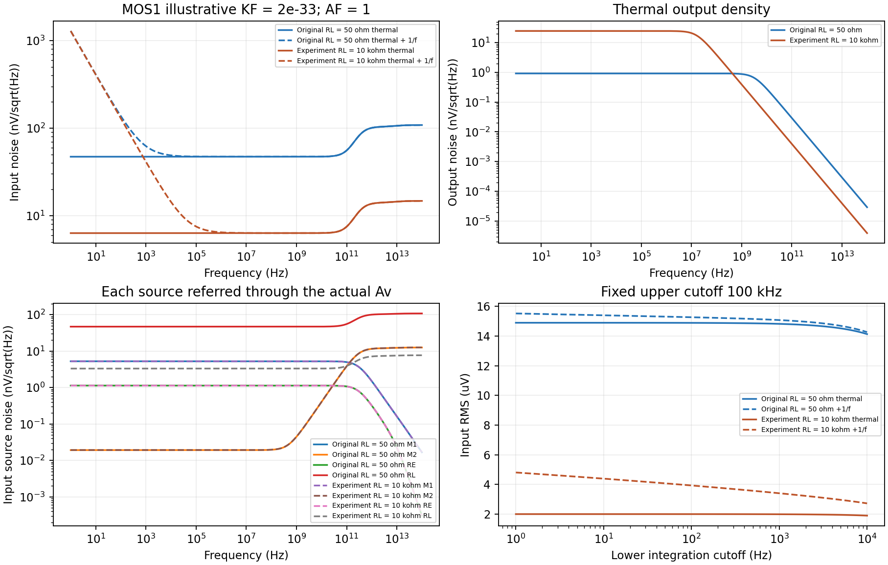
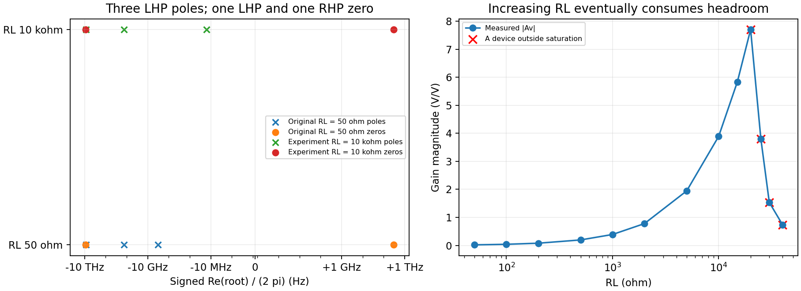
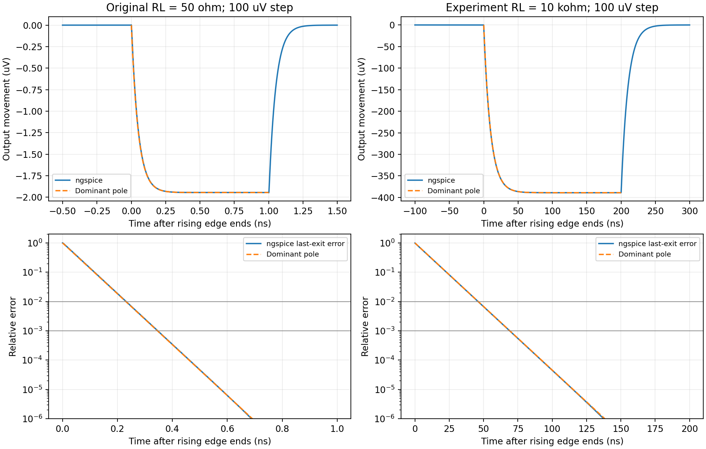
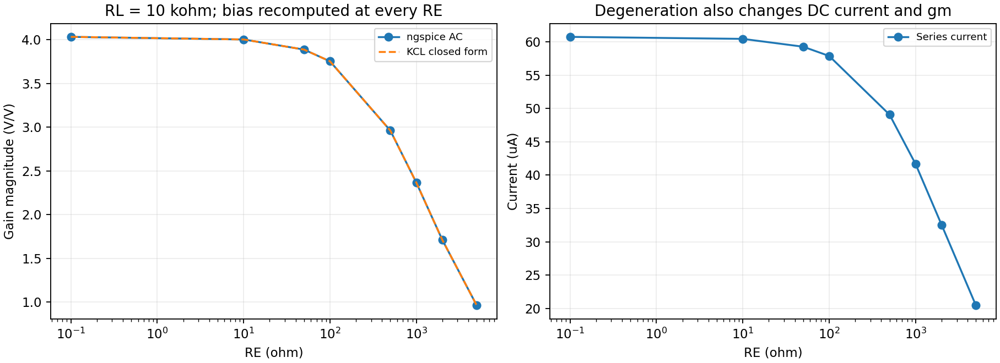

<!--
Input: user-exported cascode project, explicit teaching models and 26 ngspice testbenches | Output: schematic, derivations, measured plots and independent numerical checks | Position: Companion to Source-Degenerated-Cascode-Analysis.md
-->
# Source-Degenerated Cascode Amplifier: Schematic and Simulation

This companion to [the circuit analysis](Source-Degenerated-Cascode-Analysis.md) follows the equation-to-experiment organization of [the 5T OTA study](5T-OTA-Schematic-and-Simulation.md). It studies the **actual uploaded topology**: two stacked NMOS devices, a resistor load, a source-degeneration resistor and a single input/output. The original “Folded-cascode” filename described a topology absent from its connections.

**Verification status:** 26 testbenches ran locally on 2026-10-10 using ngspice-33. Both nominal cases pass conducting-saturation and current-balance checks; independent KCL, closed forms, full-frequency capacitance matrices, noise-source transfers, pole/zero reconstruction, DC derivatives and small-step settling agree with the simulated data. Original geometry, connectivity, W/L and 50 Ω resistors are preserved in the baseline. A separate **RL=10 kΩ experiment** changes only load resistance and recomputes bias. The results establish consistency of the specified educational LEVEL=1 model, **not SKY130 performance**. In particular, retaining 0.15 µm geometry does not make this long-channel model accurate for short-channel silicon.

## Circuit and Downloadable Assets



The drawing renders the supplied project's embedded symbol primitives, placements and routes. E and X and effective parameter values are added as teaching labels. [PNG](figures/source-degenerated-cascode/schematic.png) is also available. Both transistor bodies connect to VSS; their hidden body leads are not separate floating terminals.

| File | Purpose and execution status |
|---|---|
| [Original editable project](circuits/source-degenerated-cascode/Source-degenerated%20cascode%20amplifier.icproj.json) | Renamed file/directory, unchanged source bytes and SKY130 bindings; historical internal title retained |
| [Educational editable project](circuits/source-degenerated-cascode/educational.icproj.json) | Same schema-68 geometry, connections, W/L and R; declared primitive teaching-model binding |
| [Source provenance](circuits/source-degenerated-cascode/provenance.json) | Source SHA-256, inherited parameters, independently checked terminal tuples and node mapping |
| [Original structural netlist](simulations/source-degenerated-cascode/original-sky130.cir) | SKY130 calls, original port order/global ground; extracted but not simulated with a PDK |
| [Educational core](simulations/source-degenerated-cascode/cascode-core.cir) and [models](simulations/source-degenerated-cascode/models.lib) | Actual inputs to all 26 testbenches; no external PDK required |
| [Lab instructions](simulations/source-degenerated-cascode/README.md) | Test methods, source references and reproduction commands |
| [Execution report](simulations/source-degenerated-cascode/results/summary.json) | Conditions, metrics, checks, executable/script/input hashes and actual run date |

The [exporter](code/export_cascode.py) resolves per-type defaults, route/contact equivalence and explicit bulk-net bindings, then checks all four device tuples against a separately declared reference. It re-extracts the teaching copy to verify unchanged connections, net mapping and effective parameters. A unit wrapper NF is omitted from the primitive binding; total W and m=1 remain identical. It supports this flat schema-68 circuit, not arbitrary Analog Canvas projects. The sibling Canvas checkout has no built packages, so the generated educational editable project has **not been reopened/round-tripped through Canvas**. Its model-binding format follows the local schema source; the extracted and executed SPICE core is the validated simulation artifact. This qualification does not affect preservation of the original source.

### Devices, Nodes and Test Conditions

| Element | D / G / S / B, or resistor terminals | Original effective parameters |
|---|---|---|
| M1 | X / VIN / E / VSS | W=1 µm, L=0.15 µm, nf=m=1 |
| M2 | OUT / VB / X / VSS | W=1 µm, L=0.15 µm, nf=m=1 |
| RE | E / VSS | 50 Ω |
| RL | VDD / OUT | 50 Ω |

The original values reside in `defaults.instancesByType`. Reading only instance fields would miss them. The original wrapper port order is `VB VIN OUT VDD`, with global ground `0`. The educational core exposes `VDD VSS VIN OUT VB`; promoting ground to a VSS port permits a separately excited negative rail. Generated names X and E map to the original anonymous net identifiers in provenance.

| Condition | Baseline | Load experiment |
|---|---:|---:|
| VDD / VSS | 1.8 / 0 V | Same |
| VIN / VB | 0.75 / 1.25 V | Same |
| M1/M2 W/L | 1 / 0.15 µm | Same |
| RE | 50 Ω | Same |
| RL | **50 Ω, from original** | **10 kΩ, explicit override** |
| CL | 1 pF, added by testbench | Same |
| Temperature | 27 °C | Same |

The authored NMOS model uses LEVEL=1, VTO=0.45 V, KP=200 µA/V², LAMBDA=0.03 V$^{-1}$, GAMMA=0.4 V$^{1/2}$, PHI=0.7 V, TOX=20 nm and CGSO=CGDO=200 pF/m. These simple coefficients match the educational NMOS baseline used in the 5T example so differences can be attributed to circuit structure and load. They are not a fit to a foundry process. Junction capacitances default to zero; no source/drain series resistance is specified. The baseline has KF=0; a separate noise run uses KF=2e−33, AF=1.

Supplies, input and bias are ideal sources. CL, VIN, VB and OUT are referenced to **fixed external ground**, including when VSS is excited. AC amplitudes of 1 select linearized transfer functions; they are not large-signal 1 V swings. The broad 1 Hz–100 THz frequency sweep exposes the compact model's complete mathematical roots; it is not a physical frequency-validity claim.

## Bias and Saturation: Equations to Plot

The current mechanism is simple: M1 controls the series current; RE converts it to a source voltage; M2 provides a common-gate path; RL converts the same current to an output voltage. With VSS=0,

$$
V_E=I_DR_E,\quad V_O=V_{DD}-I_DR_L,\quad
I_{D1}=I_{D2},\quad P_{DC}=V_{DD}|I_{VDD}|.
$$

Both bodies are grounded, so

$$
V_{Ti}=0.45+0.4\left(\sqrt{0.7+V_{Si}}-\sqrt{0.7}\right),
$$

$$
I_{Di}=\frac{200\ \mathrm{\mu A/V^2}}{2}\frac{W_i}{L_i}
(V_{GSi}-V_{Ti})^2(1+0.03V_{DSi})
$$

in saturation. Define $m_i=V_{DSi}-V_{DSsat,i}$. A positive margin identifies saturation in this model.

**Test:** the `baseline-op.cir` and `load-10k-op.cir` decks record currents, node voltages, gm, gmb, gds, thresholds, overdrives and capacitances. Each `bias-sweep` changes VB from 0.9 to 1.7 V in 2 mV steps. Each `dc-transfer` changes VIN from 0.45 to 1.05 V in 0.5 mV steps, holding VB fixed. The runner separately evaluates the saturated square law and body-effect threshold at the nominal OP, using simulated terminal voltages. This checks the device equation; it is not an independent prediction of the complete bias solution.



| Nominal OP metric | Original RL=50 Ω | Experimental RL=10 kΩ |
|---|---:|---:|
| OUT | 1.797036 V | 1.207320 V |
| E | 2.963581 mV | 2.963401 mV |
| X | 0.419283 V | 0.417184 V |
| Series current | 59.2716 µA | 59.2680 µA |
| Supply power | 106.689 µW | 106.682 µW |
| M1 saturation margin | 0.119991 V | 0.117892 V |
| M2 saturation margin | 1.085557 V | 0.495443 V |

The nominal resistor drops and both saturated current equations agree with simulation within 0.0001% relative tolerance. Finite channel-length modulation permits a small current change when RL changes. Both devices conduct in saturation at the two nominal operating points; this statement does not cover the entire DC sweep.

Within the **sampled** bias sweep, the first VB with both devices saturated is 1.106 V for RL=50 Ω and 1.110 V for RL=10 kΩ. Both remain saturated through the last sampled VB=1.700 V; that upper sample is not a measured maximum permissible bias. At low VB, M1 loses drain headroom even though the series current still flows.

Raw evidence: [baseline OP log](simulations/source-degenerated-cascode/results/baseline-op.log), [10 kΩ OP log](simulations/source-degenerated-cascode/results/load-10k-op.log), [baseline bias CSV](simulations/source-degenerated-cascode/results/baseline-bias-sweep.csv) and [10 kΩ bias CSV](simulations/source-degenerated-cascode/results/load-10k-bias-sweep.csv).

## Low-Frequency KCL and Signal Gain

Take unknowns in **E, X, OUT order** and let $k_i=g_{mi}+g_{mbi}+g_{di}$, $g_E=1/R_E$, $g_L=1/R_L$. MOS drain currents use $i_d=g_mv_g+g_{mb}v_{body}+g_dv_d-kv_s$. With bodies and rails grounded in AC,

$$
G\begin{bmatrix}v_E\\v_X\\v_o\end{bmatrix}
=\begin{bmatrix}g_{m1}\\-g_{m1}\\0\end{bmatrix}v_i
+\begin{bmatrix}0\\g_{m2}\\-g_{m2}\end{bmatrix}v_b,
$$

$$
G=\begin{bmatrix}
g_E+k_1&-g_{d1}&0\\
-k_1&g_{d1}+k_2&-g_{d2}\\
0&-k_2&g_L+g_{d2}
\end{bmatrix}.
$$

The equivalent series-current derivation makes degeneration explicit:

$$
i=g_{m1}v_i+g_{d1}v_X-k_1v_E,\quad v_E=iR_E,
\quad i=av_i+bv_X,
$$

where $a=g_{m1}/(1+k_1R_E)$ and $b=g_{d1}/(1+k_1R_E)$. M2 gives $i=g_{m2}v_b+g_{d2}v_o-k_2v_X$, and $v_o=-iR_L$. Therefore

$$
v_X=\frac{g_{m2}v_b-a(1+g_{d2}R_L)v_i}{\Delta},\qquad
i=\frac{ak_2v_i+b g_{m2}v_b}{\Delta},\quad
\Delta=k_2+b(1+g_{d2}R_L),
$$

$$
\boxed{A_v=-\frac{R_Lak_2}{\Delta}},\qquad
\boxed{A_E=\frac{R_Eak_2}{\Delta}},\qquad
\boxed{A_X=-\frac{a(1+g_{d2}R_L)}{\Delta}}.
$$

Increasing VIN raises current and lowers OUT, so Av is negative. E rises and supplies local negative feedback; X moves oppositely, reducing the gate-drain Miller multiplication of M1. Ignoring the small output-conductance corrections gives

$$
A_v\approx-\frac{g_{m1}R_L}{1+(g_{m1}+g_{mb1})R_E}.
$$

**Test:** each `ac-input` drives VIN AC=1, with all other sources AC=0. Complex OUT/E/X and VIN source current are captured. The independent calculation uses **OP gm/gmb/gds as inputs**, then builds and solves its own circuit equations. Independence is in topology, signs, matrix and transfer solution, not in the compact-model parameters or bias solution. The central DC slope is a second measurement method.

| Metric | Independent calculation | ngspice at 1 Hz / central DC slope |
|---|---:|---:|
| Av, original 50 Ω | Closed form −0.0194479281 V/V; approximation −0.01951845 | −0.0194479280 V/V, −34.22253 dB |
| Av, 10 kΩ | Closed form −3.88899858 V/V; approximation −3.903456 | −3.88899853 V/V, 11.79676 dB |
| E/VIN, original | +0.0194479281 | +0.0194479280 |
| X/VIN, original | −0.80353690 | −0.80353690 |
| E/VIN, 10 kΩ | +0.019444993 | +0.019444993 |
| X/VIN, 10 kΩ | −0.82413427 | −0.82413427 |
| DC center slope, original | AC predicts −0.0194479280 V/V | −0.0194479272 V/V |
| DC center slope, 10 kΩ | AC predicts −3.88899853 V/V | −3.88899836 V/V |

The simple gain approximation is about 0.36–0.37% larger in magnitude; keeping finite drain conductances explains the difference. Original RE gives $(g_{m1}+g_{mb1})R_E\approx0.0248$, so this is weak degeneration. Neither $-R_L/R_E$ nor a differential-pair expression describes it.



Raw evidence: [baseline AC CSV](simulations/source-degenerated-cascode/results/baseline-ac-input.csv), [10 kΩ AC CSV](simulations/source-degenerated-cascode/results/load-10k-ac-input.csv) and the corresponding `dc-transfer.csv` files in [results](simulations/source-degenerated-cascode/results/).

## Output and Input Impedance: Equations to Plot

Applying a test voltage at M1's drain, with its gate/body grounded, gives

$$
R_1=r_{o1}+[1+(g_{m1}+g_{mb1})r_{o1}]R_E.
$$

The common-gate stage multiplies this source resistance:

$$
\boxed{R_{stack}=r_{o2}+[1+(g_{m2}+g_{mb2})r_{o2}]R_1},\qquad
\boxed{R_{out}=R_L\parallel R_{stack}}.
$$

With output AC shorted, the transistor stack has $G_m=ak_2/(k_2+b)$, so $A_v=-G_mR_{out}$. The nominal formulas give $R_{stack}=166.027$ MΩ (original) and 161.877 MΩ (10 kΩ). These are **model-inferred intrinsic branch values**, not separately measured unloaded impedances. The measured whole-circuit impedance includes RL.

An independent check removes RL's conductance from the linearized KCL matrix and injects a unit output current. The resulting intrinsic resistance agrees with the expression above; $k_2$ already includes $g_{d2}$, so writing $r_{o2}+(1+k_2r_{o2})R_1$ would count one $R_1$ twice.

**Test:** each `ac-output` injects 1 A AC into OUT with VIN, VB and both rails grounded in AC. $Z_o=v_o/i_{test}$ and its low-frequency real part gives $R_{out}$. The unit current is a small-signal normalization. Independent KCL computes $(G^{-1})_{33}$.

| Output resistance | Closed form and KCL | ngspice at 1 Hz |
|---|---:|---:|
| Original RL=50 Ω | 49.99998494 Ω | 49.99998494 Ω |
| Experiment RL=10 kΩ | 9999.382284 Ω | 9999.382385 Ω |

RL dominates in both cases. The large intrinsic resistance does not make the loaded circuit a high-gain OTA.

VIN source current additionally measures input admittance. With fixed body voltage,

$$
\boxed{Y_{in}(s)=s[C_{gs1}(1-A_E(s))+C_{gd1}(1-A_X(s))+C_{gb1}]}.
$$

**Test:** because ngspice defines positive source current entering the voltage source, $Y_{in}=-I(VIN)/1\ \mathrm V$. Its imaginary part divided by $2\pi f$ gives the low-frequency capacitance. The runner checks the complete complex capacitor-current equation over the entire AC grid.



The predicted/measured low-frequency input capacitance is 0.726117 fF for original RL and 0.730238 fF for RL=10 kΩ. The tiny values belong to the stated model and geometry with zero junction capacitance. Finite-frequency impedance is capacitive, while the ideal-gate DC resistance is infinite. The dashed magnitude curves use only the low-frequency capacitance, so high-frequency deviation is expected.

Raw evidence: [baseline output-injection CSV](simulations/source-degenerated-cascode/results/baseline-ac-output.csv), [10 kΩ output-injection CSV](simulations/source-degenerated-cascode/results/load-10k-ac-output.csv), and VIN current columns in the input AC CSVs.

## VB Transfer and Supply Rejection: Equations to Plot

The single signal input means differential/common-mode gains and CMRR are not defined. Instead, measure VB separately:

$$
\boxed{A_b=-\frac{R_Lb g_{m2}}{\Delta}},\qquad
\left|A_v/A_b\right|=\frac{g_{m1}k_2}{g_{d1}g_{m2}}.
$$

Finite M1 output conductance couples changes in X into current. The `ac-bias` deck applies VB AC=1 with VIN and rails grounded in AC. Its central bias-sweep slope agrees with AC. Bias rejection is about 48.69 dB at low frequency; it is not CMRR.

For supplies, define $A_{s+}=v_o/v_{DD}$, $A_{s-}=v_o/v_{SS}$ and PSRR$^\pm=|A_v/A_{s\pm}|$. With VIN/VB fixed to external ground, supply KCL adds

$$
G\mathbf v=b_+v_{DD}+b_-v_{SS},\qquad
b_+=\begin{bmatrix}0\\0\\g_L\end{bmatrix},\qquad
b_-=\begin{bmatrix}g_E+g_{mb1}\\g_{mb2}-g_{mb1}\\-g_{mb2}\end{bmatrix}.
$$

Thus $A_{s\pm}=(G^{-1}b_\pm)_3$. The positive rail appears through RL; the negative rail moves RE's bottom and both bodies. Equivalently,

$$
\boxed{A_{s+}=\frac{R_{stack}}{R_L+R_{stack}}},\qquad
\boxed{A_{s-}=1-A_v-A_b-A_{s+}}.
$$

**Test:** the `ac-psrr-positive` and `ac-psrr-negative` decks separately set VDD or VSS AC=1. The other rail, VIN and VB are fixed. OUT and CL remain ground-referenced. Complex supply transfers and all three node voltages are compared with independently stamped KCL over the same grid as signal gain.



| Low-frequency metric | Independent prediction, original / 10 kΩ | ngspice, original / 10 kΩ |
|---|---|---|
| VB → OUT | −7.15510e−5 / −0.01430551 V/V | −7.15511e−5 / −0.01430552 V/V |
| VDD → OUT | +0.999999699 / +0.999938228 V/V | +0.999999699 / +0.999938218 V/V |
| VSS → OUT | +0.019519780 / +3.90336590 V/V | +0.019519780 / +3.90336583 V/V |
| PSRR+ | −34.22253 / 11.79729 dB | −34.22253 / 11.79729 dB |
| PSRR− | −0.03203 / −0.03203 dB | −0.03203 / −0.03203 dB |

OUT nearly follows VDD. In the baseline, gain is below unity, so **input-referred PSRR+ is negative in dB**; that follows the definition. Under this convention, VSS disturbances act much like an opposite input change, so PSRR− is near zero. Supply-following input/bias sources or a VSS-referenced output would give different transfers.

Raw evidence: the two cases' `ac-bias.csv`, `ac-psrr-positive.csv` and `ac-psrr-negative.csv` in [results](simulations/source-degenerated-cascode/results/).

## Thermal Noise: Source Derivation and Measured Contributions

For one-sided PSDs and saturated MOS1, use $S_{i,Mj}=4k_BT(2/3)g_{mj}$. Resistors have Norton PSD $4k_BT/R$. Independent source injections in E/X/OUT order are

$$
q_{M1}=\begin{bmatrix}1\\-1\\0\end{bmatrix},\quad
q_{M2}=\begin{bmatrix}0\\1\\-1\end{bmatrix},\quad
q_{RE}=\begin{bmatrix}1\\0\\0\end{bmatrix},\quad
q_{RL}=\begin{bmatrix}0\\0\\1\end{bmatrix}.
$$

Each transimpedance is $h_{j,o}=(G^{-1}q_j)_3$ at low frequency. The sign chosen for a noise-current direction does not affect its squared output contribution. Full frequency uses $(G+sC)^{-1}$ instead.

Dividing by signal gain gives the four low-frequency transfer magnitudes:

$$
\left|h_{M1,o}/A_v\right|=1/g_{m1},\quad
\left|h_{M2,o}/A_v\right|=g_{d1}/(g_{m1}k_2),
$$

$$
\left|h_{RE,o}/A_v\right|=k_1R_E/g_{m1},\quad
\left|h_{RL,o}/A_v\right|=1/G_m.
$$

Consequently,

$$
\boxed{S_{v,in}^{th}=4k_BT\left[
\frac{2/3}{g_{m1}}+R_E\left(\frac{k_1}{g_{m1}}\right)^2+
\frac23g_{m2}\left(\frac{g_{d1}}{g_{m1}k_2}\right)^2+
\frac{1}{G_m^2R_L}\right]}.
$$

**Test:** both `noise` decks reference the actual VIN source and keep KF=0. They record input/output amplitude density and separate M1, M2, RE and RL sources. The runner checks every source's spectrum against full-frequency independent current-noise MNA, source power addition and input referral $e_{n,in}=e_{n,out}/|A_v|$.



| Thermal metric | Original RL=50 Ω | Experiment RL=10 kΩ |
|---|---:|---:|
| Input amplitude density, 1 Hz; formula and ngspice | 47.1192 nV/$\sqrt{\mathrm{Hz}}$ | 6.31388 nV/$\sqrt{\mathrm{Hz}}$ |
| Output amplitude density, 1 Hz | 0.916371 nV/$\sqrt{\mathrm{Hz}}$ | 24.5547 nV/$\sqrt{\mathrm{Hz}}$ |
| M1 fraction of total output PSD | 1.24420% | 69.2982% |
| M2 fraction | 0.0000166% | 0.0009325% |
| RE fraction | 0.0576700% | 3.21184% |
| RL fraction | **98.6981%** | 27.4891% |
| Input RMS, 10 Hz–100 kHz | 14.8997 µV | 1.99652 µV |
| Output RMS, 10 Hz–100 kHz | 0.289767 µV | 7.76442 µV |

The original RL dominates input-referred thermal noise because its small value makes the signal gain tiny. Increasing RL lowers input-referred noise even though absolute output noise grows. M1 then dominates. M2's low-frequency noise is strongly suppressed; the plotted high-frequency increase shows why its small low-frequency contribution is not universal.

For a finite band,

$$
v_{n,in,rms}=\sqrt{\int_{f_1}^{f_2}e_{n,in}^2(f)df}.
$$

The stated band lies far below both output bandwidths, so the white approximation $\sqrt{S_w(f_2-f_1)}$ agrees with numerical integration. Ideal supplies/VB add no noise; bias-generator noise, resistor excess noise, mismatch and correlations are absent.

Raw evidence: [baseline noise CSV](simulations/source-degenerated-cascode/results/baseline-noise.csv), [10 kΩ noise CSV](simulations/source-degenerated-cascode/results/load-10k-noise.csv).

## Illustrative 1/f Noise and Integration Limits

Each separate `noise-flicker` deck changes only KF/AF in its own process to KF=2e−33 and AF=1. The coefficient is reused from the existing educational NMOS example to make low-frequency excess noise visible across both load conditions; it has no SKY130 calibration. Actual OP, resistor noise and channel thermal spectra remain identical to baseline.

For unit multiplicity, [MOS1's source equation](https://github.com/ngspice/ngspice/blob/master/src/spicelib/devices/mos1/mos1noi.c) is

$$
S_{i,j}^{1/f}(f)=\frac{K_F|I_{Dj}|^{A_F}}{fW_jL_{eff,j}C_{ox}^2},\qquad
L_{eff}=L-2L_D,\quad C_{ox}=\epsilon_{ox}/T_{ox}.
$$

Here LD=0, TOX=20 nm and $C_{ox}=1.72657$ mF/m². AF is the drain-current exponent; amplitude density varies as $1/\sqrt f$ before transfer weighting.

At low frequency, $S_{v,in}^{total}\approx S_w+B/f$, with B from the two MOS source equations and their input-referral weights. Thus

$$
f_c=B/S_w,\qquad
\boxed{v_{n,in,rms}^2\approx S_w(f_2-f_1)+B\ln(f_2/f_1)}.
$$

**Test:** capture total MOS contributions and separate `_id`/`_1overf` vectors, plus resistor contributions and an OP snapshot. ngspice-33 MOS1 cannot query KF/AF through `@model`; record them from the executed deck, query TOX/LD/W/L, and independently verify the per-source spectral effects. Every source is checked over the full sweep using its transimpedance; total powers and integrated variances must add.

| Flicker/thermal quantity | Original RL=50 Ω | Experiment RL=10 kΩ |
|---|---:|---:|
| White input PSD $S_w$ | 2.22022e−15 V²/Hz | 3.98650e−17 V²/Hz |
| Flicker coefficient B | 1.65659e−12 V² | 1.65670e−12 V² |
| Independent crossover B/Sw | 746.139 Hz | 41.5576 kHz |
| Measured PSD crossover | 746.140 Hz | 41.5576 kHz |
| Total input density at 1 Hz | 1287.95 nV/$\sqrt{\mathrm{Hz}}$ | 1287.14 nV/$\sqrt{\mathrm{Hz}}$ |

B barely changes because device current/gm barely change. Lowering the white floor with larger RL moves the crossover **up**, even with the same KF. That does not mean device flicker noise became intrinsically worse.

| Band and case | Thermal input RMS | Flicker input RMS | Total input RMS | $S_w+B/f$ prediction |
|---|---:|---:|---:|---:|
| 1 Hz–1 kHz, original | 1.48929 µV | 3.38295 µV | 3.69626 µV | 3.69612 µV |
| 1 Hz–1 kHz, 10 kΩ | 0.199562 µV | 3.38306 µV | 3.38894 µV | 3.38879 µV |
| 10 Hz–100 kHz, original | 14.8997 µV | 3.90629 µV | 15.4032 µV | 15.4032 µV |
| 10 Hz–100 kHz, 10 kΩ | 1.99652 µV | 3.90642 µV | 4.38705 µV | 4.38689 µV |

Variances add, then the square root gives total RMS. The lower-cutoff panel in the noise figure holds the upper limit at 100 kHz. An ideal 1/f PSD cannot be integrated to zero. The small integration differences above come from sampled trapezoidal quadrature; analytical and measured variances agree within 0.03%.

Raw evidence: [baseline flicker CSV](simulations/source-degenerated-cascode/results/baseline-noise-flicker.csv), [10 kΩ flicker CSV](simulations/source-degenerated-cascode/results/load-10k-noise-flicker.csv), their logs, OP/model/geometry `.dat` snapshots and the report's `cases.*.noise` entries.

## Poles, Zeros and Bandwidth: Equations to Plot

The nominal saturated MOS1 devices have $C_{gs}=0.372657$ fF, $C_{gd}=0.200000$ fF and $C_{gb}=0$. With junction capacitances zero and ideal gate sources,

$$
C=\operatorname{diag}(C_E,C_X,C_O)
=\operatorname{diag}(C_{gs1},C_{gd1}+C_{gs2},C_L+C_{gd2}).
$$

The input includes capacitive feedforward:

$$
(G+sC)\mathbf v=\left[
\begin{bmatrix}g_{m1}\\-g_{m1}\\0\end{bmatrix}
+s\begin{bmatrix}C_{gs1}\\C_{gd1}\\0\end{bmatrix}\right]v_i.
$$

Let $a_E=g_E+k_1$, $a_X=g_{d1}+k_2$ and $a_O=g_L+g_{d2}$. Taking the determinant gives

$$
D(s)=(a_E+sC_E)\left[(a_X+sC_X)(a_O+sC_O)-g_{d2}k_2\right]
-g_{d1}k_1(a_O+sC_O).
$$

Cramer's rule for OUT gives

$$
N(s)=k_2\left[(a_E+sC_E)(-g_{m1}+sC_{gd1})
+k_1(g_{m1}+sC_{gs1})\right],
$$

$$
\boxed{N(s)=k_2\left[-g_{m1}g_E+
s\{a_EC_{gd1}+(k_1-g_{m1})C_{gs1}\}
+s^2C_{gs1}C_{gd1}\right]}.
$$

Thus $A_v(s)=N(s)/D(s)$, poles are eigenvalues of $-C^{-1}G$, and zeros are roots of this independently constructed quadratic. Positive capacitances and opposite signs of the constant/quadratic terms give one LHP and one RHP zero. Their locations are unrelated to the 5T OTA's mirror pole/zero.

**Test:** each `poles-zeros` deck provides the 0.75 V DC input through a controlled source and a 1 GΩ return at its signal port. PZ inserts its voltage excitation there; no ideal voltage source shorts that port. The same bias/load is used in AC. Signed rad/s roots are retained in CSV and reconstructed as

$$
H_{PZ}(s)=A_v(0)\frac{\prod_j(1-s/z_j)}{\prod_i(1-s/p_i)}.
$$

| Feature | Original RL=50 Ω | Experiment RL=10 kΩ |
|---|---:|---:|
| Scalar output-pole estimate $1/(2\pi R_{out}C_O)$ | 3.182463 GHz | 15.91329 MHz |
| Full slow PZ pole, LHP | 3.182457 GHz | 15.91326 MHz |
| Measured −3 dB crossing | 3.173404 GHz | 15.87524 MHz |
| First falling unity-gain crossing | None: DC gain <1 | 59.80527 MHz |
| Full X-associated pole, LHP | 135.0190 GHz | 133.9033 GHz |
| Full E-associated pole, LHP | 8.753994 THz | 8.753981 THz |
| RHP zero | +297.8534 GHz | +297.8362 GHz |
| LHP zero | −9.129170 THz | −9.129135 THz |

The bandwidth measurement uses a **3.000 dB** drop on a sampled logarithmic grid; an ideal single pole at its pole frequency drops 3.0103 dB. This explains most of the small difference between −3 dB bandwidth and pole frequency here. Frequency interpolation and internal poles add small corrections.

For a dominant pole and $|A_v(0)|>1$, $f_u\approx f_p\sqrt{|A_v(0)|^2-1}$. The simpler $f_u\approx|A_v(0)|f_p\approx G_m/(2\pi C_O)$ requires gain well above unity. Use the first falling crossing, not an assumed gain-bandwidth product, and do not assign a unity frequency to the attenuating original circuit.



Full PZ reconstruction versus complex AC has maximum relative error 4.17e−9 (original) and 1.42e−8 (10 kΩ). All roots agree with independent polynomial/eigenvalue calculations. This confirms compact-model consistency. The GHz/THz values are artifacts of the specified very small, incomplete teaching capacitances; process prediction requires an appropriate PDK and real parasitics.

Raw evidence: [baseline PZ CSV](simulations/source-degenerated-cascode/results/baseline-poles-zeros.csv), [10 kΩ PZ CSV](simulations/source-degenerated-cascode/results/load-10k-poles-zeros.csv) and their complete `.log` files.

## Small Open-Loop Step and Settling

With the output pole dominant,

$$
\Delta v_o(t)\approx A_v(0)\Delta v_i(1-e^{-t/\tau}),\qquad
t_\epsilon\approx\tau\ln(1/\epsilon),\quad \tau=1/|p_{slow}|.
$$

**Test:** each `transient` applies VIN=0.75→0.7501 V, a 100 µV step. Times scale with $R_LC_L$: delay $10R_LC_L$, rise/fall $R_LC_L/50$, pulse width $20R_LC_L$, maximum timestep $R_LC_L/100$, and stop $40R_LC_L$. The plateau is measured 15–19 nominal time constants after the initial delay. Settling is the last exit from a relative error band before the falling edge, reported from the **end of the rising edge**. The formula assumes an instantaneous step, giving a small timing difference.



| Metric | Independent prediction | ngspice |
|---|---:|---:|
| Final output movement, original | −1.944793 µV | −1.945102 µV |
| Final output movement, 10 kΩ | −388.8999 µV | −388.9616 µV |
| 1% settling, original | 0.230305 ns | 0.231528 ns |
| 0.1% settling, original | 0.345457 ns | 0.346676 ns |
| 1% settling, 10 kΩ | 46.0582 ns | 45.9594 ns |
| 0.1% settling, 10 kΩ | 69.0872 ns | 68.9877 ns |

Final step gain agrees with AC within 0.1%; both settling tolerances agree with the slow-pole prediction within 2%. Finite edge duration, internal roots and slight current nonlinearity explain the residual. These are small-signal **open-loop** tests, not large-signal slew, closed-loop stability or fabrication-speed claims.

Raw evidence: [baseline transient CSV](simulations/source-degenerated-cascode/results/baseline-transient.csv), [10 kΩ transient CSV](simulations/source-degenerated-cascode/results/load-10k-transient.csv).

## Load and Degeneration Experiments

Increasing RL initially gives $|A_v|\approx G_mR_L$ while $V_O=V_{DD}-I_DR_L$ consumes headroom. The `load-sweep` recomputes OP and 1 Hz input AC for each explicitly selected RL from 50 Ω to 40 kΩ, recording both saturation margins.

| RL | DC OUT | Measured Av | Nominal saturation check |
|---|---:|---:|---|
| 50 Ω | 1.79704 V | −0.0194479 | Both saturated |
| 5 kΩ | 1.50365 V | −1.94465 | Both saturated |
| 10 kΩ | 1.20732 V | −3.88900 | Both saturated |
| 15 kΩ | 0.911007 V | −5.83304 | Both saturated |
| 20 kΩ | 0.615179 V | −7.70008 | M2 outside saturation |
| 25 kΩ | 0.355239 V | −3.79226 | Both outside saturation |
| 40 kΩ | 0.181484 V | −0.735943 | Both outside saturation |

The first sampled load violating saturation is **20 kΩ**, not an exact threshold. Local small-signal KCL still agrees when populated with each actual OP's gm/gmb/gds, but the saturated square-law interpretation and simple gain estimates no longer apply. The gain eventually falls instead of rising indefinitely. Red markers in the load plot identify these points.

The `degeneration-sweep` holds RL=10 kΩ and varies RE from 0.1 Ω to 5 kΩ, recomputing OP at each point. This is not a fixed-gm sweep.



| RE | Series current | Av |
|---|---:|---:|
| 0.1 Ω | 60.7423 µA | −4.03418 |
| 50 Ω | 59.2680 µA | −3.88900 |
| 500 Ω | 49.0766 µA | −2.96212 |
| 2 kΩ | 32.5653 µA | −1.71073 |
| 5 kΩ | 20.4583 µA | −0.962156 |

All sampled degeneration points keep both devices saturated. Larger RE reduces current as well as effective signal transconductance. All sweep-point gains agree with independent closed forms using their recomputed device parameters.

Raw evidence: [load CSV](simulations/source-degenerated-cascode/results/load-sweep.csv), [degeneration CSV](simulations/source-degenerated-cascode/results/degeneration-sweep.csv), logs and per-point OP/device/AC snapshots in [results](simulations/source-degenerated-cascode/results/).

## Reproduction and Practical Limits

The [lab README](simulations/source-degenerated-cascode/README.md) lists all 26 decks. From any working directory:

```sh
python /path/to/circuits-and-systems-classroom/code/run_cascode.py --ngspice /path/to/ngspice
```

The runner locates inputs relative to itself, hides Windows simulator windows, runs in a temporary directory, checks exit codes/logs/acquisition, and retains evidence after the independent checks pass. It preserves authored decks on ordinary reruns; `--generate-decks` explicitly regenerates them. Each plot has a PNG and SVG counterpart. The [report](simulations/source-degenerated-cascode/results/summary.json) contains actual simulator identity, executable hash, input/script hashes and per-case checks.

No SKY130 PDK was loaded. The original structural netlist requires the correct process models, wrapper scale, corner and separately chosen bias before execution. Teaching decks use SI W/L suffixes and **must not add `scale=1u`**. Global model-source calibration, actual junction/wiring capacitance, bias noise, mismatch, source resistance, feedback and large-signal distortion remain outside the demonstrated model.

## Sources and Derivation Ownership

1. User-supplied Analog Canvas project, received 2026-10-10. [Provenance](circuits/source-degenerated-cascode/provenance.json) identifies exact bytes and effective parameters; no unprovided Gallery identity is inferred.
2. [ngspice documentation](https://ngspice.sourceforge.io/docs.html) and [official source](https://github.com/ngspice/ngspice), checked for noise/PZ/control conventions. Actual executed version is ngspice-33, as retained logs state.
3. [MOS1 noise implementation](https://github.com/ngspice/ngspice/blob/master/src/spicelib/devices/mos1/mos1noi.c), for the channel-noise and KF/AF conventions, independently checked against this run.
4. [SKY130 open-PDK documentation](https://skywater-pdk.readthedocs.io/en/main/), relevant only to the original model binding; no process-model result is claimed.

KCL, gain/resistance/noise closed forms and the transfer polynomial are this note's independent derivations. The two 5T documents provide organizational examples, not evidence for the new circuit's equations or measured numbers.
