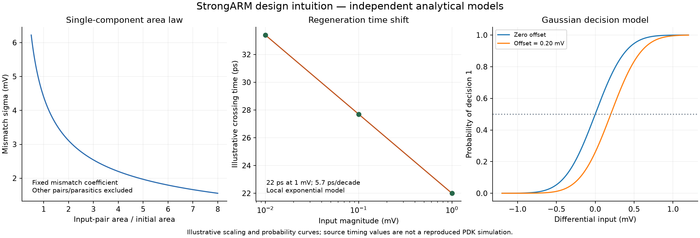

# StrongARM Comparator Design

<!--
Input: Razavi's 2020 comparator article, original-page checks, and independent local models
Output: Topology, staged operation, offset/speed/noise tradeoffs, and a validation plan
Position: Comparator design, linked to the probability-based noise calculation note
-->

**Scope and evidence:** This note builds on B. Razavi, “The Design of a Comparator,” *IEEE Solid-State Circuits Magazine*, Fall 2020, pp. 8–14 [R1]. All seven PDF pages were read and visually checked. Source simulations are identified as such; the project's equations and plots are independently derived models. No PDK simulation or silicon measurement is claimed. Figure and equation numbers preceded by “source” refer to [R1], not this note.

## 1. Define the Decision Before Sizing Devices

Let $v_d=v_{\mathrm{in1}}-v_{\mathrm{in2}}$. Define logical decision $D=1$ for sufficiently positive $v_d$; an output buffer may reverse a raw internal-node polarity. Define the decision aperture, input common mode, source impedance, load, clock edge and deadline explicitly.

| Quantity | Definition / unit |
|---|---|
| $V_{OS}$ | Input-referred deterministic offset, V |
| $\sigma_n$ | Input-referred random decision noise, V RMS |
| $A_{\mathrm{pre}}$ | Differential gain before the local regenerative phase |
| $C_P=C_Q$, $C_X=C_Y$ | Per-node capacitances for the symmetric local model, F |
| $g_m,g_o$ | Local transconductance and output conductance, S |
| $\tau_{\mathrm{reg}}$ | Regeneration time constant, s |
| $V_L$ | Differential output threshold used to define a valid decision, V |
| $t_a,t_r,t_o$ | Initial amplification, regeneration, and output/logic delays, s |

Offset is a device-to-device or state-dependent shift of the threshold; decision noise varies across otherwise equivalent repeated trials. A single standard deviation is not a guaranteed maximum error or a yield specification.

The numerical source examples below use **28-nm CMOS, slow-slow corner, $V_{DD}=0.95$ V, 75°C, and a 5-GHz clock with 50% duty cycle and 10-ps rise/fall times** (source pp. 8–9). The initial input common mode is 0.5 V; source Fig. 4 includes small output inverters, and later figures add an RS latch. Core-delay measurements and loaded logical-output delay are distinct; preserve the actual loading when reproducing a figure or comparing designs.

## 2. Topology and Phase Operation

Use source Fig. 1, p. 8, for the following explicit connection map. The body implementation follows the eventual PDK; the table specifies the signal terminals.

| Device | Type | Drain / source / gate |
|---|---|---|
| $M_1$ | NMOS input | $P$ / tail node / $v_{\mathrm{in1}}$ |
| $M_2$ | NMOS input | $Q$ / tail node / $v_{\mathrm{in2}}$ |
| $M_3$ | NMOS cross-coupled | $X$ / $P$ / $Y$ |
| $M_4$ | NMOS cross-coupled | $Y$ / $Q$ / $X$ |
| $M_5$ | PMOS regenerative | $X$ / $V_{DD}$ / $Y$ |
| $M_6$ | PMOS regenerative | $Y$ / $V_{DD}$ / $X$ |
| $M_7$ | NMOS tail | Tail node / ground / CK |
| $S_1,S_2$ | PMOS reset | $P,Q$ to $V_{DD}$, gates CK |
| $S_3,S_4$ | PMOS reset | $X,Y$ to $V_{DD}$, gates CK |

With CK low, the tail is off and the reset switches precharge $P,Q,X,Y$. With CK high:

1. The input pair discharges $P,Q$. Differential current creates a seed voltage while $M_1,M_2$ remain approximately saturated.
2. As $P,Q$ fall, $M_3,M_4$ turn on and output nodes $X,Y$ fall. The stages are coupled dynamically rather than behaving as independent static amplifiers.
3. After $X,Y$ fall enough, $M_5,M_6$ provide regenerative feedback. One output returns high and the other falls low; the topology interrupts the signal-path DC current after a completed decision.

Precharge erases the previous analog state. Incomplete equalization leaves a seed for the next decision and causes dynamic offset. The raw outputs also lose their logical decision during precharge, so downstream logic may require a separate state-retaining latch.

## 3. Initial Amplification and Offset Allocation

Under constant $g_{m,\mathrm{in}}$, constant tail current $I_{SS}$ and equal capacitive loads,

$$\frac{d(v_P-v_Q)}{dt}\approx-\frac{g_{m,\mathrm{in}}}{C_P}v_d.$$

The common-mode slope is about $-I_{SS}/(2C_P)$. If the initial mode ends after a drop $\Delta V_{CM}\approx V_{TH,3,4}$,

$$t_a\approx\frac{2C_P V_{TH,3,4}}{I_{SS}},\qquad
\boxed{|A_{\mathrm{pre}}|\approx\frac{2g_{m,\mathrm{in}}V_{TH,3,4}}{I_{SS}}.}$$

This reproduces the source's p. 8 estimate within a frozen-parameter model. Actual gain must be measured at the correct phase boundary; it is not the latch's final digital swing divided by input.

Source Eq. (1), p. 9, uses the pair mismatch convention

$$\sigma(\Delta V_{TH})\approx\frac{A_{VTH}}{\sqrt{WL}}.$$

With $A_{VTH}=2.2$ mV$\cdot\mu$m, $W=10$ $\mu$m and effective $L=0.025$ $\mu$m, this gives 4.4 mV. A PDK may define single-device versus pair variance differently; do not introduce or remove a $\sqrt{2}$ factor without checking that convention. Effective and drawn length are also distinct.

For independent mismatch sources with local input-referred sensitivities $s_i$,

$$\sigma_{OS}^2\approx\sum_i s_i^2\sigma_i^2.$$

Use covariance terms if sources are correlated. Sensitivities for $M_3,M_4$ and $M_5,M_6$ depend on when each pair becomes active and on parasitic capacitances. They cannot all be replaced by the same static gain factor.

The source, pp. 10–11, tests each pair by injecting a gate-voltage imbalance and sweeping input until the decision is nearly balanced. With the revised $M_3,M_4$ sizes, its contributions are approximately 4.4, 1.5 and 0.9 mV RMS, giving

$$\sigma_{OS}\approx\sqrt{4.4^2+1.5^2+0.9^2}\ \mathrm{mV}=4.735\ \mathrm{mV}.$$

For a zero-mean Gaussian offset population, a ±5-mV bound would cover only

$$P(|V_{OS}|<5\ \mathrm{mV})=2\Phi(5/4.735)-1\approx71\%.$$

This independent yield calculation illustrates why a nominal “offset below 5 mV” target must specify its statistical interpretation. Foundry mismatch Monte Carlo and the desired yield determine whether more area or calibration is needed.

## 4. Regeneration, Deadline and Metastability

Linearize a symmetric regenerative pair around its balanced operating point. With $v_r=v_X-v_Y$ and a simplified per-side conductance model,

$$C_X\frac{dv_r}{dt}=(g_m-g_o)v_r.$$

Consequently,

$$\boxed{v_r(t)=v_{r0}e^{t/\tau_{\mathrm{reg}}},\qquad
\tau_{\mathrm{reg}}=\frac{C_X}{g_m-g_o}\approx\frac{C_X}{g_m}.}$$

Require $g_m>g_o$ in this model. The parameter values change during a real latch trajectory; this expression is local to the regenerative interval. $C/g_m$ has units F/S = s.

**Source correction:** On printed p. 12, the prose following source Eq. (2) gives the time constant as $g_{m5,6}/C_X$. This has units s$^{-1}$ and is the approximate **regeneration rate**. The time constant used in the exponential must be its reciprocal. The rendered PDF confirms the published expression; this correction follows the differential equation above rather than an OCR guess.

If $|v_{r0}|\approx A_{\mathrm{pre}}|v_d-V_{OS}|$ and a decision requires $|v_r|\ge V_L$,

$$t_r\approx\tau_{\mathrm{reg}}\ln\left(\frac{V_L}{A_{\mathrm{pre}}|v_d-V_{OS}|}\right).$$

Only use the logarithmic expression where the initial seed is below $V_L$. Total delay includes initial discharge and output logic:

$$t_{\mathrm{decision}}\approx t_a+t_r+t_o.$$

For a deadline $t_D$, define $t_{r,\mathrm{avail}}=t_D-t_a-t_o$. Inputs inside the approximate unresolved band

$$\boxed{|v_d-V_{OS}|<\frac{V_L}{A_{\mathrm{pre}}}e^{-t_{r,\mathrm{avail}}/\tau_{\mathrm{reg}}}}$$

may not reach a valid output. Its probability depends on the input distribution, threshold, noise, loading and aperture; a time constant alone does not establish BER.

### Extract the Time Constant from Moderate Inputs

For otherwise identical conditions, reducing the input seed by a factor $a$ shifts a fixed-level crossing by

$$\boxed{\Delta t=\tau_{\mathrm{reg}}\ln a.}$$

Source Fig. 13, p. 13, reports about 5.7-ps shifts for decade input reductions, implying $\tau_{\mathrm{reg}}\approx5.7/\ln10=2.48$ ps. This avoids inferring the time constant solely from extraordinarily tiny inputs vulnerable to numerical and loading asymmetries.

Disconnecting a state-retaining latch can help diagnose an intrinsic symmetry problem, as in the source, but full-system verification must restore actual loading and prior logic states. The source's simulator tolerance settings are examples; determine convergence by tightening settings and checking whether extracted delay changes materially.

## 5. Decision Noise as a Probability Curve

Use an equivalent Gaussian decision model

$$D=1\quad\text{if}\quad v_d-V_{OS}+n>0,\qquad n\sim\mathcal N(0,\sigma_n^2).$$

Then

$$\boxed{p_1(v_d)=\Phi\left(\frac{v_d-V_{OS}}{\sigma_n}\right).}$$

At the 50% crossing, $v_d=V_{OS}$. At $v_d=V_{OS}+\sigma_n$, $p_1\approx0.8413$ and $p_0\approx0.1587$. This generalizes the source's 16%-decision method, Figs. 14–15, pp. 13–14. Its roughly 0.31-mV RMS result belongs to the source comparator and operating conditions.

For two measured probabilities strictly between zero and one,

$$\boxed{\sigma_n=\frac{v_{d2}-v_{d1}}{\Phi^{-1}(p_2)-\Phi^{-1}(p_1)},\qquad
V_{OS}=v_{d1}-\sigma_n\Phi^{-1}(p_1).}$$

Multiple input levels allow simultaneous fitting of offset and noise. A one-point formula $\sigma_n=v_d/\Phi^{-1}(p_1)$ assumes $V_{OS}=0$ and is singular at $p_1=0.5$; an all-zero/all-one record does not prove zero noise. See [Comparator Noise Calculation](Comparator-Noise-Calculation.md).

With $K$ approximately independent decisions, $\mathrm{SE}(\hat p)\approx\sqrt{p(1-p)/K}$. At $p\approx0.84$ and $K=100$, this is about 0.037: the source's short illustrative record gives a coarse estimate. Longer records, repeated seeds, adequate reset and confidence intervals are necessary for a precise extraction. Temporal correlation lowers the effective sample count.

## 6. Power, Reset and Kickback Must Be Optimized Together

Source p. 8 gives the signal-path estimate

$$P_{\mathrm{sig}}\approx f_{CK}(2C_P+C_X)V_{DD}^2,$$

under its assumed charge trajectories, with additional clock-path $P_{CK}\approx f_{CK}C_{CK}V_{DD}^2$. A dynamic comparator has no static core current after a completed decision, but still consumes clock, reset and output energy. For a complete implementation, extract

$$E_{\mathrm{decision}}=\int_{\mathrm{one\ cycle}}V_{DD}i_{DD}(t)\,dt,\qquad
P_{\mathrm{avg}}=f_{CK}E_{\mathrm{decision}}.$$

Specify which drivers and output loads the measurement includes.

| Change | Benefit | Coupled cost |
|---|---|---|
| Larger input pair | Lower mismatch | Larger internal capacitance and input kickback |
| Larger tail | Faster initial discharge | More clock load and kickback; common-mode operating region changes |
| Larger PMOS regenerative pair | Potentially higher $g_m$ | Greater node capacitance; may worsen $C/g_m$ and lower preceding gain |
| Stronger reset | Less history-dependent offset | Clock load and redistribution at the input |
| Output RS latch | Holds valid logic through core reset | Extra delay, loading and possible state-dependent asymmetry |

Source pp. 10–12 reports core-delay reductions from 36 to 28 ps after narrowing $M_3,M_4$, then to 22 ps after widening the tail, using a 200-mV differential threshold and a 1-mV input. Its final circuit is reported around 0.2 mW at 5 GHz. These observations explain tradeoffs; the dimensions and performance are not portable specifications.

Kickback is a switching disturbance, which can be deterministic rather than random electronic noise. If an input node behaves as an isolated capacitance $C_{\mathrm{src}}$ during the disturbance,

$$\Delta v_{\mathrm{in}}\approx\frac{1}{C_{\mathrm{src}}}\int i_{\mathrm{kick}}(t)\,dt.$$

A driven source requires its impedance and dynamics instead. Separate common-mode and differential currents. Unequal source impedances can convert common-mode disturbance into differential error; its timing relative to the decision can matter more than its absolute peak. This links comparator sizing to the [sampling-switch buffer requirements](Bootstrapped-Sampling-Switch.md).

## 7. Reproducible Models and Verification Plan

Generate the plots and numerical checks with `python code/razavi_first_batch_analysis.py` (NumPy and Matplotlib). The plots are models, not extracted transistor waveforms.

| Validation target | Method and recorded conditions |
|---|---|
| Phase operation and reset | Transient analysis over alternating large and small inputs; record all four nodes and initial residual difference |
| Delay | Both input polarities, input-CM sweep and output load; define clock crossing, output threshold and full logic deadline |
| Mismatch/yield | PDK mismatch Monte Carlo; extract decision threshold for each instance and separate process variation from mismatch |
| Regeneration | Several moderate input magnitudes; fit crossing-time slope against $\ln|v_d|$ within a common phase |
| Decision noise | Transient-noise runs at multiple input levels; fit $V_{OS},\sigma_n$, report trial count and uncertainty |
| Metastability | Include actual RS/logic loads and previous states; sweep time budget and input distribution, verify numerical convergence |
| Kickback and power | Actual source network, clock drivers and loads; integrate currents and energy, then repeat at PVT and with extracted parasitics |

## Sources and Related Notes

**[R1]** B. Razavi, “The Design of a Comparator,” *IEEE Solid-State Circuits Magazine*, vol. 12, no. 4, pp. 8–14, Fall 2020. [Original PDF](https://www.seas.ucla.edu/brweb/papers/Journals/BR_SSCM_4_2020.pdf), [DOI: 10.1109/MSSC.2020.3021865](https://doi.org/10.1109/MSSC.2020.3021865). Full text and original-page checks completed 2026-10-04; see [verification record](sources/razavi-first-batch-verification.md).

Further primary-paper leads cited by [R1], not independently read here: Pelgrom et al., “Matching properties of MOS transistors,” [DOI 10.1109/JSSC.1989.572629](https://doi.org/10.1109/JSSC.1989.572629), and Nuzzo et al., “Noise analysis of regenerative comparators for reconfigurable ADC architectures,” [DOI 10.1109/TCSI.2008.917991](https://doi.org/10.1109/TCSI.2008.917991).

- [Comparator Noise Calculation](Comparator-Noise-Calculation.md): probability-based extraction.
- [Bootstrapped Sampling Switch](Bootstrapped-Sampling-Switch.md): input acquisition, source impedance and sampled-noise allocation.
- [Analog Mind Index](Razavi-Analog-Mind-Index.md): collection, review status and topic mapping.
