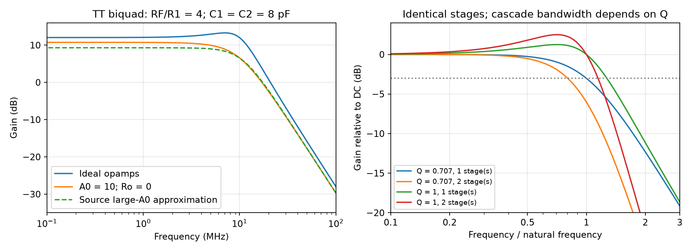

# Tow–Thomas Biquadratic Filter

A Tow–Thomas (TT) biquad realizes a second-order low-pass response with two integrators and negative feedback. This note starts from Razavi's differential, programmable baseband filter [1] and extends the analysis through state equations, cascade bandwidth and exact finite-gain KCL. All eight PDF pages were read and visually reviewed. Source transistor simulations are reported with their conditions; project calculations do not constitute a PDK filter design.

## 1. Application and explicit topology

Source pp. 6–7 target a Wi-Fi baseband low-pass with programmable 10–80-MHz bandwidth, 25-dB adjacent-channel rejection, 50-dB alternate-channel rejection, differential output 1-dB compression at 1.2 V peak-to-peak, input noise approximately 10 nV/√Hz and power below 5 mW. The source circuit simulations use 28-nm CMOS, SS, 75 °C and 0.95-V supply. Rejection is evaluated at the specified channel locations, not at arbitrary normalized frequencies.

Fig. 5(b) (p. 8) uses two fully differential opamps. Define differential voltages as top minus bottom:

| Element / node | Connections |
|---|---|
| $u$ | Differential first-opamp summing input; first output $e=-A_1u$ |
| $w$ | Differential second-opamp summing input; final output $v=-A_2w$ |
| Two $R_1$ | Each input terminal to the corresponding first summing node |
| Two $R_2\parallel C_1$ | First output terminals to their corresponding summing nodes; lossy first integration |
| Two $R_3$ | First output terminals to the corresponding second summing nodes |
| Two $C_2$ | Second output terminals to corresponding second summing nodes |
| Two $R_F$ | Final outputs crossed back to opposite first summing nodes; closes negative overall feedback |

The crossing is essential: it adds an inversion around the two local inverting integrators. An uncrossed feedback path has a different sign and cannot use these equations. The differential equations below assume perfect symmetry and ideal common-mode control; they do not verify the common-mode loop.

Source Fig. 8 (p. 9) supplies a two-stage differential opamp: an NMOS input pair with a 250-µA tail current, PMOS first-stage loads, and PMOS second-stage devices with NMOS sinks. Resistor averaging provides common-mode feedback in both stages; an additional current source shifts output common mode toward $V_{DD}/2$. A device-level implementation must check both differential and common-mode loops and the compatibility of consecutive stages.

| Symbol | Definition |
|---|---|
| $v_{in},v$ | Differential input/output voltage (V) |
| $x=-e$ | State equal to the negative differential first output (V) |
| $A_v$ | Ideal DC voltage gain $R_F/R_1$ |
| $\omega_n,Q$ | Natural angular frequency (rad/s), quality factor |
| $f_{3dB}$ | First frequency where power gain is half its DC value (Hz) |
| $A_0,R_o$ | Constant opamp differential gain, output resistance in a stated model |
| $S_v,e_n$ | One-sided PSD (V²/Hz), ASD (V/√Hz) |

## 2. State equations reveal the design knobs

With virtual-ground summing nodes and ideal opamps, first-stage KCL and second-stage KCL give

$$
C_1\frac{dx}{dt}=\frac{v_{in}}{R_1}-\frac{x}{R_2}-\frac{v}{R_F},\qquad
C_2\frac{dv}{dt}=\frac{x}{R_3}.
$$

Eliminate $x=R_3C_2\,dv/dt$:

$$
R_3C_1C_2\frac{d^2v}{dt^2}+\frac{R_3C_2}{R_2}\frac{dv}{dt}+\frac{v}{R_F}
=\frac{v_{in}}{R_1}.
$$

Thus

$$
\boxed{H(s)=\frac{A_v\omega_n^2}{s^2+(\omega_n/Q)s+\omega_n^2}},\quad
A_v=\frac{R_F}{R_1},\quad
\omega_n=\frac1{\sqrt{R_3R_FC_1C_2}},\quad
Q=R_2\sqrt{\frac{C_1}{R_3R_FC_2}}.
$$

These agree with source p. 8, Eqs. (4)–(7). $R_1$ sets gain without moving ideal $\omega_n,Q$; $R_2$ changes damping without changing $\omega_n$. Scaling both capacitors together tunes frequency while preserving ideal $Q$. Scaling every resistance by $k$ and every capacitance by $1/k$ preserves the ideal transfer but changes thermal noise, loading, capacitor area and switch constraints.

For $z=\omega/\omega_n$,

$$
\frac{|H(j\omega)|^2}{A_v^2}=\frac1{(1-z^2)^2+z^2/Q^2}.
$$

Consequently,

$$
z_{3dB}^2=\frac{2-Q^{-2}+\sqrt{(Q^{-2}-2)^2+4}}2.
$$

$Q=1/\sqrt2$ gives $f_{3dB}=f_n$, while $Q=1$ gives $f_{3dB}=1.2720f_n$ and approximately 1.25-dB peaking. Natural frequency and 3-dB bandwidth are different quantities.

## 3. Cascading two biquads depends on Q

For $N$ identical sections, half-power relative to overall DC requires each denominator power factor to equal $2^{1/N}$. Therefore the independent result is

$$
z_N^2=\frac{2-Q^{-2}+\sqrt{(Q^{-2}-2)^2+4(2^{1/N}-1)}}2.
$$

The cascade-to-single bandwidth ratio is $z_N/z_1$. For two sections:

| Section Q | Cascade bandwidth / single-section bandwidth |
|---|---:|
| $1/\sqrt2$ | 0.80224 |
| 1 | 0.90150 |

Source p. 11, Eqs. (21)–(22), uses $\sqrt[4]{\sqrt2-1}\simeq0.8$ and then chooses $Q=1$. The 0.802 factor holds for identical second-order Butterworth sections; it does not apply unchanged to $Q=1$ sections. In practice the source's finite-gain sections have different effective $Q$, so calculate the composite transfer rather than multiplying an assumed fixed bandwidth factor. Two identical Butterworth sections also do not form a fourth-order Butterworth response, whose two section Q values differ.

## 4. Finite gain: compare the source approximation with exact KCL

Assume identical opamps with constant $A_0$ and zero output resistance. Unlike the ideal derivation, $u=-e/A_0$ and $w=-v/A_0$. The physical differential KCL equations are

$$
\frac{u-v_{in}}{R_1}+(u-e)\left(\frac1{R_2}+sC_1\right)+\frac{u+v}{R_F}=0,
\qquad
\frac{w-e}{R_3}+(w-v)sC_2=0.
$$

Elimination yields

$$
H_{exact}(s)=\frac{R_2R_FA_0^2}{as^2+bs+c_{exact}},
$$

where

$$
\begin{aligned}
a&=(A_0+1)^2R_1R_2R_3R_FC_1C_2,\\
b&=[R_2R_F+R_1R_2+(A_0+1)R_1R_F](A_0+1)R_3C_2
+(A_0+1)R_1R_2R_FC_1,\\
c_{exact}&=R_2R_F+R_1R_2+(A_0+1)R_1R_F+A_0^2R_1R_2.
\end{aligned}
$$

Source p. 9, Eqs. (10)–(15), explicitly assumes $A_0\gg1$ and uses **$(A_0+1)^2R_1R_2$ in the final term of $c$**. This large-gain approximation approaches the exact expression as $A_0$ grows, but it is not identical to finite-gain KCL at $A_0=10$. Both use $\omega_n=\sqrt{c/a}$ and $Q=\sqrt{ac}/b$, with their respective $c$.

For $R_1=500$ Ω, $R_2=R_3=R_F=2$ kΩ, $C_1=C_2=8$ pF and $A_0=10$:

| Model | $f_n$ | Q | $f_{3dB}$ relative to its own DC |
|---|---:|---:|---:|
| Source large-gain approximation | 10.584 MHz | 0.6885 | 10.299 MHz |
| Exact constant-gain, zero-$R_o$ KCL | 9.739 MHz | 0.6335 | 8.624 MHz |

The first row reproduces the article's approximately 10.6 MHz, 0.69 and 10.3 MHz. The second is independently verified by solving the two node equations. Neither models the source's actual two-stage opamp at all frequencies. Reducing capacitance can restore bandwidth but does not repair finite-gain distortion, common-mode limitations or noise.

### Opamp poles and output resistance

Source Eq. (9) (p. 8) recommends $A_0\omega_0\ge14\omega_n$, approximately eleven times $f_{3dB}$ at $Q=1$, to limit pole-induced peaking. This rule uses a single-pole opamp with zero output resistance. A multistage, resistively loaded opamp needs its actual transfer and loop analysis.

For one inverting integrator with an internal source $-A_0v_x$, series output resistance $R_o$, input resistor $R_1$ and feedback capacitor $C_1$, source p. 9, Eqs. (19)–(20), gives

$$
H_{int}(s)=-\frac{A_0-R_oC_1s}{1+[(A_0+1)R_1+R_o]C_1s}.
$$

The zero at $s=+A_0/(R_oC_1)$ is in the **right half-plane**. The pole is negative. Resistive loading by $R_2,R_3,R_F$ also reduces opamp gain and can be more important than the simple pole shift.

Source pp. 11–12 report unloaded gain around 500 and single-ended output resistance 8.5 kΩ, but in-circuit gain around 100. Source Fig. 11 finds this gain by injecting a small differential current step while retaining closed-loop DC bias and comparing settled differential outputs and input errors. An arbitrary open-loop break that changes bias would not measure the same amplifier.

## 5. Noise budgeting and a numerical discrepancy

An independent receiver budget with preceding voltage gain $A_{front}$, source resistance $R_s$, front-end noise factor $F_{front}$ and permitted total factor $F_{tot}$ gives

$$
S_{v,filter}\le4kTR_s A_{front}^2(F_{tot}-F_{front}).
$$

Use **linear** noise factors, not a subtraction of dB values. The source's illustrative $R_s=50$ Ω, 30-dB voltage gain, 3.8→4-dB noise figure and 375 K give 10.82 nV/√Hz, motivating approximately 10 nV/√Hz [1, p. 7]. The 375-K budget temperature differs from the 75-°C transistor simulation condition; they should not be silently conflated.

For the low-frequency model in Fig. 6 (p. 9), assume independent opamp input-noise sources with consistently defined single-ended or differential PSD. Divide source Eq. (16)'s output noise by signal gain squared to obtain

$$
S_{v,in}=\left(\frac{R_1}{R_F\parallel R_1\parallel R_2}\right)^2S_{n1}
+\left(\frac{R_1}{R_2}\right)^2S_{n2}.
$$

At 500 Ω and 2 kΩ, the coefficients are **2.25 and 0.0625**. Original source Eq. (18) prints **2.25 and 0.25**, inconsistent with its own Eq. (17)'s substitution. This is confirmed on the original page, not caused by Marker. Use the equation-derived coefficients for this model; a complete differential transistor noise analysis still needs resistor factors, correlations and frequency-dependent transfers.

Two uncorrelated input resistors $R_1$ produce differential ASD $\sqrt{8kTR_1}$ in the ideal input-referred model. For $R_1=1$ kΩ this is 5.76 nV/√Hz at 300 K and 6.20 nV/√Hz at 348.15 K. The article's 5.75-nV example corresponds to approximately room temperature. Lower $R_1$ reduces this contribution but increases loading on the preceding TIA.

Raising $R_2/R_1$ reduces second-opamp input-referred noise while raising ideal $Q$ unless other values change. Increasing first-section gain suppresses downstream noise but reduces signal headroom. For flicker noise, define a lower integration limit. An “average noise density” obtained by integration is

$$
e_{avg}=\sqrt{\frac1{f_H-f_L}\int_{f_L}^{f_H}S_v(f)df},
$$

not the arithmetic average of ASD. The source integrates 10 kHz–10 MHz and normalizes by approximately 10 MHz [1, p. 11]; state this approximation when reproducing its numbers.

## 6. Source outcomes, programming and remaining tests

The first section has approximately 11.9-MHz bandwidth, 0.87-dB peaking and 9.4-nV/√Hz equivalent average noise. The second section scales all resistors up by four and capacitors down by four to lighten loading on the first. Source Figs. 15–19 (pp. 12–13) report:

| Quantity | Source simulated result | Qualification |
|---|---|---|
| Low-band complete filter | 10.4 MHz; 1.4-dB peaking | Close to 10 MHz; not flat |
| High-band complete filter | 88 MHz; 2.4-dB peaking | Exceeds nominal 80 MHz |
| Adjacent / alternate rejection | 24 / 48 dB | Below the stated 25 / 50-dB targets; preceding TIA may add rejection |
| Average input noise | Approximately 10 nV/√Hz | Stated integration range and normalization |
| Output 1-dB compression | Approximately 1.8 V differential peak-to-peak | Above 1.2-V target; graph uses dBV of peak-to-peak voltage, not dBm |
| Power | Approximately 2 mW | Source 0.95-V, SS, 75-°C circuit |

Source Fig. 20 adds 50-fF feedforward capacitors across each biquad's $R_F$ path, reducing peaking below 1 dB in the example. This changes the transfer numerator/feedback frequency dependence and requires a new composite model.

Programmable capacitors need switches at both terminals, typically NMOS/PMOS transmission gates around mid-supply common mode. At 40 MHz an 8-pF capacitor has impedance magnitude about 497 Ω. Total series resistance of 100 Ω for 8 pF and 400 Ω for 2 pF causes only modest changes in the source example [1, p. 13, Fig. 21]; it is not a universal acceptable resistance. Include voltage-dependent on-resistance, disabled-bank parasitic capacitance, charge injection, mismatch and PVT. Small nominal capacitors are especially vulnerable to switch and routing capacitance.

For implementation, test every bandwidth code with actual opamp gain/loading and common-mode feedback; evaluate composite peaking and channel rejection; integrate differential noise with declared limits; sweep compression and two-tone intermodulation; and verify capacitor switches, mismatch, supply and temperature. Measure the in-circuit gains and loop margins without changing DC bias. Separate nominal schematic results from extracted-layout results.

The [analytical script](code/razavi_second_batch_analysis.py) verifies state equations, exact finite-gain KCL, source approximations, cascade bandwidth and noise arithmetic. The [source review record](sources/razavi-second-batch-verification.md) documents discrepancies and conversion review. Related: [TIA design](Transimpedance-Amplifier-Design.md), [bandwidth calculations](Amplifier-Bandwidth-Calculations.md), [z-domain analysis](Z-Transform-for-Analog-Designers.md).

## References

[1] B. Razavi, “The Design of a Biquadratic Filter,” *IEEE Solid-State Circuits Magazine*, Winter 2024, printed pp. 6–13; eight PDF pages. [DOI: 10.1109/MSSC.2023.3336149](https://doi.org/10.1109/MSSC.2023.3336149). [Original PDF](https://www.seas.ucla.edu/brweb/papers/Journals/BR_SSCM_1_2024.pdf). The historical Tow/Thomas and other references in its bibliography were not independently read for this note; the state, cascade and finite-gain extensions above are independent derivations.
