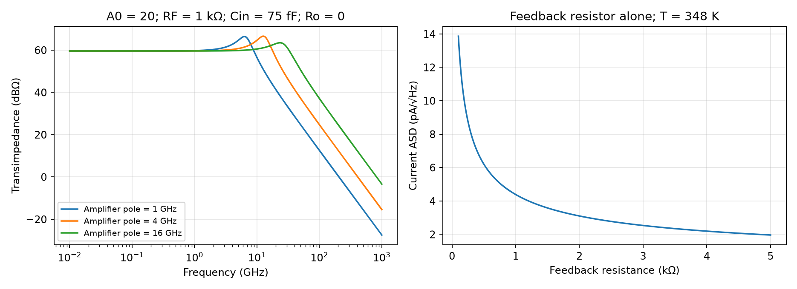

# Transimpedance Amplifier Design

A transimpedance amplifier (TIA) converts detector current into voltage while controlling input impedance, noise and bandwidth. This note examines Razavi's Winter 2023 optical-receiver design [1], then derives explicit feedback and noise models. All five PDF pages were read and visually reviewed; the last page has no confirmed printed page number and is cited as PDF p. 5. Verification here uses analytical equations and independent KCL solutions, not a PDK.

## 1. Specifications must be stated at the receiver

The article targets 40-Gb/s non-return-to-zero (NRZ) data, 1-kΩ transimpedance, input-current noise below 10 pA/√Hz and power below 5 mW. Its simulations use 28-nm CMOS, SS, 75 °C and $V_{DD}=0.95$ V [1, p. 7]. The photodiode/pad capacitance is approximately 50 fF; an estimated 25-fF TIA contribution gives $C_{in}=75$ fF.

For a single input RC pole,

$$
f_{in}=\frac1{2\pi R_{in}C_{in}},\qquad
R_{in}\le106.1\,\Omega\quad\text{for }f_{in}\ge20\,\mathrm{GHz}.
$$

This is an initial budget, not an exact feedback-TIA bandwidth formula. Active feedback can make input impedance frequency dependent and partially inductive; output poles and interconnect still matter.

For ideal random rectangular NRZ pulses, the continuous signal PSD has a $\operatorname{sinc}^2(f/R_b)$ envelope. Integrating it gives 87.76% of power within $\pm0.7R_b$ and 77.37% within $\pm0.5R_b$. The article describes the latter as approximately 75% [1, p. 7]; use the explicit pulse model for precise numbers. Spectral power retention alone does not establish acceptable intersymbol interference (ISI) or bit error rate (BER).

### A noise target from BER

Let $I_{pp}$ be the separation of the two received current levels and $\sigma_i$ the equivalent RMS input noise at the decision sample. Equal Gaussian noise variance, equally likely levels, no ISI and a midpoint threshold give

$$
\mathrm{BER}=Q\!\left(\frac{I_{pp}}{2\sigma_i}\right).
$$

For $I_{pp}=25$ µA and BER $10^{-12}$, $Q^{-1}(10^{-12})=7.0345$, hence $\sigma_i\le1.777$ µA. A white input noise density passed through a first-order 20-GHz low-pass has one-sided equivalent noise bandwidth (ENBW)

$$
\mathrm{ENBW}=\int_0^\infty\frac{df}{1+(f/f_{3dB})^2}
=\frac\pi2 f_{3dB}.
$$

This gives approximately 10.03 pA/√Hz [1, p. 8, Eqs. (1)–(3); independent Gaussian calculation]. A realistic BER calculation must include pulse response, threshold error and the sampled noise covariance. Optical average power is not automatically the on-level power: extinction ratio and mark probability are needed before translating average optical power into $I_{pp}$.

## 2. Circuit and model definitions

The source compares resistive loads, common-gate inputs, local feedback and shunt feedback [1, pp. 7–9, Figs. 1–8]. The selected circuit in Fig. 8 (p. 9) uses:

| Element | Explicit connection |
|---|---|
| NMOS $M_1$ | Source ground, gate input $P$, drain $X$; $R_{D1}$ from $X$ to $V_{DD}$ |
| PMOS $M_2,M_3$ | Common source $S$ fed by a current source from $V_{DD}$; gates $X,V_b$ respectively |
| Pair drains | $M_2$ drain ground; $M_3$ drain $V_{out}$ |
| $R_{D2}$ | $V_{out}$ to ground |
| $R_F$ | $V_{out}$ to input $P$, providing negative shunt feedback |
| Wells | $M_2,M_3$ sources tied to their n-wells as stated in the source |

An increase at $P$ lowers $X$, increases $M_2$'s share of tail current, lowers $M_3$ current and lowers $V_{out}$. Feeding that falling voltage back through $R_F$ opposes the input current. Final Fig. 13 (p. 10) adds the $M_4/M_{REF}$ bias mirror and $R_b$; its next-stage gate capacitance is included in the source's final simulations.

| Symbol | Meaning / assumption |
|---|---|
| $i_{in},v_P,v_o$ | Current injected at $P$ (A), input and output voltages (V) |
| $Z_T=v_o/i_{in}$ | Signed transimpedance (Ω); inversion gives negative low-frequency $Z_T$ |
| $R_{in}=v_P/i_{in}$ | Low-frequency input resistance (Ω) |
| $-A v_P,R_o$ | Unloaded internal amplifier voltage and series output resistance |
| $A(s)$ | Inverting voltage-gain magnitude; loaded gain is defined separately |
| $S_i,i_n$ | One-sided current PSD (A²/Hz) and ASD (A/√Hz) |

The next derivation is a linear voltage-amplifier model. It does not set MOS dimensions, parasitic capacitances or bias margins.

## 3. Feedback equations and the source's gain-definition problem

At DC, neglect amplifier input current. KCL at $P$ and at the output gives

$$
i_{in}=\frac{v_P-v_o}{R_F},\qquad
\frac{v_o+Av_P}{R_o}+\frac{v_o-v_P}{R_F}=0.
$$

Eliminate $v_o$ to obtain

$$
\boxed{R_{in}=\frac{R_F+R_o}{1+A}},\qquad
\boxed{Z_T=\frac{R_o-AR_F}{1+A}=R_{in}-R_F}.
$$

Increasing unloaded gain lowers input resistance and moves $Z_T$ toward $-R_F$. Large $R_o$ makes this harder. For $R_o\to0$, $R_{in}=R_F/(1+A)$ and $Z_T=-AR_F/(1+A)$. These limits also check the signs.

The original p. 10 states $A\simeq3.9$, $R_F=R_{D2}=1$ kΩ and $(R_F+R_{D2})/(1+3.9)\simeq200$ Ω. That substitution actually gives **408.16 Ω** and, with $R_o=1$ kΩ, **$Z_T=-591.84$ Ω**. The reported source simulations of approximately 200-Ω input resistance and 800-Ω transimpedance are mutually consistent with $Z_T=R_{in}-R_F$. They correspond to **unloaded $A\simeq9$** if $R_o=1$ kΩ; their actual loaded voltage gain magnitude is $800/200=4$.

Therefore, a loaded gain near 3.9–4 cannot simply be inserted where the equation requires unloaded gain. This is an arithmetic/gain-definition inconsistency in the explanatory model, not proof that the source simulations are wrong. Preserve source conditions and distinguish $A$, $R_o$ and $v_o/v_P$ when building a model.

## 4. Finite amplifier bandwidth changes the input model

An independent illustrative extension takes $R_o=0$, input capacitance $C_{in}$ to ground and $A(s)=A_0/(1+s/\omega_a)$. Input KCL is

$$
i_{in}=sC_{in}v_P+\frac{v_P-v_o}{R_F},\qquad v_o=-A(s)v_P.
$$

Hence

$$
\boxed{Z_T(s)=\frac{-A_0R_F}{(1+A_0)+s(1/\omega_a+R_FC_{in})+s^2R_FC_{in}/\omega_a}}.
$$

Its natural angular frequency and quality factor are

$$
\omega_n=\sqrt{\frac{(1+A_0)\omega_a}{R_FC_{in}}},\qquad
Q=\frac{\sqrt{(1+A_0)\omega_aR_FC_{in}}}{1+\omega_aR_FC_{in}}.
$$

This second-order response shows why a single $R_{in}C_{in}$ estimate cannot predict closed-loop peaking or bandwidth. Actual $R_o$, multiple amplifier poles, detector/package parasitics and next-stage loading require additional states. Frequency-domain peaking can improve nominal bandwidth while worsening pulse ringing and BER.

The left curves use an illustrative $A_0=20$, $R_F=1$ kΩ, $C_{in}=75$ fF and zero output resistance; they are not fits to source simulations.

## 5. Noise contributions and proper integration

For a high-gain ideal feedback amplifier at low frequency, feedback-resistor and equivalent input-voltage noise give approximately

$$
S_{i,eq}\simeq\frac{4kT}{R_F}+\frac{e_n^2}{R_F^2}.
$$

With an ideal amplifier input and detector capacitance, the voltage-noise contribution generalizes to

$$
S_{i,en}(f)=\left|\frac1{R_F}+j2\pi fC_{in}\right|^2 S_{en}(f).
$$

Thus capacitance can raise the input-equivalent voltage-noise contribution at high frequency. Add device current noise, detector shot noise ($2qI$ for a one-sided ideal Poisson model), background-light noise and any correlated terms through their actual transfer functions. The high-loop approximation cannot describe every frequency or transistor noise path.

The common-gate candidate has the source's low-frequency approximation $4kT/R_D+4kT\gamma g_{m2}$ when body effect, output conductance and input capacitance are neglected [1, p. 8, Fig. 4, Eqs. (6)–(8)]. With $R_D=500$ Ω, $g_{m2}\simeq1/150$ Ω, $\gamma\simeq1$ and 350 K, this is approximately 13 pA/√Hz. The common-gate input transistor's low-frequency noise cancellation does not persist unchanged with finite input capacitance. Do not turn this candidate-specific result into a universal common-gate noise floor.

For an actual TIA, integrate output PSD:

$$
\sigma_o^2=\int_{f_L}^{f_H}S_o(f)df.
$$

An equivalent white input density based on the full current transfer is

$$
i_{eq}=\frac{\sigma_o}{\sqrt{\int_{f_L}^{f_H}|Z_T(f)|^2df}}.
$$

Only for a first-order shape and sufficiently wide integration limits does this reduce to $\sigma_o/(|Z_T(0)|\sqrt{\pi f_{3dB}/2})$. It is a normalization, not evidence that the actual input PSD is flat.

Original p. 10 integrates the preliminary output PSD from **100 MHz to 100 GHz**, giving $\sigma_o^2=1.8\times10^{-6}$ V² and **$\sigma_o=1.34$ mV**, not 13.4 mV. With 800 Ω and 19 GHz its first-order, full-band ENBW normalization gives 9.71 pA/√Hz equivalent density. The finite integration limits and actual higher-order transfer prevent treating this as a measured flat input spectrum. The final PDF p. 5 gives $1.3\times10^{-6}$ V², 17 GHz, approximately 224 Ω input resistance and 2-mA supply current; the same normalization gives 8.72 pA/√Hz. The source attributes over 90% of output noise to $R_F$ [1, pp. 10 and PDF 5, Figs. 10–15].

## 6. Design outcome and verification priorities

The source's final transimpedance remains approximately 800 Ω, below the 1-kΩ target. Its 17-GHz bandwidth is below the initial 20-GHz choice, and the article explicitly cautions that reliable 40-Gb/s operation after layout parasitics is not established. These are unresolved specifications, even though the normalized noise and approximately 1.9-mW supply power appear favorable.

For long runs of identical bits, DC coupling avoids baseline wander. If AC coupling is necessary, an independent first-order droop model $V(t)=V_0e^{-t/\tau}$ requires

$$
\tau\ge-\frac{t_{run}}{\ln(1-\epsilon)}.
$$

For 100 bits at 40 Gb/s and at most 1% droop, $\tau\ge248.75$ ns. This constrains coupling and baseline-restoration design, but does not account for every receiver coding or offset-control scheme.

An implementation should verify DC bias and headroom over detector currents and PVT; extract $Z_T(f)$ and $Z_{in}(f)$ with detector, pad and next-stage parasitics; calculate integrated noise with explicit limits; and test PRBS plus long runs for eye opening, ringing, threshold offset and timing sensitivity. Use post-layout capacitance to reassess BER and power. Declare whether the BER comes from noise extrapolation or observed errors; a short eye simulation cannot demonstrate $10^{-12}$ BER directly.

The [analytical script](code/razavi_second_batch_analysis.py) checks DC and dynamic KCL, NRZ spectral fractions, Gaussian/ENBW budgets and source noise arithmetic. See the [review record](sources/razavi-second-batch-verification.md). Related: [basic MOS amplifier configurations](Single-Transistor-Amplifier-Configurations.md), [bandwidth calculations](Amplifier-Bandwidth-Calculations.md).

## References

[1] B. Razavi, “The Design of a Transimpedance Amplifier,” *IEEE Solid-State Circuits Magazine*, Winter 2023, five PDF pages; confirmed printed pp. 7–10, last printed page unconfirmed. [DOI: 10.1109/MSSC.2022.3219682](https://doi.org/10.1109/MSSC.2022.3219682). [Original PDF](https://www.seas.ucla.edu/brweb/papers/Journals/BR_SSCM_1_2023.pdf). The website's pp. 7–11 span is not used to invent a printed number for the final PDF page.
