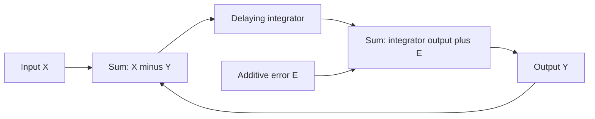
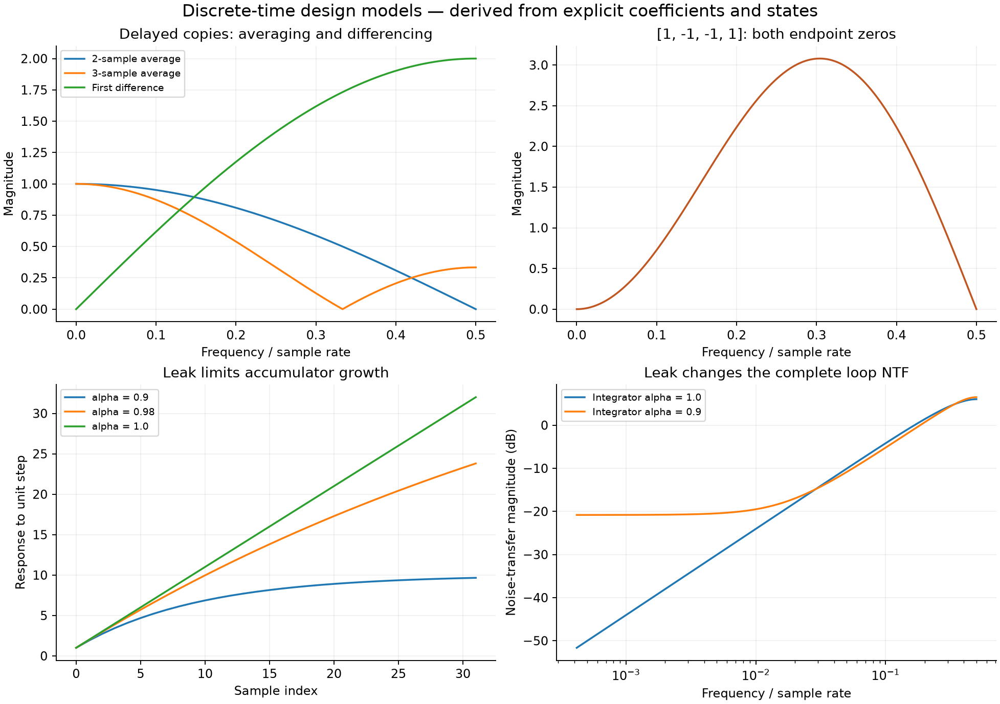

# The z-Transform for Analog Designers

<!--
Input: Razavi's 2020 article checked against all original pages, plus independent system derivations
Output: Delay, filtering, integration, feedback noise shaping, and stability design intuition
Position: Discrete-time analysis foundation for sampling, CDS, ADCs, equalizers and digital PLLs
-->

**Scope and evidence:** This note develops reusable discrete-time design tools around Razavi's “The z-Transform for Analog Designers,” Summer 2020, pp. 8–14 [R1]. The full seven-page article and its original equations/diagrams were reviewed. Additional derivations, stability qualifications and computations are identified below. The systems are linear models; physical switch timing, finite amplifier gain, nonlinear quantizers and circuit noise require separate models.

## 1. Begin with Samples, Not a Substitution Rule

Let $T_S$ be the sample period in seconds, $f_S=1/T_S$ in Hz, $k$ an integer index, and $x[k]=x_c(kT_S)$. Normalized angular frequency is $\Omega=\omega T_S=2\pi f/f_S$ in radians/sample; $\omega$ is rad/s. The complex variable $z$ is dimensionless.

For a sequence, use the bilateral definition

$$X(z)=\sum_{k=-\infty}^{\infty}x[k]z^{-k}.$$

For a causal impulse response, $h[k]=0$ for $k<0$, so

$$H(z)=\sum_{k=0}^{\infty}h[k]z^{-k}.$$

This is source Eq. (8), p. 9. Include the region of convergence (ROC) when it affects causality or stability. A transfer function describes zero-state behavior; initial capacitor charge or register contents add a separate response.

For an LTI system,

$$y[k]=\sum_m h[m]x[k-m],\qquad Y(z)=H(z)X(z).$$

Ideal impulse sampling is $x_s(t)=\sum_k x_c(kT_S)\delta(t-kT_S)$, corresponding to source Eqs. (3)–(4), p. 8. The impulse train and the dimensionless sequence are different representations; physical hold behavior and scaling must be specified separately.

## 2. A Unit Delay Is the Basic Building Block

With $y[k]=x[k-1]$, reindexing the transform gives

$$Y(z)=z^{-1}X(z),\qquad\boxed{H_{\mathrm{delay}}(z)=z^{-1}.}$$

Source Eq. (11) and Figs. 3–5, p. 9, establish this delay intuition. On the unit circle,

$$z=e^{j\Omega},\qquad z^{-1}=e^{-j\Omega}.$$

A unit delay has unity magnitude and a phase of $-\Omega$, hence one-sample group delay. At low frequency it resembles unity because $e^{-j\Omega}\approx1-j\Omega$, not because the physical delay disappears.

The algebraic factor $z$ advances a sequence: $y[k]=x[k+1]$. This is useful for symbolic manipulation or offline processing, but it needs a future sample and is not generally a causal real-time circuit.

### Relating s and z Carefully

Sampling the exponential mode $e^{st}$ gives $e^{skT_S}=(e^{sT_S})^k$, so its discrete-time mode is

$$\boxed{z=e^{sT_S}.}$$

This gives frequency and mode-mapping intuition, as in source Eqs. (9)–(10). It does not make arbitrary $H_c(s)$ and $H_d(z)$ interchangeable by replacing $s$ with $\ln z/T_S$: sampling, zero-order hold, impulse invariance and bilinear transformations are different operations, with different numerator and scaling behavior. The logarithm also has frequency branches corresponding to aliasing.

An exact continuous-time delay is $H_c(s)=e^{-sT_D}$. Its low-frequency expansion $1-sT_D$ introduces a right-half-plane zero at $s=1/T_D$ into the **approximation**. The exact exponential has no finite zeros. Source p. 8 uses this approximation for intuition; the actual expansion condition is $|sT_D|\ll1$. Do not treat the approximate zero as an exact physical transmission zero.

## 3. Adding Delayed Copies Produces FIR Filtering

For $y[k]=x[k]+x[k-1]$,

$$H_{LP}(z)=1+z^{-1}.$$

Using $1+e^{-j\Omega}=2e^{-j\Omega/2}\cos(\Omega/2)$,

$$\boxed{|H_{LP}(e^{j\Omega})|=2|\cos(\Omega/2)|.}$$

Source Eqs. (12)–(14), Fig. 6, p. 10, give the equivalent expression $\sqrt{2+2\cos\Omega}$. DC gain is two and the response vanishes at $f_S/2$. Normalize the coefficient pair to $[1/2,1/2]$ for a unity-DC moving average.

For $H(z)=1+\alpha z^{-1}$ with $0\le\alpha<1$,

$$|H|^2=1+\alpha^2+2\alpha\cos\Omega.$$

DC gain is $1+\alpha$; Nyquist gain is $1-\alpha$. The zero moves from $z=-1$ to $z=-\alpha$, so exact Nyquist cancellation is lost. This gives the coefficient-mismatch intuition behind source Fig. 7, pp. 10–11.

For an $M$-sample average,

$$H_M(z)=\frac{1}{M}\sum_{m=0}^{M-1}z^{-m},$$

and on the unit circle,

$$H_M(e^{j\Omega})=\frac{e^{-j\Omega(M-1)/2}}{M}
\frac{\sin(M\Omega/2)}{\sin(\Omega/2)}.$$

This independent extension makes the tradeoff explicit: a longer averaging window narrows the main lobe and adds latency, while creating repeated passbands/zeros over the periodic spectrum. An FIR low-pass alone is not proof of adequate antialiasing for a chosen decimation factor.

## 4. Subtraction Produces Differences and DC Zeros

For $y[k]=x[k]-x[k-1]$,

$$H_D(z)=1-z^{-1},\qquad
\boxed{|H_D(e^{j\Omega})|=2|\sin(\Omega/2)|.}$$

It has a DC zero, cancels a constant input and approaches $j\Omega$ at low frequency. The correctly scaled physical derivative approximation is

$$\frac{x[k]-x[k-1]}{T_S}\approx\frac{dx_c}{dt}.$$

The unscaled difference and a continuous-time derivative have different units. Source Figs. 9–11, pp. 11–12, establish the difference/high-pass intuition.

A finite correlation-sensitive subtraction, such as CDS, follows the same structure. For two samples separated by $T_D$,

$$|H_{\mathrm{CDS}}(f)|^2=4\sin^2(\pi fT_D).$$

Suppression near DC does not guarantee cancellation of uncorrelated sample noise. If two sample errors have equal variance $\sigma^2$ and correlation coefficient $\rho$,

$$\boxed{\mathrm{Var}(n_2-n_1)=2\sigma^2(1-\rho).}$$

This independent covariance relation links the transform to [Correlated Double Sampling](Correlated-Double-Sampling.md). The sample separation need not equal the system's complete clock period, so state which delay the factor represents.

### Inspect All Important Zeros

For the source's four-tap example, p. 12, Fig. 12,

$$1-z^{-1}-z^{-2}+z^{-3}=(1-z^{-1})^2(1+z^{-1}).$$

It has a double zero at DC **and** a zero at Nyquist. It is therefore bandpass over $0<f<f_S/2$, rather than a high-pass that remains large at Nyquist. A coefficient sum of zero checks DC rejection; it does not fully classify a filter.

The source's intermediate printed expression on p. 12 lacks grouping around its first $1-z^{-1}$ term. Expanding $(1-z^{-1})-z^{-2}(1-z^{-1})$ gives the polynomial above and verifies the final factorization independently.

Similarly, $1-z^{-2}=(1-z^{-1})(1+z^{-1})$ is a differencing-plus-smoothing cascade with both DC and Nyquist zeros. Source Figs. 16–17, pp. 13–14, illustrate why added delay changes more than the low-frequency slope.

## 5. Accumulators and Leaky Integrators

With initial state $y[-1]=0$,

$$y[k]=y[k-1]+x[k],\qquad
\boxed{H_I(z)=\frac{1}{1-z^{-1}}.}$$

This is the nondelaying integrator in source Eqs. (17)–(20), p. 13. With $x[k-1]$ instead of $x[k]$,

$$H_{I,D}(z)=\frac{z^{-1}}{1-z^{-1}},$$

the delaying integrator, source Fig. 14, p. 13. One sample of delay is material when this block enters a feedback loop.

For a leaky accumulator,

$$y[k]=\alpha y[k-1]+x[k],\qquad
H_{I,\alpha}(z)=\frac{1}{1-\alpha z^{-1}}.$$

For $0\le\alpha<1$, its pole is inside the unit circle, its impulse response is $\alpha^k u[k]$ and its DC gain is $1/(1-\alpha)$. A unit-step response is $(1-\alpha^{k+1})/(1-\alpha)$, while $\alpha=1$ gives $k+1$ and grows without bound. A physical integrator may leak because of finite amplifier gain or charge retention; derive $\alpha$ from its actual phase equations rather than equating it to a gain error by inspection.

For small normalized frequency,

$$1-\alpha e^{-j\Omega}\approx(1-\alpha)+j\alpha\Omega.$$

Thus a leak dominates below approximately $\Omega\sim(1-\alpha)/\alpha$ for $\alpha$ close to one. This is a low-frequency approximation; near Nyquist use the full transfer function.

## 6. Derive Noise Shaping from the Actual Loop

Source Fig. 15 and Eqs. (21)–(22), p. 13, use a delaying integrator in negative feedback with additive output noise. Let

$$L(z)=\frac{z^{-1}}{1-z^{-1}},\qquad Y=L(X-Y)+E.$$

Solving separately for input and additive-noise excitation gives

$$\boxed{\mathrm{STF}(z)=\frac{L}{1+L}=z^{-1},\qquad
\mathrm{NTF}(z)=\frac{1}{1+L}=1-z^{-1}.}$$

The signal is delayed by one sample. Noise is differenced, suppressing low-frequency components and increasing some high-frequency components. Suppression is useful only with a specified signal band and filtering/decimation.

This is an independently drawn block diagram of the analyzed loop. The stated integrator transfer function and summing signs define it.

If leakage changes the block to $L_\alpha=z^{-1}/(1-\alpha z^{-1})$, independent algebra gives

$$\mathrm{STF}_\alpha=\frac{z^{-1}}{1+(1-\alpha)z^{-1}},\qquad
\mathrm{NTF}_\alpha=\frac{1-\alpha z^{-1}}{1+(1-\alpha)z^{-1}}.$$

At DC the noise transfer is $(1-\alpha)/(2-\alpha)$, rather than zero. Reusing $1-z^{-1}$ after changing the integrator or introducing another feedback delay would miss this change.

### An Explicit White-Error Model

For white independent sample error of variance $\sigma_E^2$, define a two-sided discrete-time PSD $S_E(\Omega)=\sigma_E^2$ for $-\pi\le\Omega<\pi$, with variance $(1/2\pi)\int S_E\,d\Omega$. Output PSD is $4\sin^2(\Omega/2)\sigma_E^2$.

Integrating over $|\Omega|\le\Omega_B$ gives

$$\boxed{\sigma_{\mathrm{inband}}^2=\frac{2\sigma_E^2}{\pi}(\Omega_B-\sin\Omega_B).}$$

For $\mathrm{OSR}=f_S/(2B)$, $\Omega_B=\pi/\mathrm{OSR}$, and large OSR,

$$\sigma_{\mathrm{inband}}^2\approx\frac{\pi^2\sigma_E^2}{3\,\mathrm{OSR}^3}.$$

If additionally $\sigma_E^2=\Delta^2/12$, this is the usual first-order white-quantization-error estimate. The whiteness/independence assumption can fail for an actual quantizer, especially with tones, overload or limit cycles. The linear model does not prove nonlinear loop stability.

## 7. Stability: Qualify the Unit-Circle Rule

For a causal rational LTI system with no hidden unstable internal modes, BIBO stability requires its ROC to include the unit circle; equivalently all transfer-function poles must lie strictly inside it. This refines the source's p. 14, Fig. 18 mode-mapping argument.

Since $|e^{sT_S}|=e^{\mathrm{Re}(s)T_S}$, decaying continuous-time modes map inside the unit circle. Unit-circle poles can sustain a homogeneous mode, but are not generally BIBO stable. A DC input makes the ideal accumulator grow; repeated unit-circle poles can produce growing homogeneous responses as well. Hidden cancellations need internal-state analysis.

For $\alpha=0.9$, the leaky accumulator has pole 0.9 and DC gain 10. Its mode decays by a factor of 0.9 per sample. For $\alpha=1$, a constant input produces an unbounded ramp. For $\alpha>1$, even its causal impulse response grows exponentially.

## 8. Computation and Practical Use

Run `python code/razavi_first_batch_analysis.py` for coefficient-versus-frequency checks, time-domain recurrences, noise shaping and the in-band integral. It checks a state-space recurrence against the independently derived STF/NTF; it does not simulate an ADC quantizer or physical switched-capacitor network.

When applying these tools to a circuit:

1. Write the charge/state update at a precisely defined phase boundary, including initial state and capacitance ratios.
2. Identify each actual sample delay before taking the transform.
3. Derive signal and noise transfer functions by exciting each source separately.
4. Check DC, Nyquist, relevant zeros, causality and the pole locations.
5. Reintroduce finite gain, incomplete settling, coefficient mismatch, noise correlations and physical output limits as the task requires.

## Sources and Related Notes

**[R1]** B. Razavi, “The z-Transform for Analog Designers,” *IEEE Solid-State Circuits Magazine*, vol. 12, no. 3, pp. 8–14, Summer 2020. [Original PDF](https://www.seas.ucla.edu/brweb/papers/Journals/BR_SSCM_3_2020.pdf), [DOI: 10.1109/MSSC.2020.3002137](https://doi.org/10.1109/MSSC.2020.3002137). Full text and original-page checks completed 2026-10-04. The bilateral/ROC qualification, CDS covariance, general moving average, leaky-loop transfer functions and noise integral are independently developed here. See [verification record](sources/razavi-first-batch-verification.md).

- [Correlated Double Sampling](Correlated-Double-Sampling.md): correlation-sensitive subtraction.
- [Current Integration Sampling](Current-Integration-Sampling.md): physical charge accumulation and sampling.
- [Bootstrapped Sampling Switch](Bootstrapped-Sampling-Switch.md): acquisition and harmonic folding.
- [Analog Mind Index](Razavi-Analog-Mind-Index.md): sources and review status.
